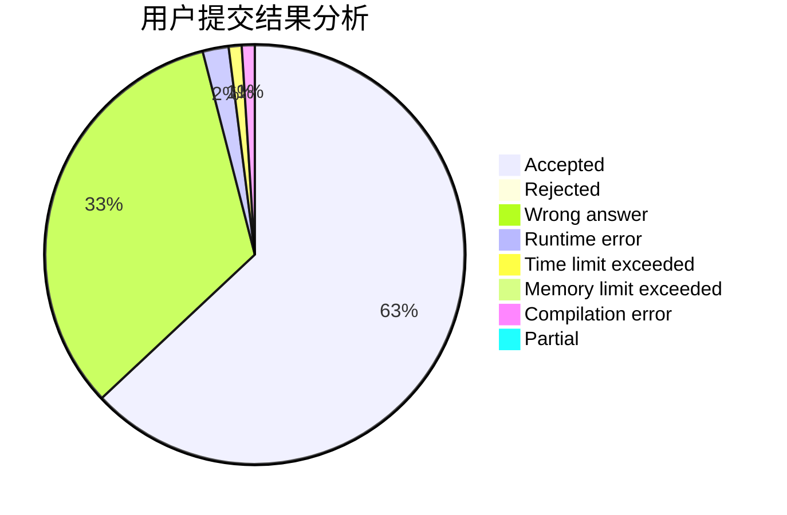
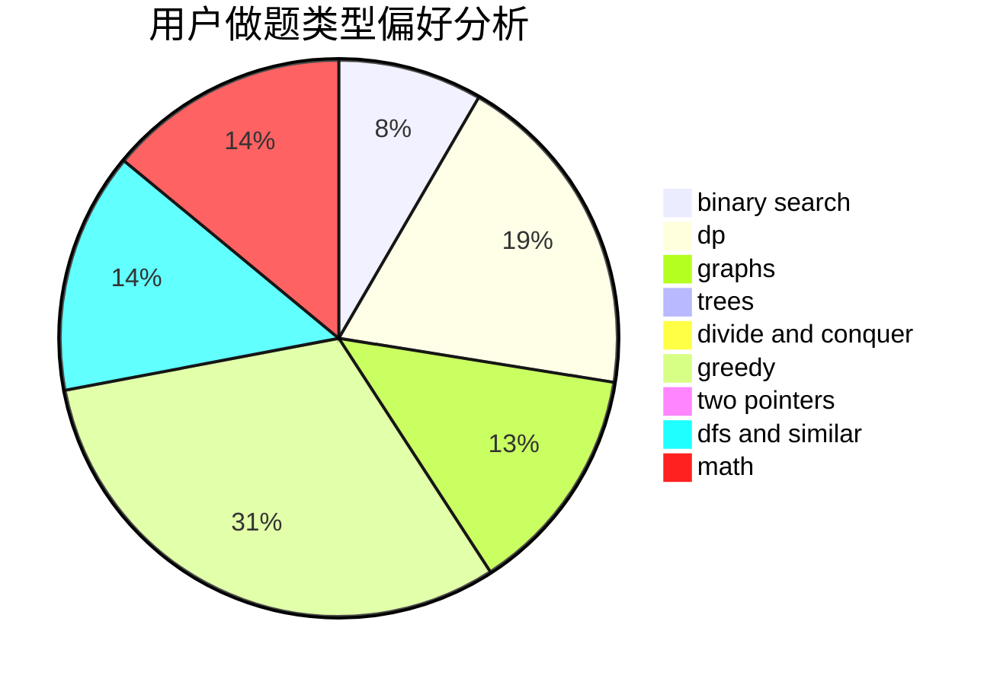

# BobbyZ

<!-- tabs:start -->

#### **用户提交结果分析**

#### **用户做题类型偏好分析**

<!-- tabs:end -->
# 推荐题目
[1509E](https://codeforces.com/contest/1509/problem/E)
[1063F](https://codeforces.com/contest/1063/problem/F)
[548A](https://codeforces.com/contest/548/problem/A)
[521A](https://codeforces.com/contest/521/problem/A)
[574B](https://codeforces.com/contest/574/problem/B)
[198B](https://codeforces.com/contest/198/problem/B)
[56A](https://codeforces.com/contest/56/problem/A)
[150A](https://codeforces.com/contest/150/problem/A)
[1017G](https://codeforces.com/contest/1017/problem/G)
[575A](https://codeforces.com/contest/575/problem/A)
