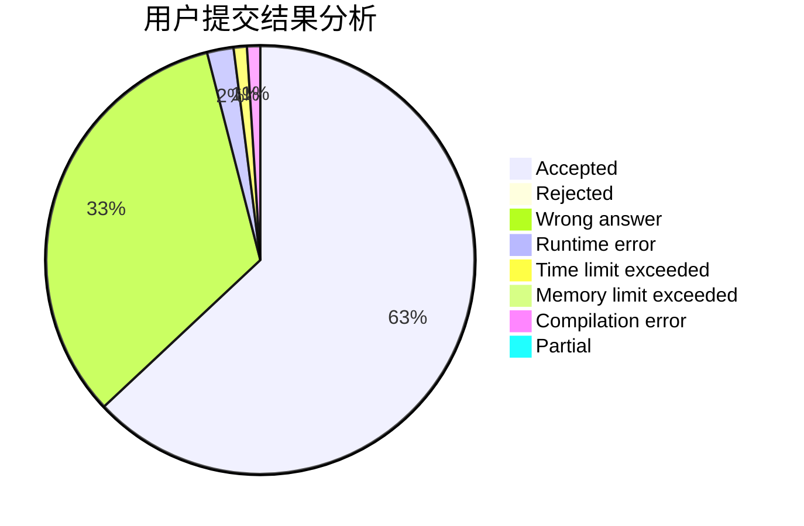
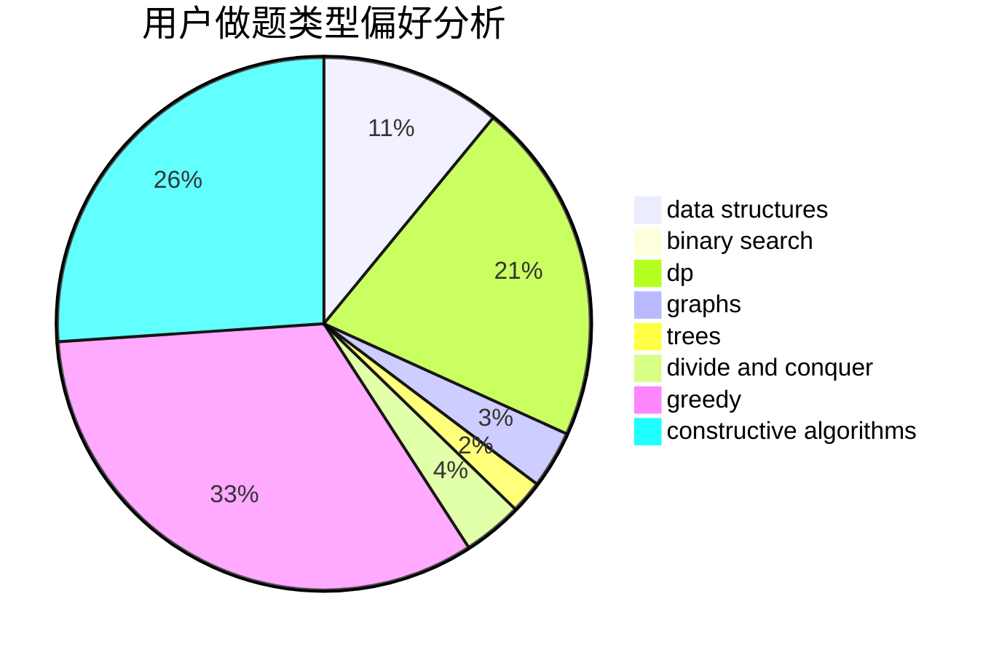

# BobbyZ

<!-- tabs:start -->

#### **用户提交结果分析**

#### **用户做题类型偏好分析**

#### **用户错题知识点分析**

<!-- tabs:end -->
# 推荐题目
[1499E](https://codeforces.com/contest/1499/problem/E)		combinatorics,
                        dp,
                        math,
                        strings		  
[1063C](https://codeforces.com/contest/1063/problem/C)		binary search,
                        constructive algorithms,
                        geometry,
                        interactive		  
[522D](https://codeforces.com/contest/522/problem/D)		*special problem,
                        data structures		  
[500A](https://codeforces.com/contest/500/problem/A)		dfs and similar,
                        graphs,
                        implementation		  
[549C](https://codeforces.com/contest/549/problem/C)		games		  
[171B](https://codeforces.com/contest/171/problem/B)		*special problem,
                        combinatorics		  
[545A](https://codeforces.com/contest/545/problem/A)		implementation		  
[1499G](https://codeforces.com/contest/1499/problem/G)		data structures,
                        graphs,
                        interactive		  
[1017D](https://codeforces.com/contest/1017/problem/D)		bitmasks,
                        brute force,
                        data structures		  
[54A](https://codeforces.com/contest/54/problem/A)		implementation		  
