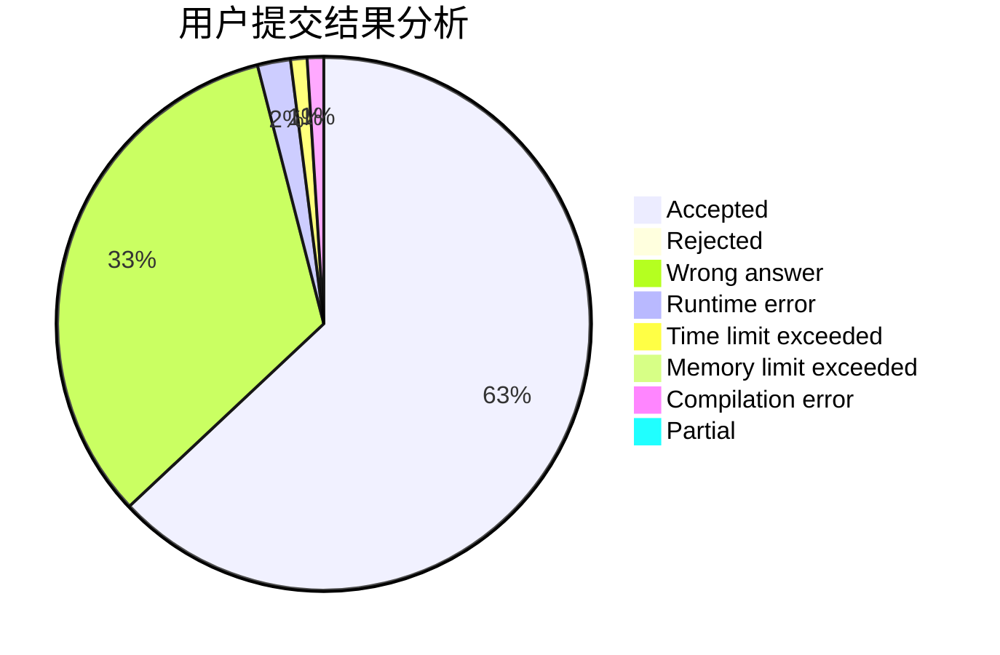
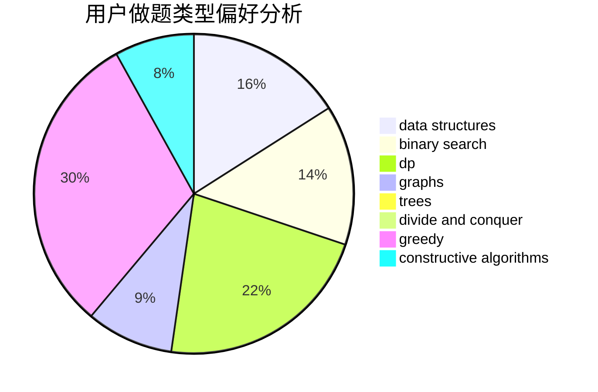

# BobbyZ

<!-- tabs:start -->

#### **用户提交结果分析**

#### **用户做题类型偏好分析**

#### **用户错题知识点分析**

<!-- tabs:end -->
# 推荐题目
[1509E](https://codeforces.com/contest/1509/problem/E)		dsu,graphs,sortings,trees		  
[1063F](https://codeforces.com/contest/1063/problem/F)		data structures,
                        dp,
                        string suffix structures		  
[548A](https://codeforces.com/contest/548/problem/A)		brute force,
                        implementation,
                        strings		  
[521A](https://codeforces.com/contest/521/problem/A)		dsu,graphs,sortings,trees		  
[574B](https://codeforces.com/contest/574/problem/B)		brute force,
                        dfs and similar,
                        graphs,
                        hashing		  
[198B](https://codeforces.com/contest/198/problem/B)		shortest paths		  
[56A](https://codeforces.com/contest/56/problem/A)		implementation		  
[150A](https://codeforces.com/contest/150/problem/A)		games,
                        math,
                        number theory		  
[1017G](https://codeforces.com/contest/1017/problem/G)		data structures		  
[575A](https://codeforces.com/contest/575/problem/A)		data structures,
                        math,
                        matrices		  
