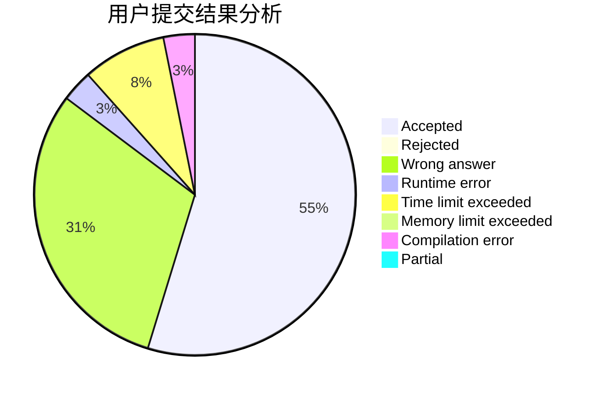
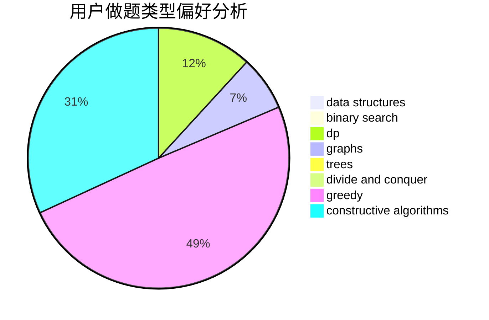
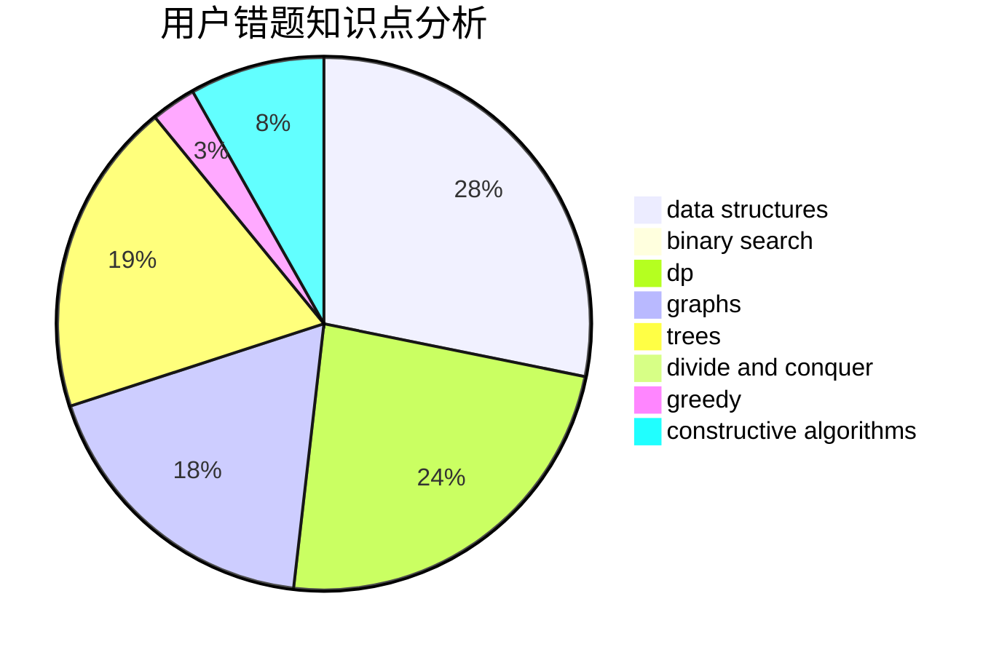

# memset0c

<!-- tabs:start -->

#### **用户提交结果分析**

#### **用户做题类型偏好分析**

#### **用户错题知识点分析**

<!-- tabs:end -->
# 推荐题目
[1421A](https://codeforces.com/contest/1421/problem/A)		bitmasks,
                        greedy,
                        math		  
[1500C](https://codeforces.com/contest/1500/problem/C)		bitmasks,
                        brute force,
                        constructive algorithms,
                        greedy,
                        two pointers		  
[1491G](https://codeforces.com/contest/1491/problem/G)		constructive algorithms,
                        graphs,
                        math		  
[1254E](https://codeforces.com/contest/1254/problem/E)		combinatorics,
                        dfs and similar,
                        dsu,
                        trees		  
[1077C](https://codeforces.com/contest/1077/problem/C)		nan		  
[706D](https://codeforces.com/contest/706/problem/D)		binary search,
                        bitmasks,
                        data structures,
                        trees		  
[739D](https://codeforces.com/contest/739/problem/D)		graph matchings		  
[76B](https://codeforces.com/contest/76/problem/B)		greedy,
                        two pointers		  
[924B](https://codeforces.com/contest/924/problem/B)		binary search,
                        greedy,
                        two pointers		  
[856E](https://codeforces.com/contest/856/problem/E)		nan		  
