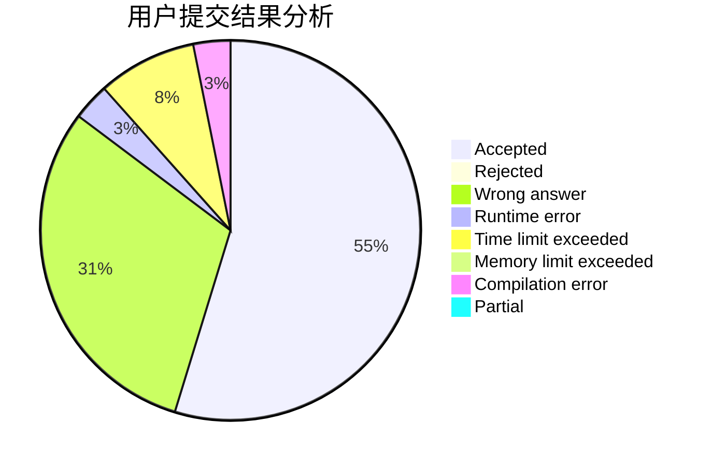
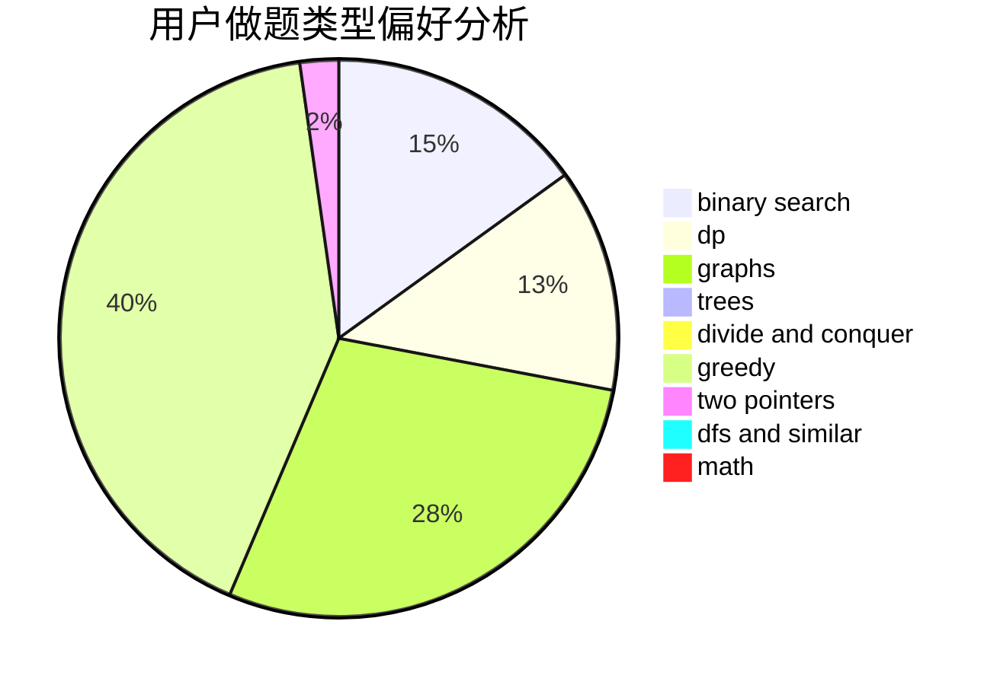

# memset0c

<!-- tabs:start -->

#### **用户提交结果分析**

#### **用户做题类型偏好分析**

<!-- tabs:end -->
# 推荐题目
[1428D](https://codeforces.com/contest/1428/problem/D)
[1510I](https://codeforces.com/contest/1510/problem/I)
[14D](https://codeforces.com/contest/14/problem/D)
[12622](https://codeforces.com/contest/1262/problem/2)
[1077D](https://codeforces.com/contest/1077/problem/D)
[725A](https://codeforces.com/contest/725/problem/A)
[75D](https://codeforces.com/contest/75/problem/D)
[789C](https://codeforces.com/contest/789/problem/C)
[947E](https://codeforces.com/contest/947/problem/E)
[875E](https://codeforces.com/contest/875/problem/E)
