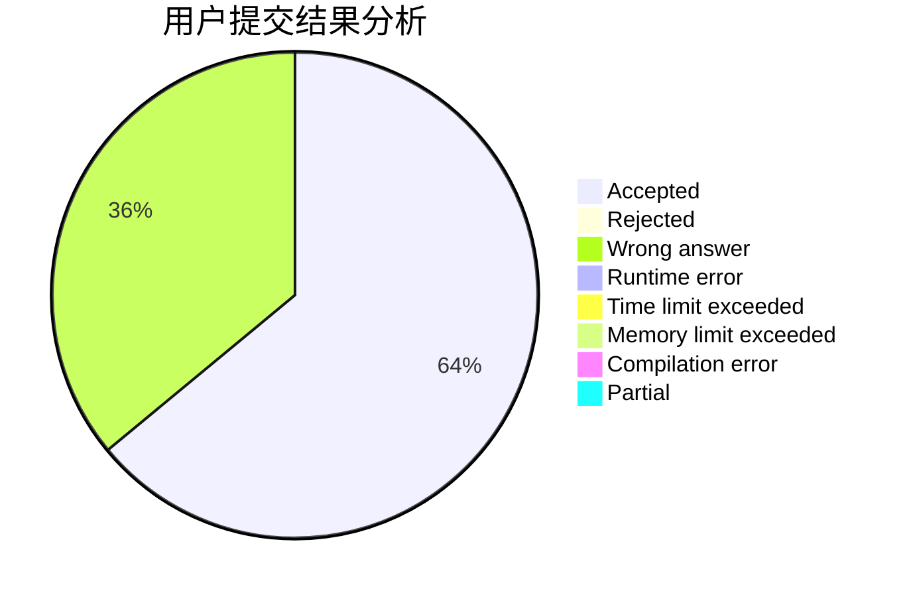
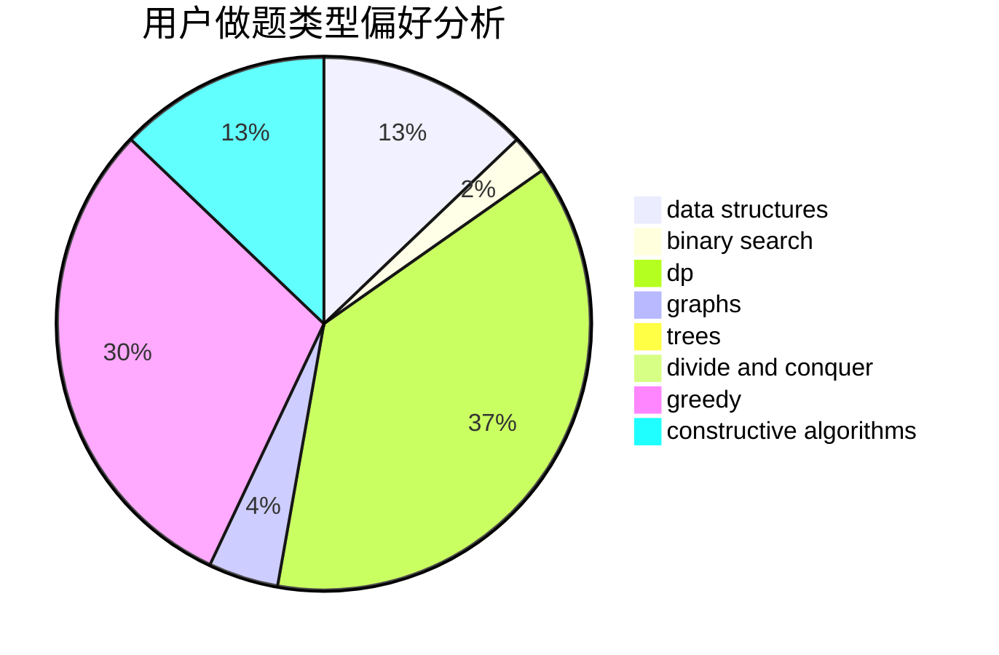
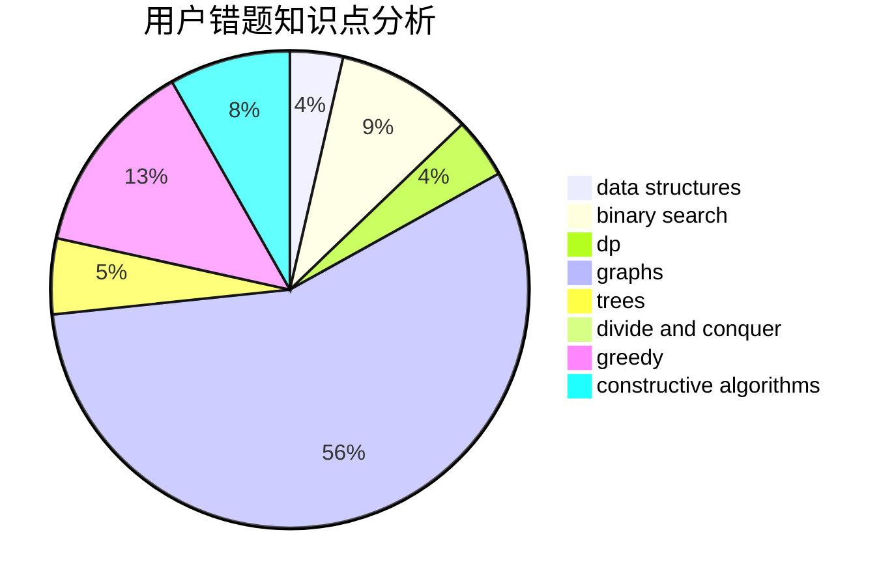

# mfdy
<!-- tabs:start -->
#### **用户提交结果分析**

#### **用户做题类型偏好分析**

#### **用户错题知识点分析**

<!-- tabs:end -->
# 推荐题目
[Pekora and Trampoline](http://codeforces.com/problemset/problem/1491/C)		brute force,
                        data structures,
                        dp,
                        greedy,
                        implementation		  
[Tea Queue](http://codeforces.com/problemset/problem/920/B)		implementation		  
[Break Up](https://codeforces.com/contest/701/problem/F)		dfs and similar,
                        graphs		  
[Orac and LCM](http://codeforces.com/problemset/problem/1349/A)		data structures,
                        math,
                        number theory		  
[Dead Ends](http://codeforces.com/problemset/problem/53/E)		bitmasks,
                        dp		  
[Coach](http://codeforces.com/problemset/problem/300/B)		brute force,
                        dfs and similar,
                        graphs		  
[Ehab and a Special Coloring Problem](http://codeforces.com/problemset/problem/1174/C)		constructive algorithms,
                        number theory		  
[Prince's Problem](http://codeforces.com/problemset/problem/986/E)		brute force,
                        data structures,
                        math,
                        number theory,
                        trees		  
[Neko does Maths](http://codeforces.com/problemset/problem/1152/C)		brute force,
                        math,
                        number theory		  
[I_love_\%username\%](http://codeforces.com/problemset/problem/155/A)		brute force		  
<!-- tabs:start -->
#### **data structures**
[Pekora and Trampoline](http://codeforces.com/problemset/problem/1491/C)		brute force,
                        data structures,
                        dp,
                        greedy,
                        implementation		  
[Tea Queue](http://codeforces.com/problemset/problem/1349/A)		data structures,
                        math,
                        number theory		  
[Break Up](http://codeforces.com/problemset/problem/986/E)		brute force,
                        data structures,
                        math,
                        number theory,
                        trees		  
[Orac and LCM](http://codeforces.com/problemset/problem/1119/F)		data structures,
                        dp,
                        trees		  
[Dead Ends](http://codeforces.com/problemset/problem/403/E)		data structures,
                        implementation,
                        trees		  
[Coach](http://codeforces.com/problemset/problem/204/E)		data structures,
                        implementation,
                        string suffix structures,
                        two pointers		  
[Ehab and a Special Coloring Problem](http://codeforces.com/problemset/problem/1290/A)		brute force,
                        data structures,
                        implementation		  
[Prince's Problem](http://codeforces.com/problemset/problem/446/B)		brute force,
                        data structures,
                        greedy		  
[Neko does Maths](http://codeforces.com/problemset/problem/729/E)		constructive algorithms,
                        data structures,
                        graphs,
                        greedy,
                        sortings		  
[I_love_\%username\%](http://codeforces.com/problemset/problem/232/D)		binary search,
                        data structures,
                        string suffix structures		  
#### **binary search**
[Pekora and Trampoline](http://codeforces.com/problemset/problem/949/D)		binary search,
                        brute force,
                        greedy,
                        sortings		  
[Tea Queue](https://codeforces.com/contest/497/problem/B)		binary search		  
[Break Up](http://codeforces.com/problemset/problem/1244/E)		binary search,
                        constructive algorithms,
                        greedy,
                        sortings,
                        ternary search,
                        two pointers		  
[Orac and LCM](http://codeforces.com/problemset/problem/348/A)		binary search,
                        math,
                        sortings		  
[Dead Ends](http://codeforces.com/problemset/problem/360/B)		binary search,
                        dp		  
[Coach](http://codeforces.com/problemset/problem/938/C)		binary search,
                        brute force,
                        constructive algorithms		  
[Ehab and a Special Coloring Problem](http://codeforces.com/problemset/problem/126/B)		binary search,
                        dp,
                        hashing,
                        string suffix structures,
                        strings		  
[Prince's Problem](http://codeforces.com/problemset/problem/653/D)		binary search,
                        flows,
                        graphs		  
[Neko does Maths](http://codeforces.com/problemset/problem/232/D)		binary search,
                        data structures,
                        string suffix structures		  
[I_love_\%username\%](http://codeforces.com/problemset/problem/607/A)		binary search,
                        dp		  
#### **dp**
[Pekora and Trampoline](http://codeforces.com/problemset/problem/1491/C)		brute force,
                        data structures,
                        dp,
                        greedy,
                        implementation		  
[Tea Queue](http://codeforces.com/problemset/problem/53/E)		bitmasks,
                        dp		  
[Break Up](http://codeforces.com/problemset/problem/1119/F)		data structures,
                        dp,
                        trees		  
[Orac and LCM](http://codeforces.com/problemset/problem/360/B)		binary search,
                        dp		  
[Dead Ends](https://codeforces.com/contest/1345/problem/E)		dfs and similar,
                        dp,
                        graphs,
                        math		  
[Coach](http://codeforces.com/problemset/problem/126/B)		binary search,
                        dp,
                        hashing,
                        string suffix structures,
                        strings		  
[Ehab and a Special Coloring Problem](http://codeforces.com/problemset/problem/909/E)		dfs and similar,
                        dp,
                        graphs,
                        greedy		  
[Prince's Problem](http://codeforces.com/problemset/problem/482/C)		bitmasks,
                        dp,
                        probabilities		  
[Neko does Maths](http://codeforces.com/problemset/problem/1395/C)		bitmasks,
                        brute force,
                        dp,
                        greedy		  
[I_love_\%username\%](http://codeforces.com/problemset/problem/607/A)		binary search,
                        dp		  
#### **graph**
[Pekora and Trampoline](https://codeforces.com/contest/701/problem/F)		dfs and similar,
                        graphs		  
[Tea Queue](http://codeforces.com/problemset/problem/300/B)		brute force,
                        dfs and similar,
                        graphs		  
[Break Up](https://codeforces.com/contest/1345/problem/E)		dfs and similar,
                        dp,
                        graphs,
                        math		  
[Orac and LCM](http://codeforces.com/problemset/problem/729/E)		constructive algorithms,
                        data structures,
                        graphs,
                        greedy,
                        sortings		  
[Dead Ends](http://codeforces.com/problemset/problem/909/E)		dfs and similar,
                        dp,
                        graphs,
                        greedy		  
[Coach](http://codeforces.com/problemset/problem/653/D)		binary search,
                        flows,
                        graphs		  
[Ehab and a Special Coloring Problem](http://codeforces.com/problemset/problem/521/E)		dfs and similar,
                        graphs		  
[Prince's Problem](http://codeforces.com/problemset/problem/1487/C)		brute force,
                        constructive algorithms,
                        dfs and similar,
                        graphs,
                        greedy,
                        implementation,
                        math		  
[Neko does Maths](http://codeforces.com/problemset/problem/1437/C)		dp,
                        flows,
                        graph matchings,
                        greedy,
                        math,
                        sortings		  
[I_love_\%username\%](http://codeforces.com/problemset/problem/1470/D)		constructive algorithms,
                        dfs and similar,
                        graph matchings,
                        graphs,
                        greedy		  
#### **trees**
[Pekora and Trampoline](http://codeforces.com/problemset/problem/986/E)		brute force,
                        data structures,
                        math,
                        number theory,
                        trees		  
[Tea Queue](http://codeforces.com/problemset/problem/1119/F)		data structures,
                        dp,
                        trees		  
[Break Up](http://codeforces.com/problemset/problem/403/E)		data structures,
                        implementation,
                        trees		  
[Orac and LCM](http://codeforces.com/problemset/problem/578/F)		matrices,
                        trees		  
[Dead Ends](https://codeforces.com/contest/430/problem/C)		dfs and similar,
                        trees		  
[Coach](http://codeforces.com/problemset/problem/1479/D)		binary search,
                        bitmasks,
                        brute force,
                        data structures,
                        probabilities,
                        trees		  
[Ehab and a Special Coloring Problem](http://codeforces.com/problemset/problem/1511/C)		brute force,
                        data structures,
                        implementation,
                        trees		  
[Prince's Problem](http://codeforces.com/problemset/problem/1499/F)		combinatorics,
                        dfs and similar,
                        dp,
                        trees		  
[Neko does Maths](http://codeforces.com/problemset/problem/1491/E)		brute force,
                        dfs and similar,
                        divide and conquer,
                        number theory,
                        trees		  
[I_love_\%username\%](http://codeforces.com/problemset/problem/1466/D)		data structures,
                        greedy,
                        sortings,
                        trees		  
#### **divide and conquer**
[Pekora and Trampoline](http://codeforces.com/problemset/problem/1461/D)		binary search,
                        brute force,
                        data structures,
                        divide and conquer,
                        implementation,
                        sortings		  
[Tea Queue](http://codeforces.com/problemset/problem/1466/G)		combinatorics,
                        divide and conquer,
                        hashing,
                        math,
                        string suffix structures,
                        strings		  
[Break Up](http://codeforces.com/problemset/problem/1490/D)		dfs and similar,
                        divide and conquer,
                        implementation		  
[Orac and LCM](https://codeforces.com/contest/1483/problem/C)		data structures,
                        divide and conquer,
                        dp		  
[Dead Ends](http://codeforces.com/problemset/problem/1491/E)		brute force,
                        dfs and similar,
                        divide and conquer,
                        number theory,
                        trees		  
[Coach](http://codeforces.com/problemset/problem/1303/G)		data structures,
                        divide and conquer,
                        geometry,
                        trees		  
[Ehab and a Special Coloring Problem](http://codeforces.com/problemset/problem/1494/D)		constructive algorithms,
                        data structures,
                        dfs and similar,
                        divide and conquer,
                        dsu,
                        greedy,
                        sortings,
                        trees		  
[Prince's Problem](http://codeforces.com/problemset/problem/1482/E)		data structures,
                        divide and conquer,
                        dp		  
[Neko does Maths](http://codeforces.com/problemset/problem/566/C)		dfs and similar,
                        divide and conquer,
                        trees		  
[I_love_\%username\%](http://codeforces.com/problemset/problem/1428/F)		binary search,
                        data structures,
                        divide and conquer,
                        dp,
                        two pointers		  
#### **greedy**
[Pekora and Trampoline](http://codeforces.com/problemset/problem/1491/C)		brute force,
                        data structures,
                        dp,
                        greedy,
                        implementation		  
[Tea Queue](http://codeforces.com/problemset/problem/949/D)		binary search,
                        brute force,
                        greedy,
                        sortings		  
[Break Up](http://codeforces.com/problemset/problem/724/C)		greedy,
                        hashing,
                        implementation,
                        math,
                        number theory,
                        sortings		  
[Orac and LCM](http://codeforces.com/problemset/problem/540/B)		greedy,
                        implementation		  
[Dead Ends](http://codeforces.com/problemset/problem/1244/E)		binary search,
                        constructive algorithms,
                        greedy,
                        sortings,
                        ternary search,
                        two pointers		  
[Coach](http://codeforces.com/problemset/problem/446/B)		brute force,
                        data structures,
                        greedy		  
[Ehab and a Special Coloring Problem](http://codeforces.com/problemset/problem/729/E)		constructive algorithms,
                        data structures,
                        graphs,
                        greedy,
                        sortings		  
[Prince's Problem](http://codeforces.com/problemset/problem/909/E)		dfs and similar,
                        dp,
                        graphs,
                        greedy		  
[Neko does Maths](https://codeforces.com/contest/1071/problem/A)		greedy		  
[I_love_\%username\%](http://codeforces.com/problemset/problem/1395/C)		bitmasks,
                        brute force,
                        dp,
                        greedy		  
#### **constructive algorithms**
[Pekora and Trampoline](http://codeforces.com/problemset/problem/1174/C)		constructive algorithms,
                        number theory		  
[Tea Queue](http://codeforces.com/problemset/problem/1028/B)		constructive algorithms,
                        math		  
[Break Up](http://codeforces.com/problemset/problem/1244/E)		binary search,
                        constructive algorithms,
                        greedy,
                        sortings,
                        ternary search,
                        two pointers		  
[Orac and LCM](http://codeforces.com/problemset/problem/938/C)		binary search,
                        brute force,
                        constructive algorithms		  
[Dead Ends](http://codeforces.com/problemset/problem/729/E)		constructive algorithms,
                        data structures,
                        graphs,
                        greedy,
                        sortings		  
[Coach](http://codeforces.com/problemset/problem/1266/B)		constructive algorithms,
                        math		  
[Ehab and a Special Coloring Problem](http://codeforces.com/problemset/problem/1404/D)		constructive algorithms,
                        dfs and similar,
                        interactive,
                        math,
                        number theory		  
[Prince's Problem](http://codeforces.com/problemset/problem/1493/A)		constructive algorithms,
                        greedy		  
[Neko does Maths](http://codeforces.com/problemset/problem/1463/D)		binary search,
                        constructive algorithms,
                        greedy,
                        two pointers		  
[I_love_\%username\%](https://codeforces.com/contest/1456/problem/B)		bitmasks,
                        brute force,
                        constructive algorithms		  
#### **sortings**
[Pekora and Trampoline](http://codeforces.com/problemset/problem/949/D)		binary search,
                        brute force,
                        greedy,
                        sortings		  
[Tea Queue](http://codeforces.com/problemset/problem/1092/B)		sortings		  
[Break Up](http://codeforces.com/problemset/problem/724/C)		greedy,
                        hashing,
                        implementation,
                        math,
                        number theory,
                        sortings		  
[Orac and LCM](http://codeforces.com/problemset/problem/1244/E)		binary search,
                        constructive algorithms,
                        greedy,
                        sortings,
                        ternary search,
                        two pointers		  
[Dead Ends](http://codeforces.com/problemset/problem/348/A)		binary search,
                        math,
                        sortings		  
[Coach](http://codeforces.com/problemset/problem/729/E)		constructive algorithms,
                        data structures,
                        graphs,
                        greedy,
                        sortings		  
[Ehab and a Special Coloring Problem](https://codeforces.com/contest/1496/problem/C)		geometry,
                        greedy,
                        math,
                        sortings		  
[Prince's Problem](http://codeforces.com/problemset/problem/1495/A)		geometry,
                        greedy,
                        math,
                        sortings		  
[Neko does Maths](http://codeforces.com/problemset/problem/1497/A)		brute force,
                        data structures,
                        greedy,
                        sortings		  
[I_love_\%username\%](http://codeforces.com/problemset/problem/1427/A)		math,
                        sortings		  
<!-- tabs:end -->
