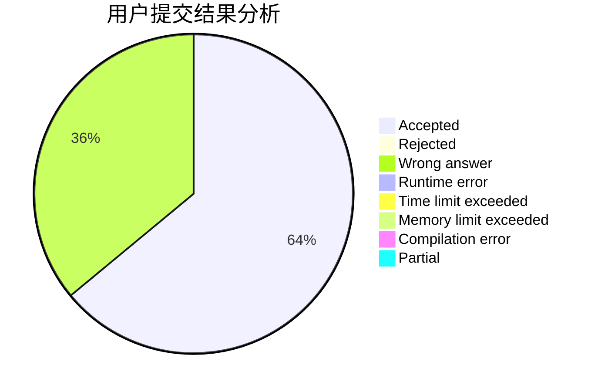
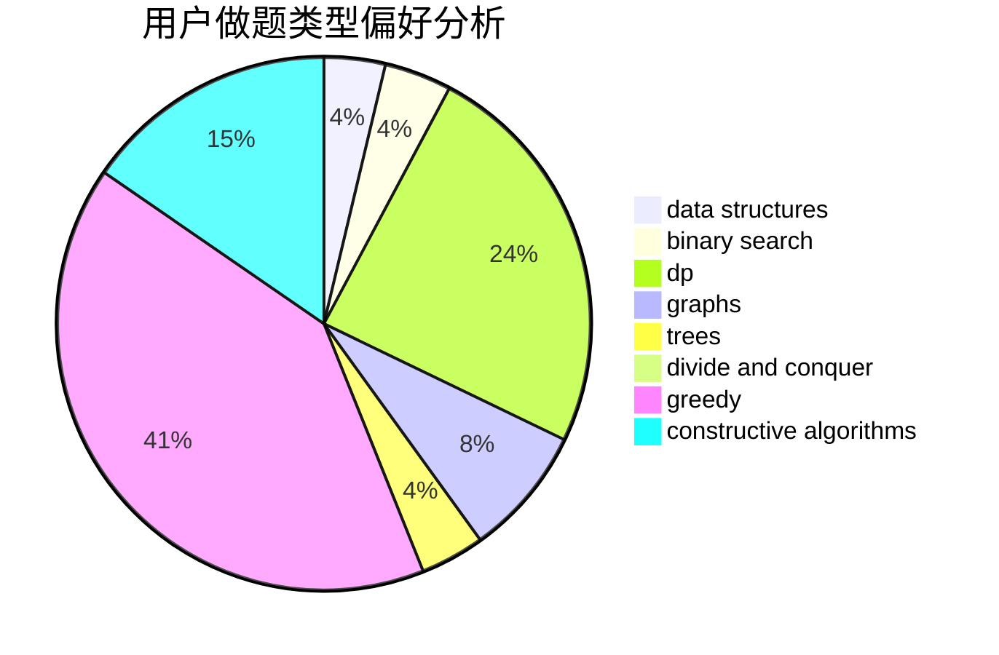
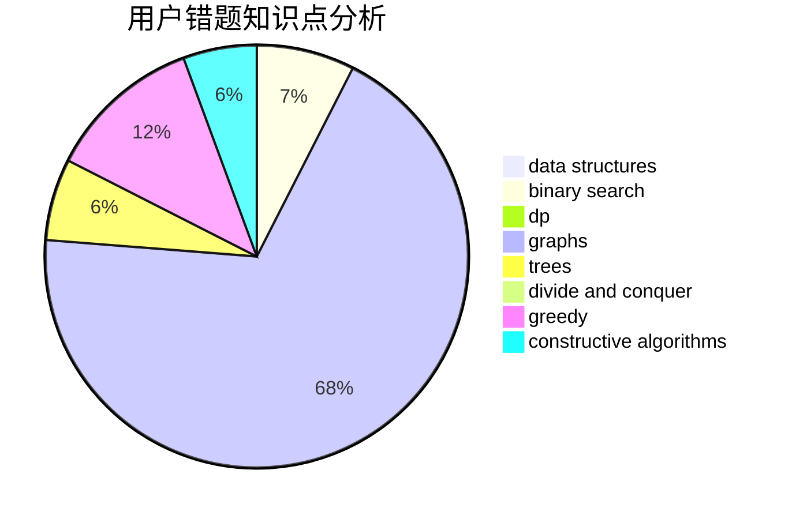

# mfdy

<!-- tabs:start -->

#### **用户提交结果分析**

#### **用户做题类型偏好分析**

#### **用户错题知识点分析**

<!-- tabs:end -->
# 推荐题目
[acmsguru7](https://codeforces.com/contest/acmsguru/problem/7)		dsu,graphs,sortings,trees		  
[940B](https://codeforces.com/contest/940/problem/B)		dp,
                        greedy		  
[560E](https://codeforces.com/contest/560/problem/E)		dsu,graphs,sortings,trees		  
[1029D](https://codeforces.com/contest/1029/problem/D)		implementation,
                        math		  
[372D](https://codeforces.com/contest/372/problem/D)		binary search,
                        data structures,
                        dfs and similar,
                        trees,
                        two pointers		  
[431E](https://codeforces.com/contest/431/problem/E)		binary search,
                        data structures,
                        ternary search		  
[59E](https://codeforces.com/contest/59/problem/E)		graphs,
                        shortest paths		  
[516C](https://codeforces.com/contest/516/problem/C)		dsu,graphs,sortings,trees		  
[176D](https://codeforces.com/contest/176/problem/D)		dp		  
[1154C](https://codeforces.com/contest/1154/problem/C)		implementation,
                        math		  
