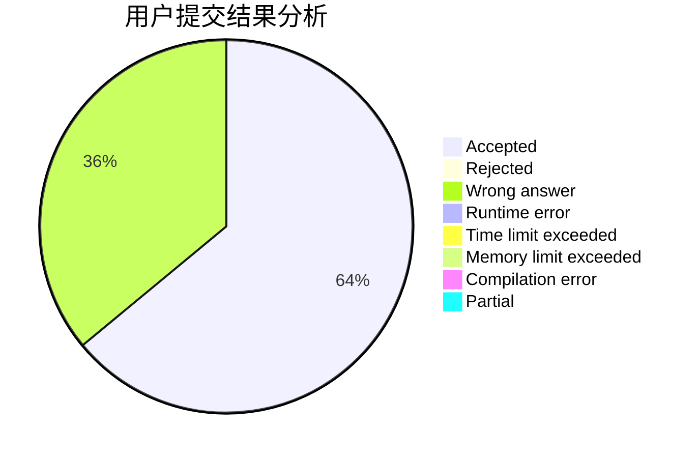
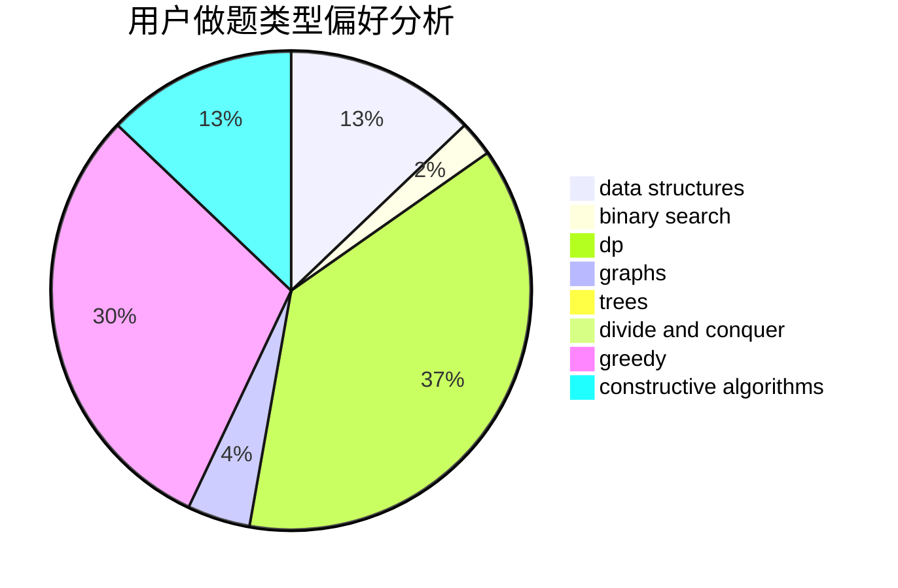
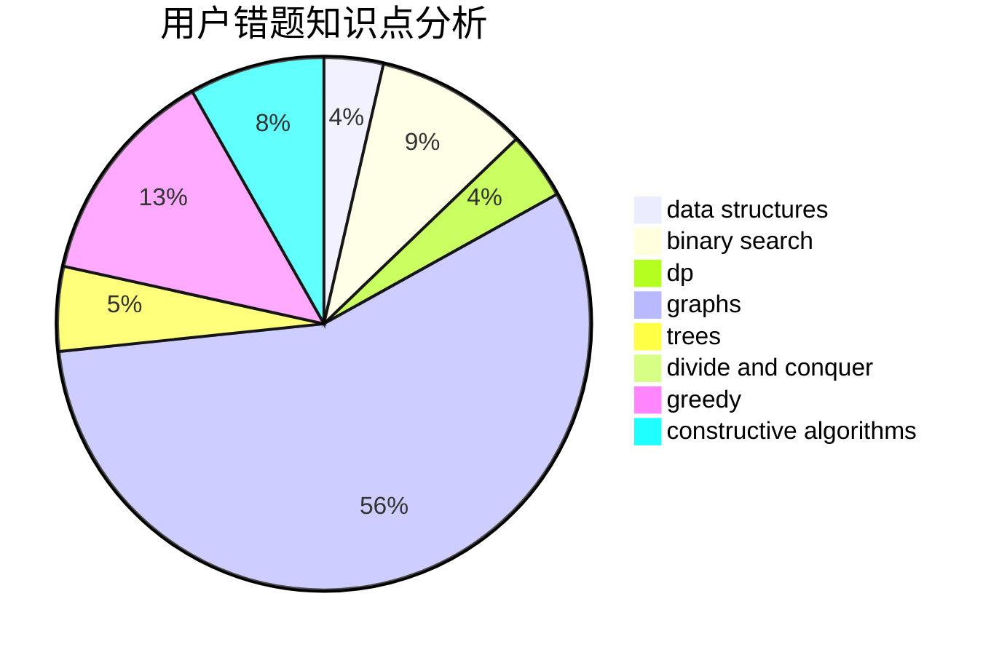

# mfdy

<!-- tabs:start -->

#### **用户提交结果分析**

#### **用户做题类型偏好分析**

#### **用户错题知识点分析**

<!-- tabs:end -->
# 推荐题目
[986E](https://codeforces.com/contest/986/problem/E)		brute force,
                        data structures,
                        math,
                        number theory,
                        trees		  
[920B](https://codeforces.com/contest/920/problem/B)		implementation		  
[53E](https://codeforces.com/contest/53/problem/E)		bitmasks,
                        dp		  
[1029A](https://codeforces.com/contest/1029/problem/A)		implementation,
                        strings		  
[348A](https://codeforces.com/contest/348/problem/A)		binary search,
                        math,
                        sortings		  
[403E](https://codeforces.com/contest/403/problem/E)		data structures,
                        implementation,
                        trees		  
[578F](https://codeforces.com/contest/578/problem/F)		matrices,
                        trees		  
[497B](https://codeforces.com/contest/497/problem/B)		dsu,graphs,sortings,trees		  
[155A](https://codeforces.com/contest/155/problem/A)		brute force		  
[1152C](https://codeforces.com/contest/1152/problem/C)		brute force,
                        math,
                        number theory		  
