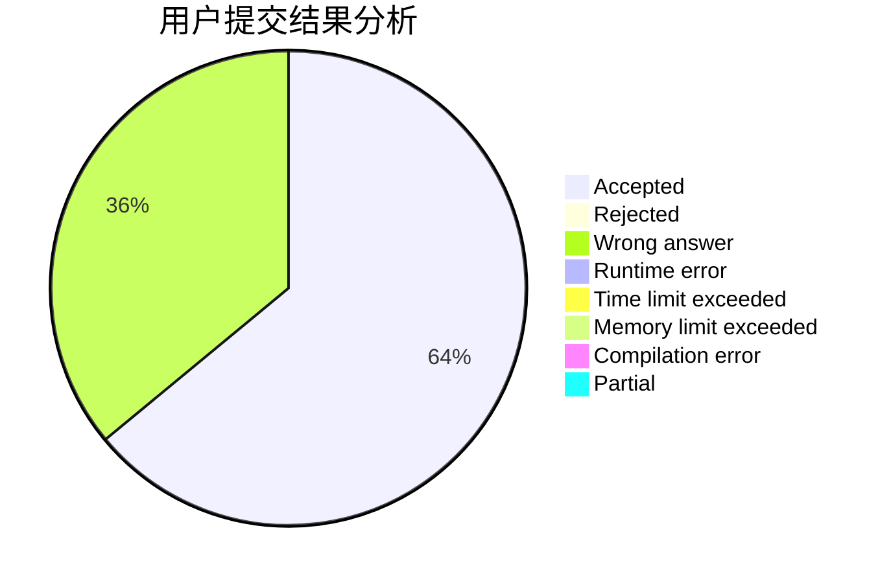
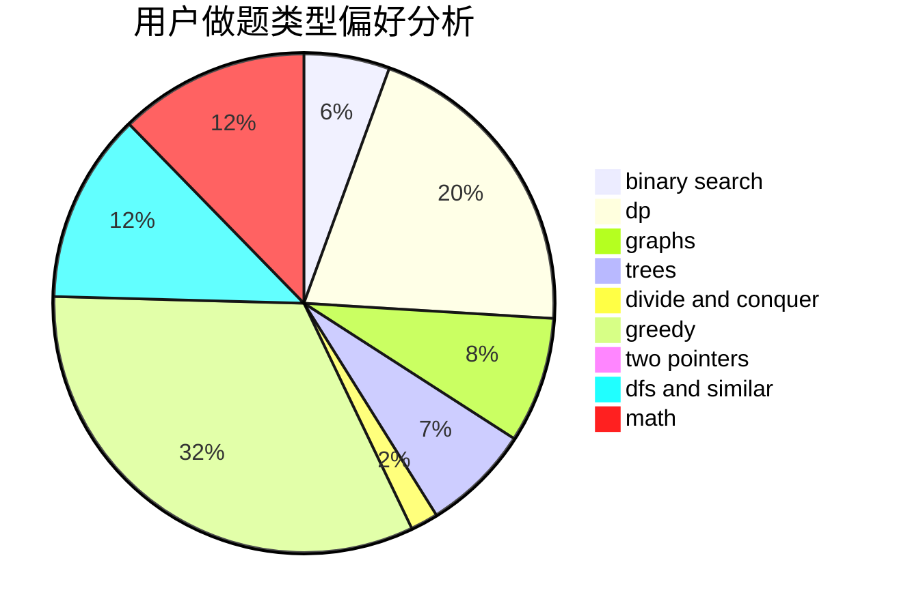

# mfdy

<!-- tabs:start -->

#### **用户提交结果分析**

#### **用户做题类型偏好分析**

<!-- tabs:end -->
# 推荐题目
[acmsguru7](https://codeforces.com/contest/acmsguru/problem/7)
[940B](https://codeforces.com/contest/940/problem/B)
[560E](https://codeforces.com/contest/560/problem/E)
[1029D](https://codeforces.com/contest/1029/problem/D)
[372D](https://codeforces.com/contest/372/problem/D)
[431E](https://codeforces.com/contest/431/problem/E)
[59E](https://codeforces.com/contest/59/problem/E)
[516C](https://codeforces.com/contest/516/problem/C)
[176D](https://codeforces.com/contest/176/problem/D)
[1154C](https://codeforces.com/contest/1154/problem/C)
