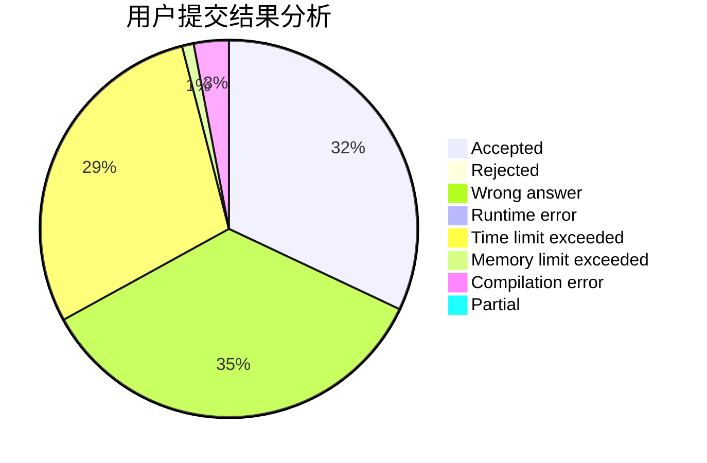
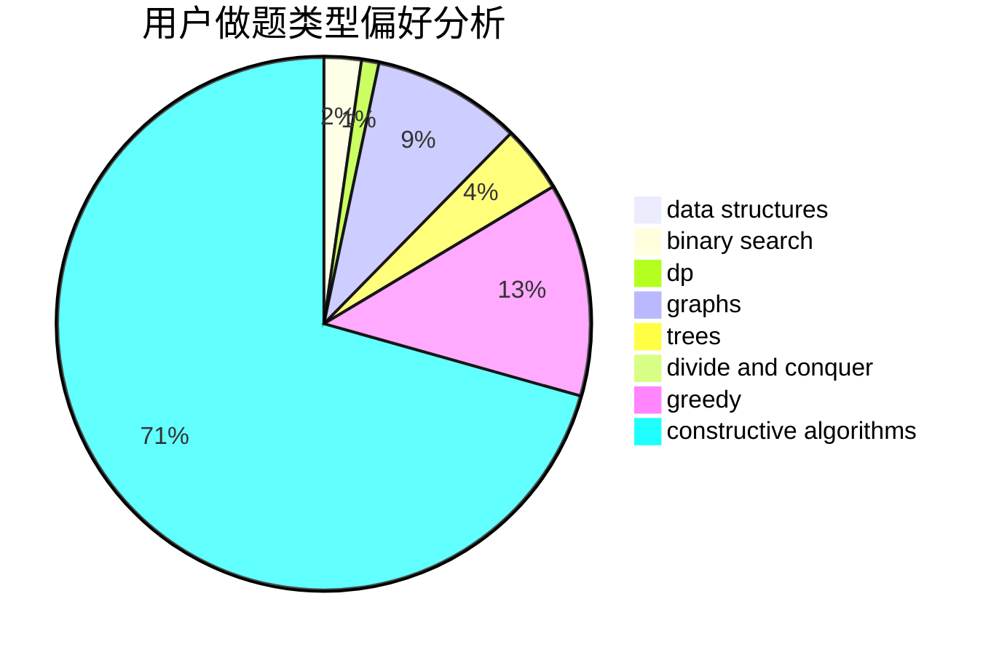
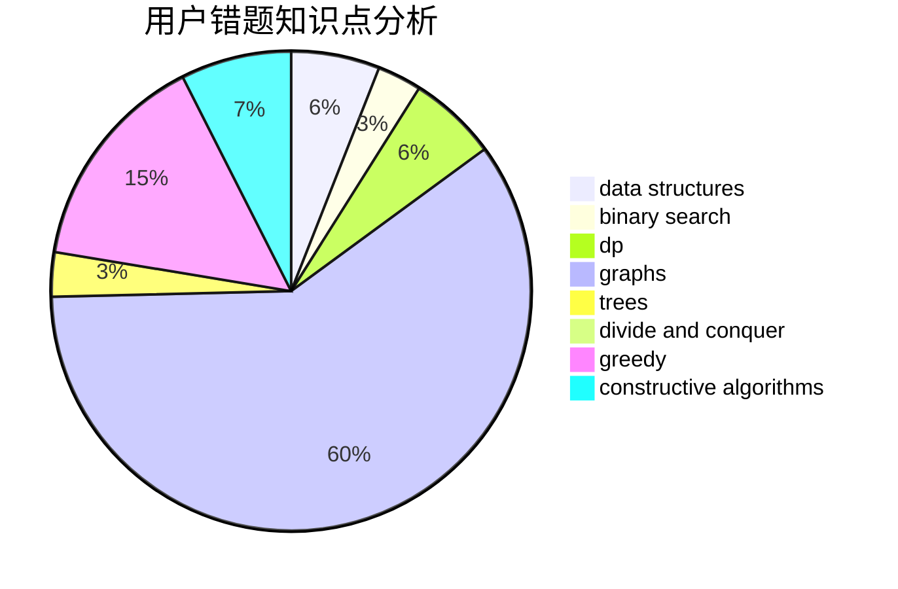

# miao22

<!-- tabs:start -->

#### **用户提交结果分析**

#### **用户做题类型偏好分析**

#### **用户错题知识点分析**

<!-- tabs:end -->
# 推荐题目
[1191B](https://codeforces.com/contest/1191/problem/B)		brute force,
                        implementation		  
[498D](https://codeforces.com/contest/498/problem/D)		data structures,
                        dp,
                        number theory		  
[1080B](https://codeforces.com/contest/1080/problem/B)		math		  
[261B](https://codeforces.com/contest/261/problem/B)		dp,
                        math,
                        probabilities		  
[238D](https://codeforces.com/contest/238/problem/D)		data structures,
                        implementation		  
[597A](https://codeforces.com/contest/597/problem/A)		math		  
[436E](https://codeforces.com/contest/436/problem/E)		data structures,
                        greedy		  
[696B](https://codeforces.com/contest/696/problem/B)		dfs and similar,
                        math,
                        probabilities,
                        trees		  
[510B](https://codeforces.com/contest/510/problem/B)		dfs and similar		  
[1417D](https://codeforces.com/contest/1417/problem/D)		dsu,graphs,sortings,trees		  
