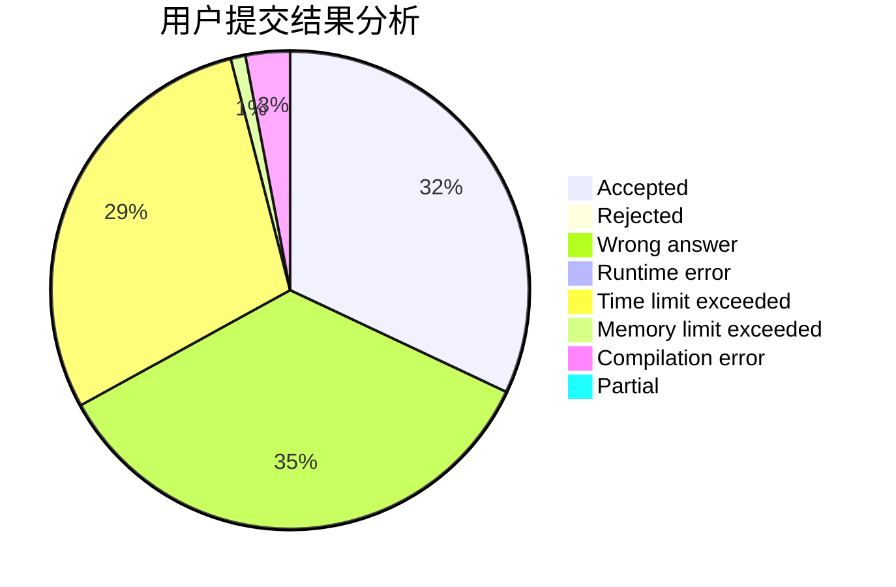
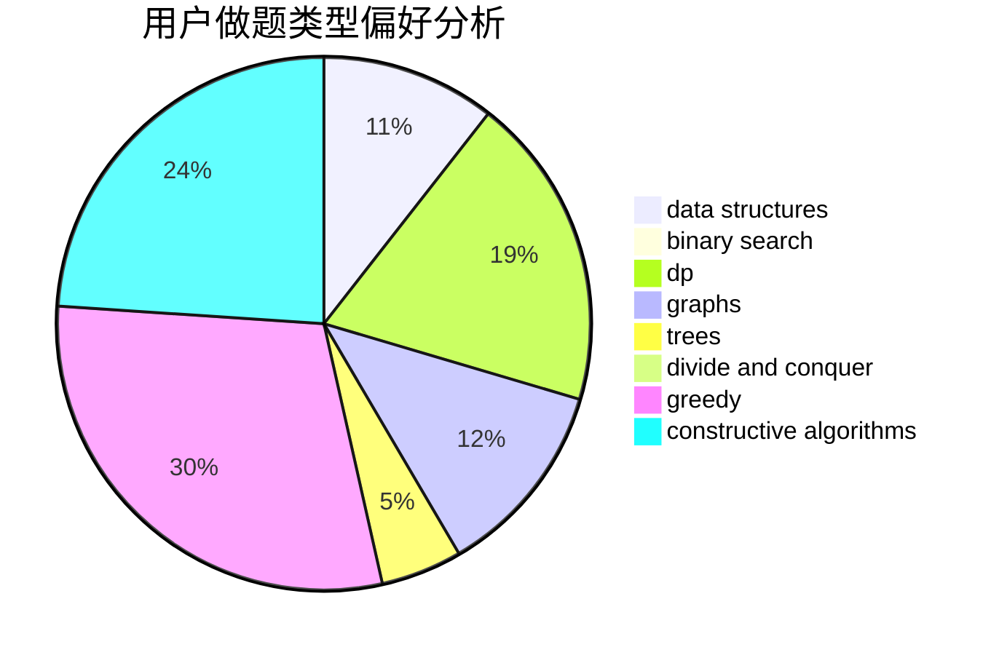
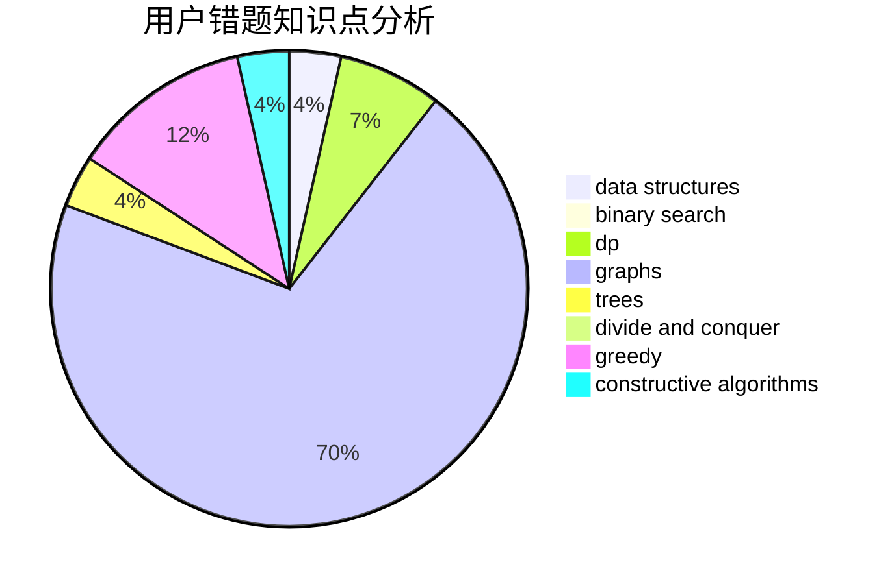

# miao22

<!-- tabs:start -->

#### **用户提交结果分析**

#### **用户做题类型偏好分析**

#### **用户错题知识点分析**

<!-- tabs:end -->
# 推荐题目
[1197A](https://codeforces.com/contest/1197/problem/A)		greedy,
                        math,
                        sortings		  
[519D](https://codeforces.com/contest/519/problem/D)		data structures,
                        dp,
                        two pointers		  
[1080E](https://codeforces.com/contest/1080/problem/E)		strings		  
[279E](https://codeforces.com/contest/279/problem/E)		dp,
                        games,
                        greedy,
                        number theory		  
[260A](https://codeforces.com/contest/260/problem/A)		implementation,
                        math		  
[613E](https://codeforces.com/contest/613/problem/E)		dp,
                        hashing,
                        strings		  
[457E](https://codeforces.com/contest/457/problem/E)		constructive algorithms,
                        flows,
                        math		  
[712E](https://codeforces.com/contest/712/problem/E)		data structures,
                        math,
                        probabilities		  
[533E](https://codeforces.com/contest/533/problem/E)		constructive algorithms,
                        dp,
                        greedy,
                        hashing,
                        strings,
                        two pointers		  
[1425A](https://codeforces.com/contest/1425/problem/A)		games,
                        greedy		  
