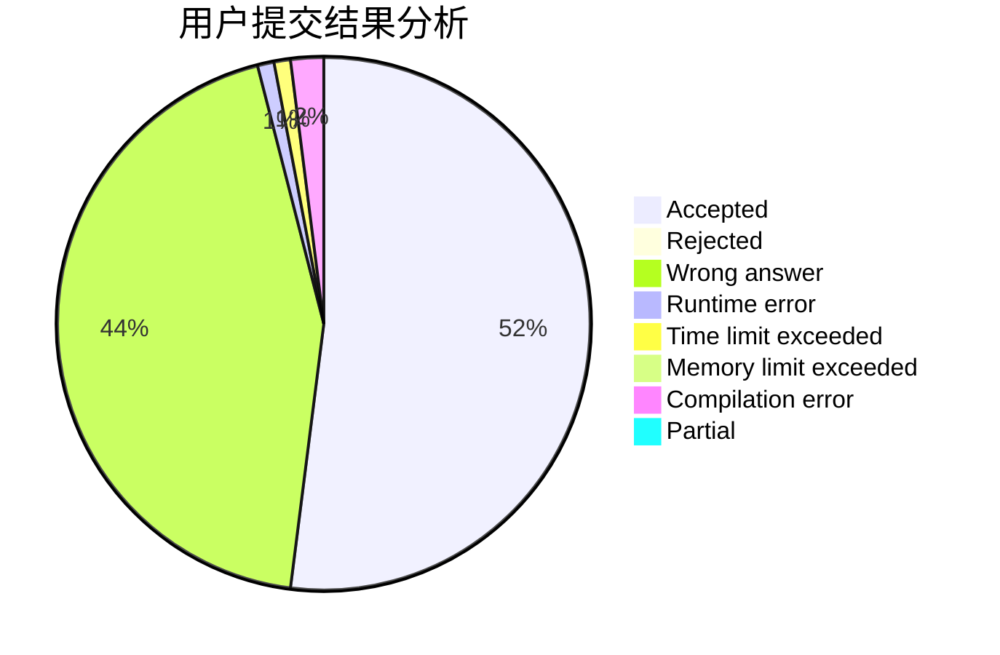
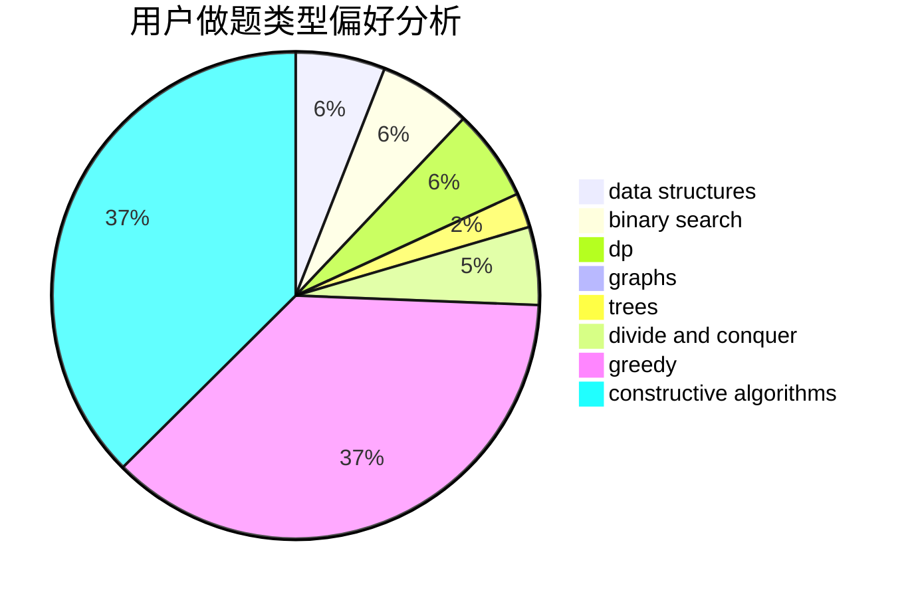
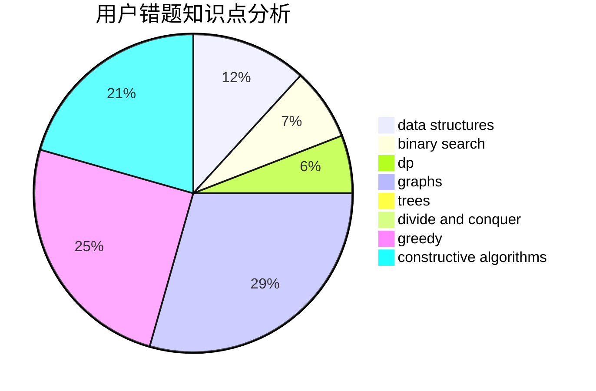

# mig

<!-- tabs:start -->

#### **用户提交结果分析**

#### **用户做题类型偏好分析**

#### **用户错题知识点分析**

<!-- tabs:end -->
# 推荐题目
[835E](https://codeforces.com/contest/835/problem/E)		binary search,
                        constructive algorithms,
                        interactive		  
[750C](https://codeforces.com/contest/750/problem/C)		binary search,
                        greedy,
                        math		  
[1270A](https://codeforces.com/contest/1270/problem/A)		games,
                        greedy,
                        math		  
[392B](https://codeforces.com/contest/392/problem/B)		dp		  
[28D](https://codeforces.com/contest/28/problem/D)		binary search,
                        data structures,
                        dp,
                        hashing		  
[125A](https://codeforces.com/contest/125/problem/A)		math		  
[1479D](https://codeforces.com/contest/1479/problem/D)		binary search,
                        bitmasks,
                        brute force,
                        data structures,
                        probabilities,
                        trees		  
[757E](https://codeforces.com/contest/757/problem/E)		brute force,
                        combinatorics,
                        dp,
                        number theory		  
[1179B](https://codeforces.com/contest/1179/problem/B)		constructive algorithms		  
[543A](https://codeforces.com/contest/543/problem/A)		dp		  
