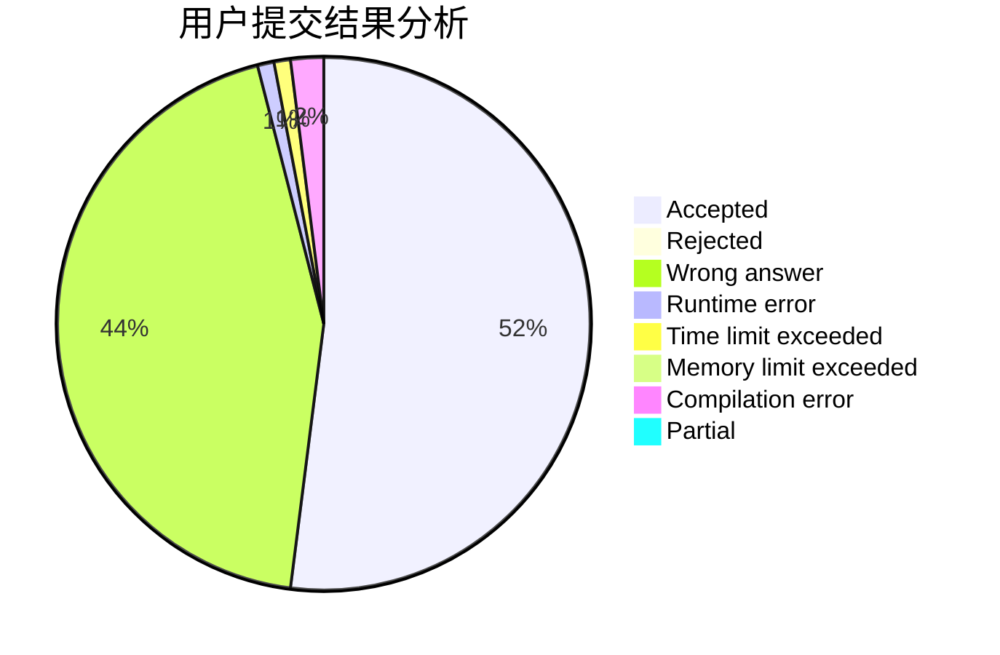
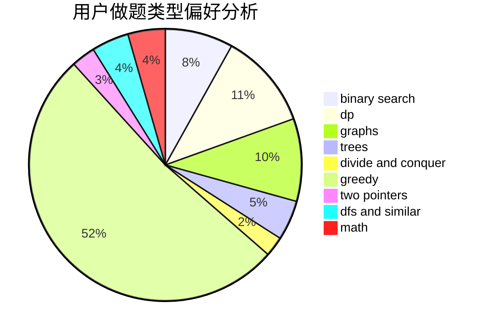

# mig

<!-- tabs:start -->

#### **用户提交结果分析**

#### **用户做题类型偏好分析**

<!-- tabs:end -->
# 推荐题目
[853C](https://codeforces.com/contest/853/problem/C)
[76C](https://codeforces.com/contest/76/problem/C)
[1279A](https://codeforces.com/contest/1279/problem/A)
[421A](https://codeforces.com/contest/421/problem/A)
[304D](https://codeforces.com/contest/304/problem/D)
[1265C](https://codeforces.com/contest/1265/problem/C)
[1488B](https://codeforces.com/contest/1488/problem/B)
[776D](https://codeforces.com/contest/776/problem/D)
[1182A](https://codeforces.com/contest/1182/problem/A)
[567C](https://codeforces.com/contest/567/problem/C)
