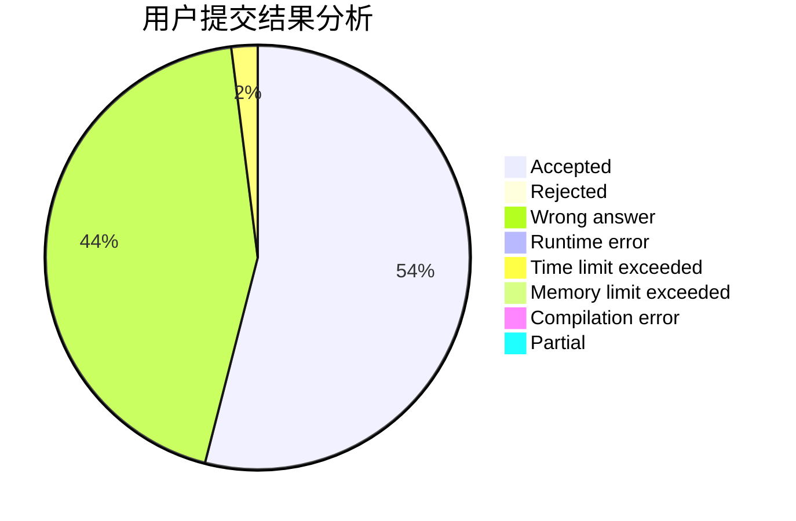
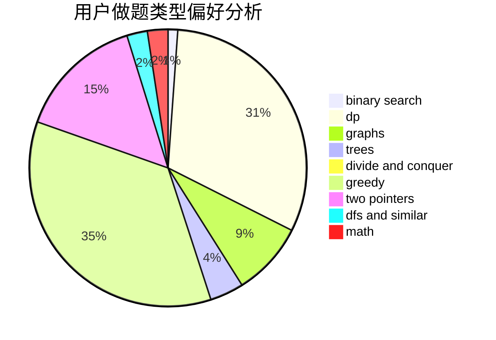

# mike_chu

<!-- tabs:start -->

#### **用户提交结果分析**

#### **用户做题类型偏好分析**

<!-- tabs:end -->
# 推荐题目
[1322C](https://codeforces.com/contest/1322/problem/C)
[548A](https://codeforces.com/contest/548/problem/A)
[916C](https://codeforces.com/contest/916/problem/C)
[291A](https://codeforces.com/contest/291/problem/A)
[132C](https://codeforces.com/contest/132/problem/C)
[1347C](https://codeforces.com/contest/1347/problem/C)
[434A](https://codeforces.com/contest/434/problem/A)
[157C](https://codeforces.com/contest/157/problem/C)
[678B](https://codeforces.com/contest/678/problem/B)
[1088B](https://codeforces.com/contest/1088/problem/B)
