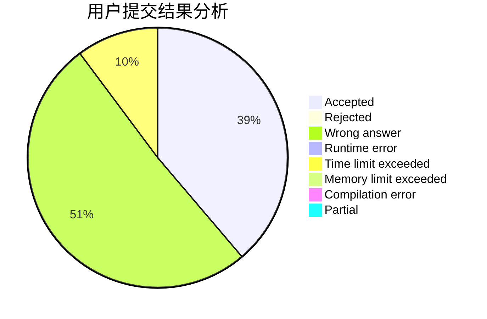
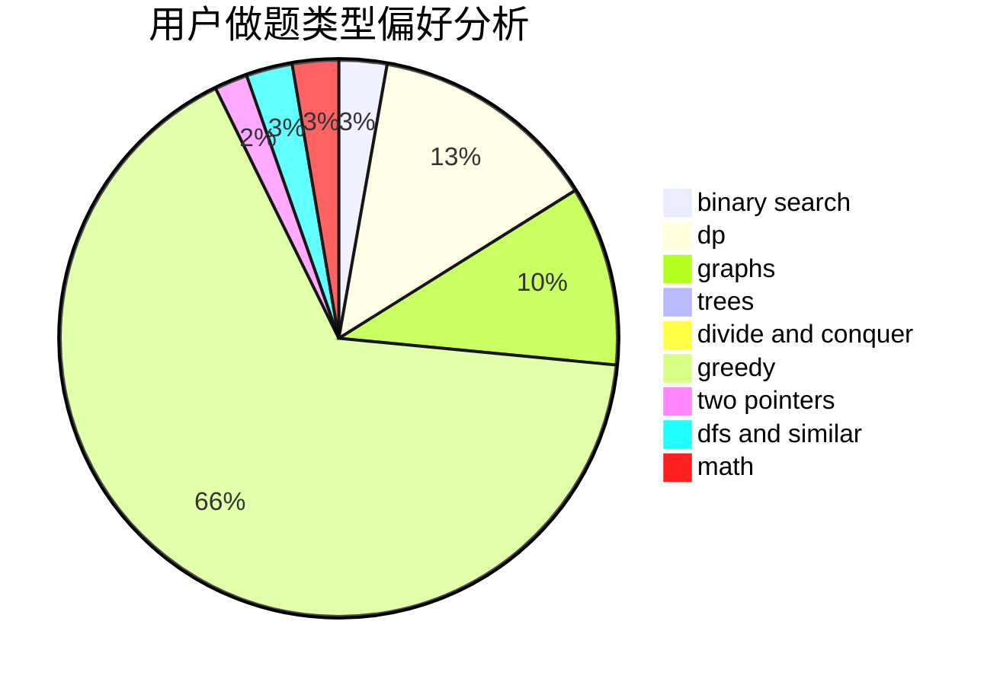

# mikku

<!-- tabs:start -->

#### **用户提交结果分析**

#### **用户做题类型偏好分析**

<!-- tabs:end -->
# 推荐题目
[1349E](https://codeforces.com/contest/1349/problem/E)
[1004B](https://codeforces.com/contest/1004/problem/B)
[166E](https://codeforces.com/contest/166/problem/E)
[1132C](https://codeforces.com/contest/1132/problem/C)
[1063B](https://codeforces.com/contest/1063/problem/B)
[810B](https://codeforces.com/contest/810/problem/B)
[1076B](https://codeforces.com/contest/1076/problem/B)
[789B](https://codeforces.com/contest/789/problem/B)
[1288E](https://codeforces.com/contest/1288/problem/E)
[548C](https://codeforces.com/contest/548/problem/C)
