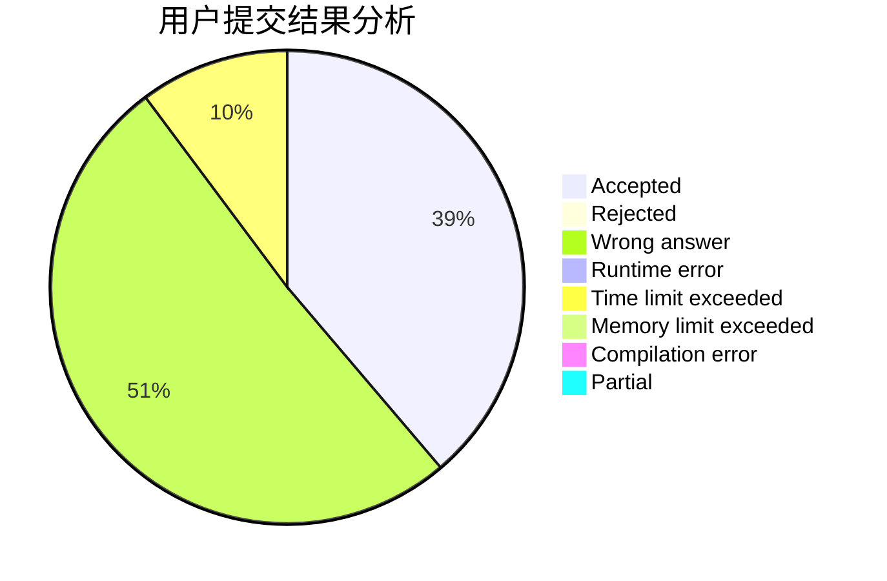
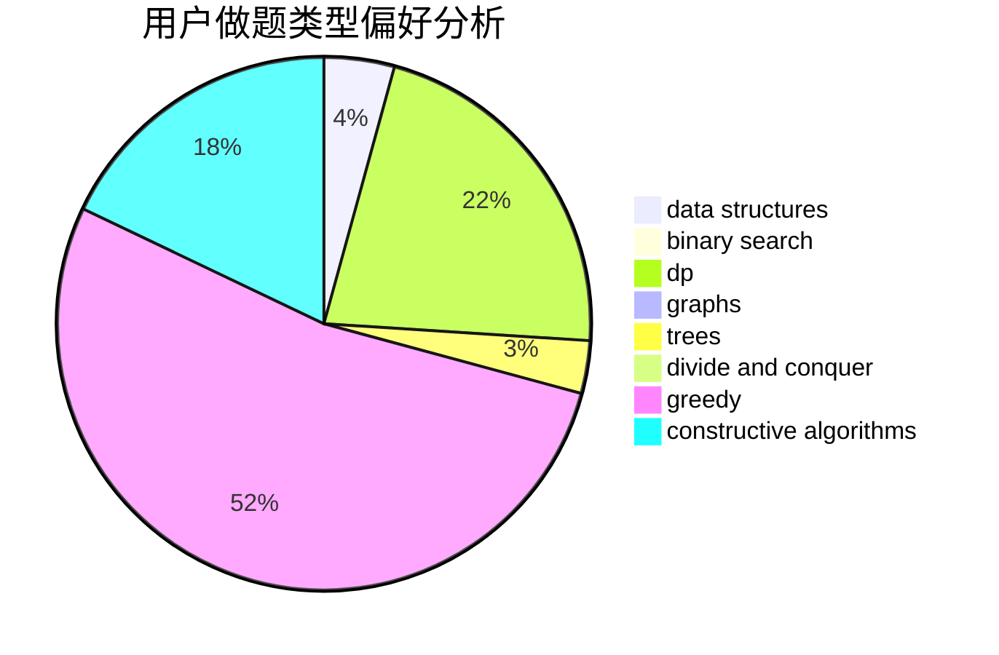

# mikku

<!-- tabs:start -->

#### **用户提交结果分析**

#### **用户做题类型偏好分析**

#### **用户错题知识点分析**

<!-- tabs:end -->
# 推荐题目
[1343A](https://codeforces.com/contest/1343/problem/A)		brute force,
                        math		  
[1003E](https://codeforces.com/contest/1003/problem/E)		constructive algorithms,
                        graphs		  
[1510K](https://codeforces.com/contest/1510/problem/K)		brute force,
                        graphs,
                        implementation		  
[1130C](https://codeforces.com/contest/1130/problem/C)		brute force,
                        dfs and similar,
                        dsu		  
[1062E](https://codeforces.com/contest/1062/problem/E)		binary search,
                        data structures,
                        dfs and similar,
                        greedy,
                        trees		  
[796A](https://codeforces.com/contest/796/problem/A)		brute force,
                        implementation		  
[1074C](https://codeforces.com/contest/1074/problem/C)		dsu,graphs,sortings,trees		  
[76A](https://codeforces.com/contest/76/problem/A)		dsu,
                        graphs,
                        sortings,
                        trees		  
[1282B2](https://codeforces.com/contest/1282B/problem/2)		dp,
                        greedy,
                        sortings		  
[523D](https://codeforces.com/contest/523/problem/D)		*special problem,
                        data structures,
                        implementation		  
