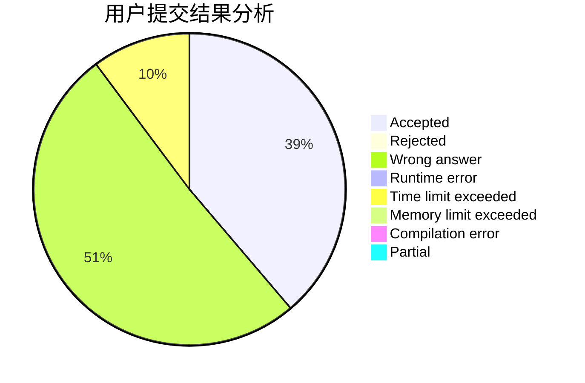
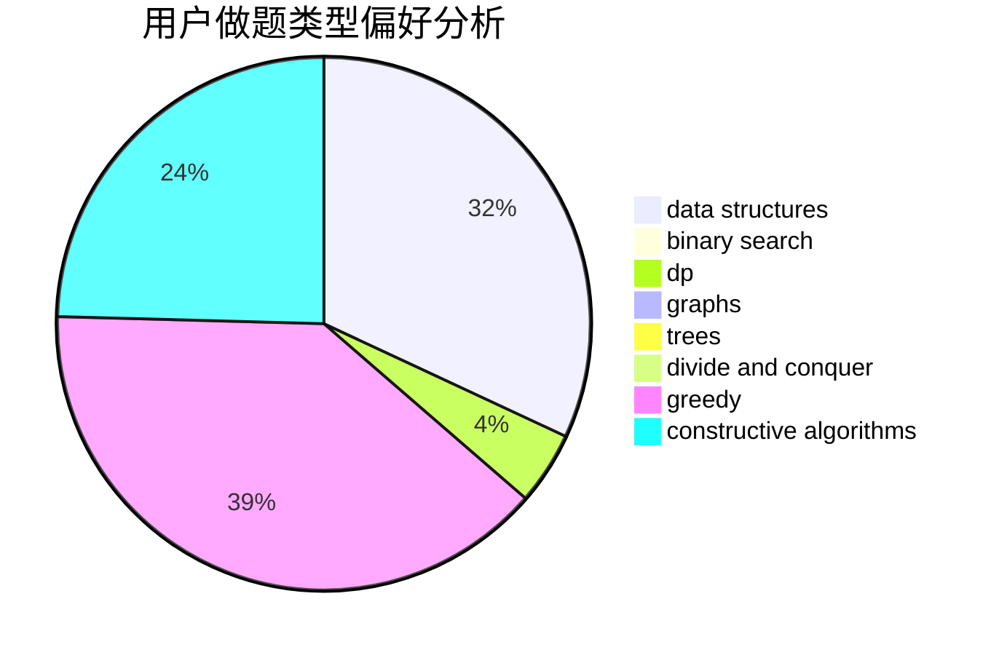

# mikku

<!-- tabs:start -->

#### **用户提交结果分析**

#### **用户做题类型偏好分析**

#### **用户错题知识点分析**

<!-- tabs:end -->
# 推荐题目
[1349E](https://codeforces.com/contest/1349/problem/E)		constructive algorithms,
                        dp,
                        greedy		  
[1004B](https://codeforces.com/contest/1004/problem/B)		constructive algorithms,
                        greedy,
                        implementation,
                        math		  
[166E](https://codeforces.com/contest/166/problem/E)		dp,
                        math,
                        matrices		  
[1132C](https://codeforces.com/contest/1132/problem/C)		brute force		  
[1063B](https://codeforces.com/contest/1063/problem/B)		graphs,
                        shortest paths		  
[810B](https://codeforces.com/contest/810/problem/B)		greedy,
                        sortings		  
[1076B](https://codeforces.com/contest/1076/problem/B)		implementation,
                        math,
                        number theory		  
[789B](https://codeforces.com/contest/789/problem/B)		brute force,
                        implementation,
                        math		  
[1288E](https://codeforces.com/contest/1288/problem/E)		data structures		  
[548C](https://codeforces.com/contest/548/problem/C)		dsu,graphs,sortings,trees		  
