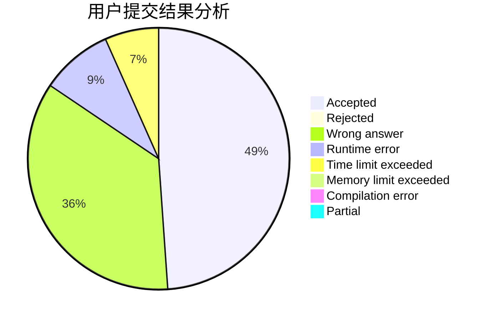
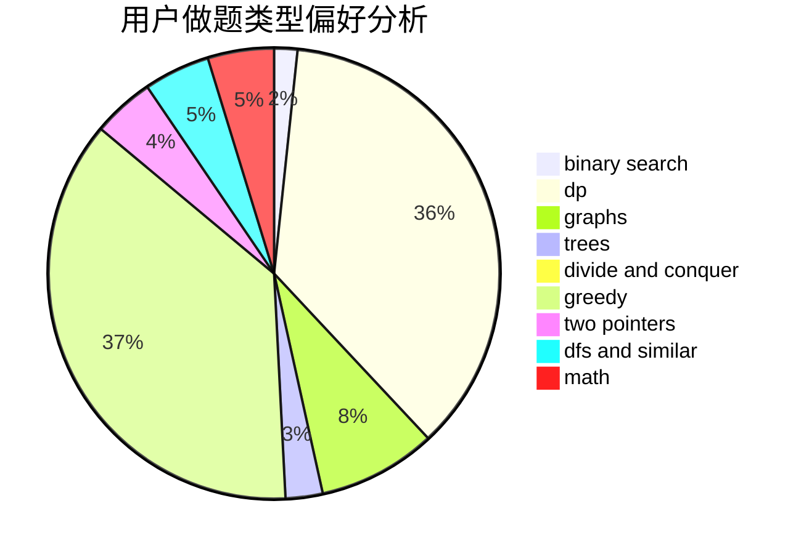

# mingming_0701

<!-- tabs:start -->

#### **用户提交结果分析**

#### **用户做题类型偏好分析**

<!-- tabs:end -->
# 推荐题目
[1428B](https://codeforces.com/contest/1428/problem/B)
[840D](https://codeforces.com/contest/840/problem/D)
[1080E](https://codeforces.com/contest/1080/problem/E)
[1017G](https://codeforces.com/contest/1017/problem/G)
[1265A](https://codeforces.com/contest/1265/problem/A)
[1148E](https://codeforces.com/contest/1148/problem/E)
[837A](https://codeforces.com/contest/837/problem/A)
[540A](https://codeforces.com/contest/540/problem/A)
[976E](https://codeforces.com/contest/976/problem/E)
[676C](https://codeforces.com/contest/676/problem/C)
