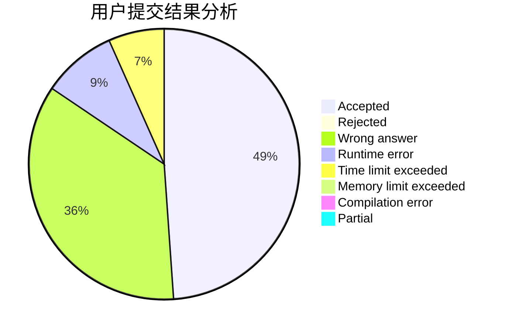
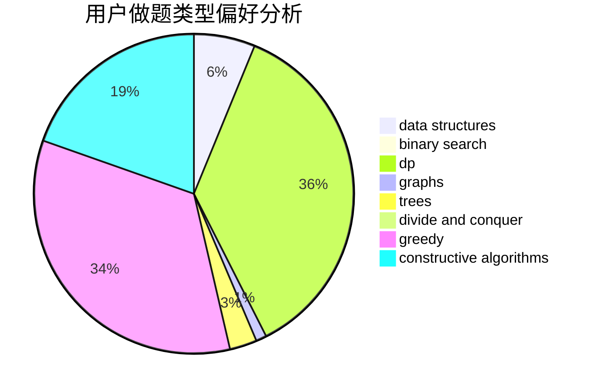
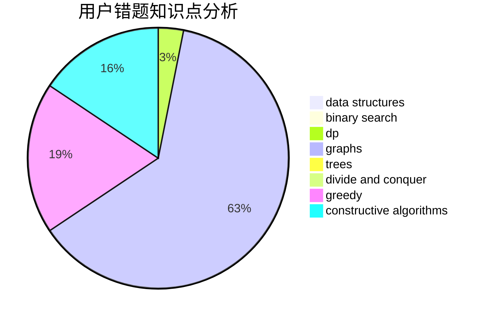

# mingming_0701

<!-- tabs:start -->

#### **用户提交结果分析**

#### **用户做题类型偏好分析**

#### **用户错题知识点分析**

<!-- tabs:end -->
# 推荐题目
[1428B](https://codeforces.com/contest/1428/problem/B)		graphs,
                        implementation		  
[840D](https://codeforces.com/contest/840/problem/D)		data structures,
                        probabilities		  
[1080E](https://codeforces.com/contest/1080/problem/E)		strings		  
[1017G](https://codeforces.com/contest/1017/problem/G)		data structures		  
[1265A](https://codeforces.com/contest/1265/problem/A)		constructive algorithms,
                        greedy		  
[1148E](https://codeforces.com/contest/1148/problem/E)		constructive algorithms,
                        greedy,
                        math,
                        sortings,
                        two pointers		  
[837A](https://codeforces.com/contest/837/problem/A)		implementation		  
[540A](https://codeforces.com/contest/540/problem/A)		implementation		  
[976E](https://codeforces.com/contest/976/problem/E)		greedy,
                        sortings		  
[676C](https://codeforces.com/contest/676/problem/C)		binary search,
                        dp,
                        strings,
                        two pointers		  
