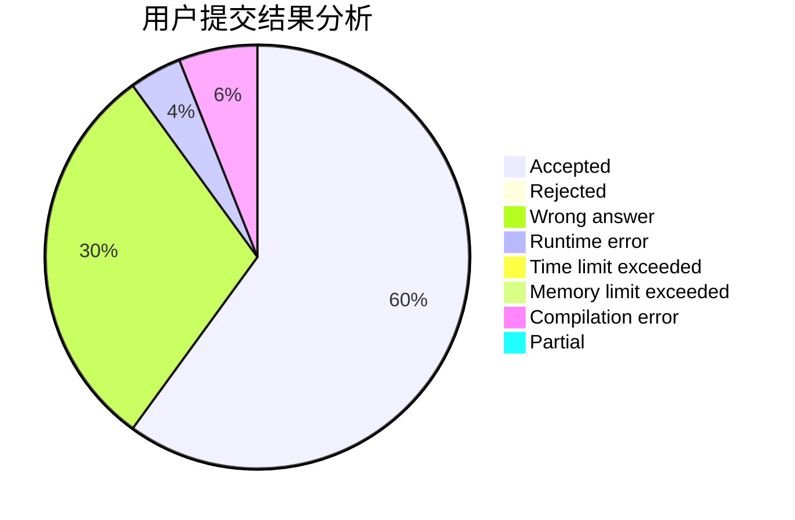
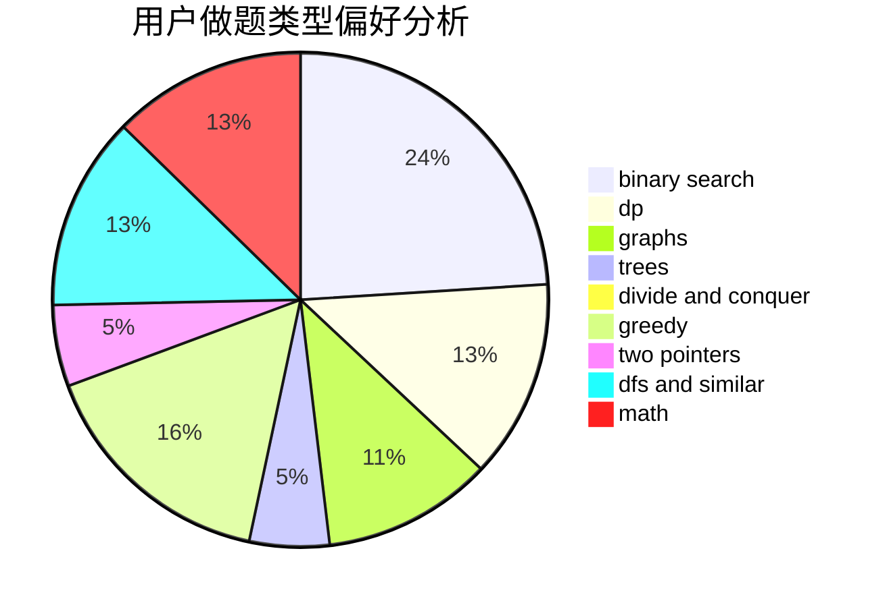

# mio520

<!-- tabs:start -->

#### **用户提交结果分析**

#### **用户做题类型偏好分析**

<!-- tabs:end -->
# 推荐题目
[817A](https://codeforces.com/contest/817/problem/A)
[212E](https://codeforces.com/contest/212/problem/E)
[796D](https://codeforces.com/contest/796/problem/D)
[913B](https://codeforces.com/contest/913/problem/B)
[1091H](https://codeforces.com/contest/1091/problem/H)
[1144F](https://codeforces.com/contest/1144/problem/F)
[1248E](https://codeforces.com/contest/1248/problem/E)
[405D](https://codeforces.com/contest/405/problem/D)
[765C](https://codeforces.com/contest/765/problem/C)
[266B](https://codeforces.com/contest/266/problem/B)
