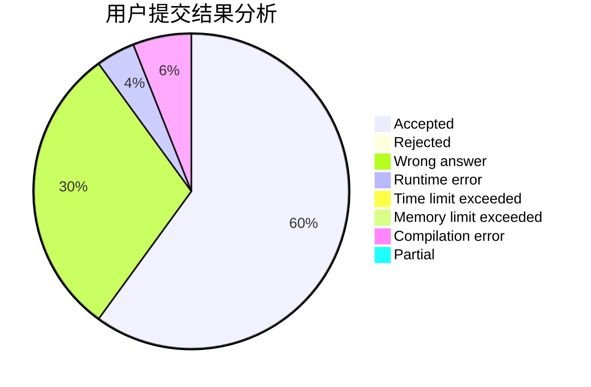
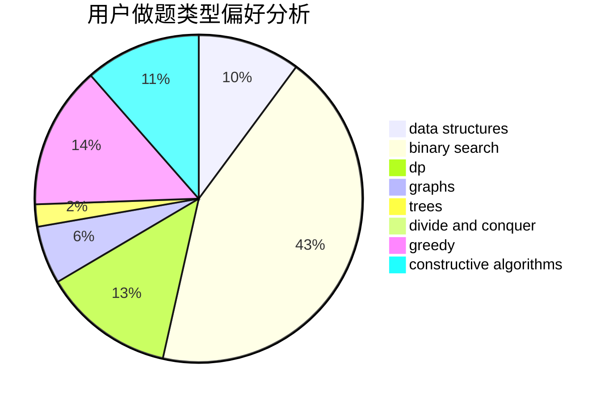
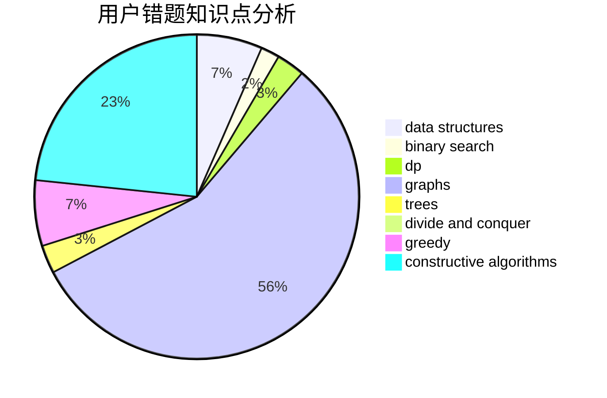

# mio520

<!-- tabs:start -->

#### **用户提交结果分析**

#### **用户做题类型偏好分析**

#### **用户错题知识点分析**

<!-- tabs:end -->
# 推荐题目
[817A](https://codeforces.com/contest/817/problem/A)		implementation,
                        math,
                        number theory		  
[212E](https://codeforces.com/contest/212/problem/E)		dfs and similar,
                        dp,
                        trees		  
[796D](https://codeforces.com/contest/796/problem/D)		constructive algorithms,
                        dfs and similar,
                        dp,
                        graphs,
                        shortest paths,
                        trees		  
[913B](https://codeforces.com/contest/913/problem/B)		implementation,
                        trees		  
[1091H](https://codeforces.com/contest/1091/problem/H)		games		  
[1144F](https://codeforces.com/contest/1144/problem/F)		dfs and similar,
                        graphs		  
[1248E](https://codeforces.com/contest/1248/problem/E)		dsu,graphs,sortings,trees		  
[405D](https://codeforces.com/contest/405/problem/D)		greedy,
                        implementation,
                        math		  
[765C](https://codeforces.com/contest/765/problem/C)		math		  
[266B](https://codeforces.com/contest/266/problem/B)		constructive algorithms,
                        graph matchings,
                        implementation,
                        shortest paths		  
