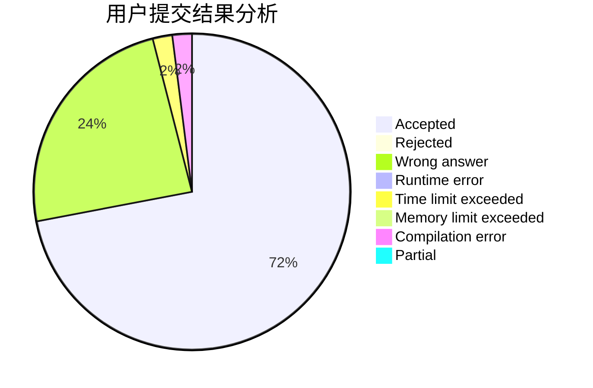
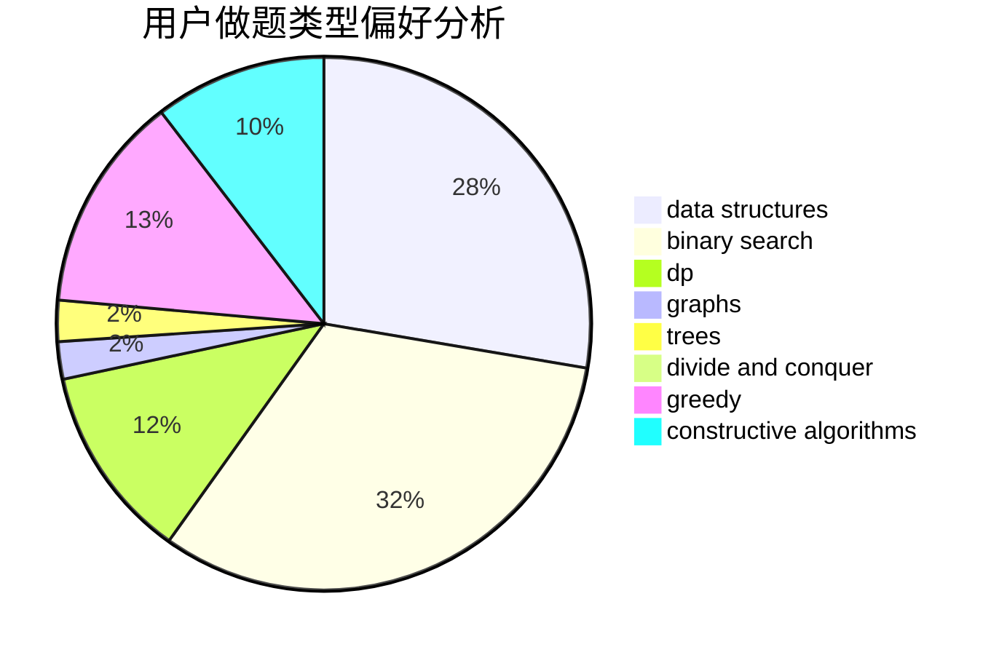
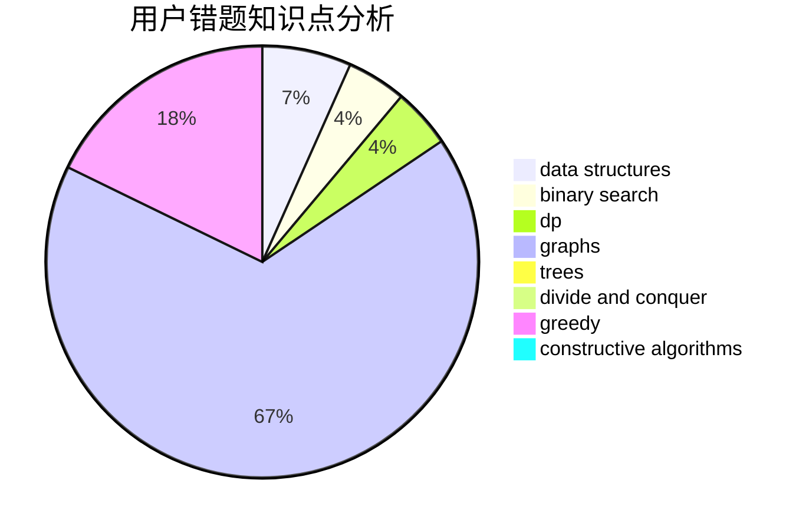

# mitsuri

<!-- tabs:start -->

#### **用户提交结果分析**

#### **用户做题类型偏好分析**

#### **用户错题知识点分析**

<!-- tabs:end -->
# 推荐题目
[417C](https://codeforces.com/contest/417/problem/C)		constructive algorithms,
                        graphs,
                        implementation		  
[629A](https://codeforces.com/contest/629/problem/A)		brute force,
                        combinatorics,
                        constructive algorithms,
                        implementation		  
[759A](https://codeforces.com/contest/759/problem/A)		dsu,graphs,sortings,trees		  
[1147D](https://codeforces.com/contest/1147/problem/D)		dfs and similar,
                        graphs		  
[534F](https://codeforces.com/contest/534/problem/F)		bitmasks,
                        dp,
                        hashing,
                        meet-in-the-middle		  
[158C](https://codeforces.com/contest/158/problem/C)		*special problem,
                        data structures,
                        implementation		  
[194E](https://codeforces.com/contest/194/problem/E)		dsu,graphs,sortings,trees		  
[23A](https://codeforces.com/contest/23/problem/A)		brute force,
                        greedy		  
[1217C](https://codeforces.com/contest/1217/problem/C)		binary search,
                        bitmasks,
                        brute force		  
[704B](https://codeforces.com/contest/704/problem/B)		dp,
                        graphs,
                        greedy		  
