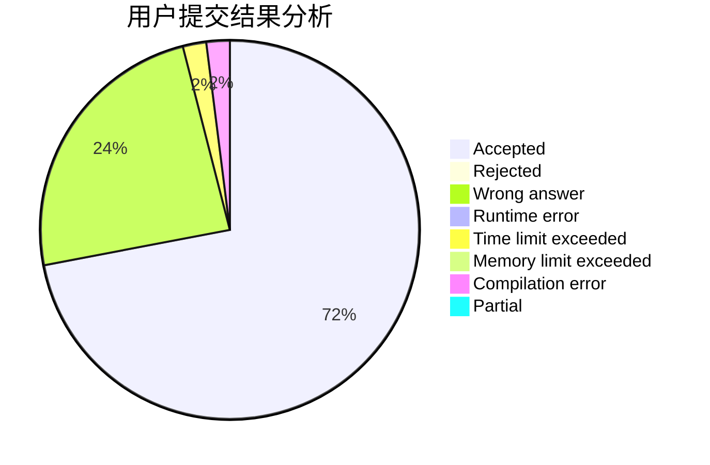
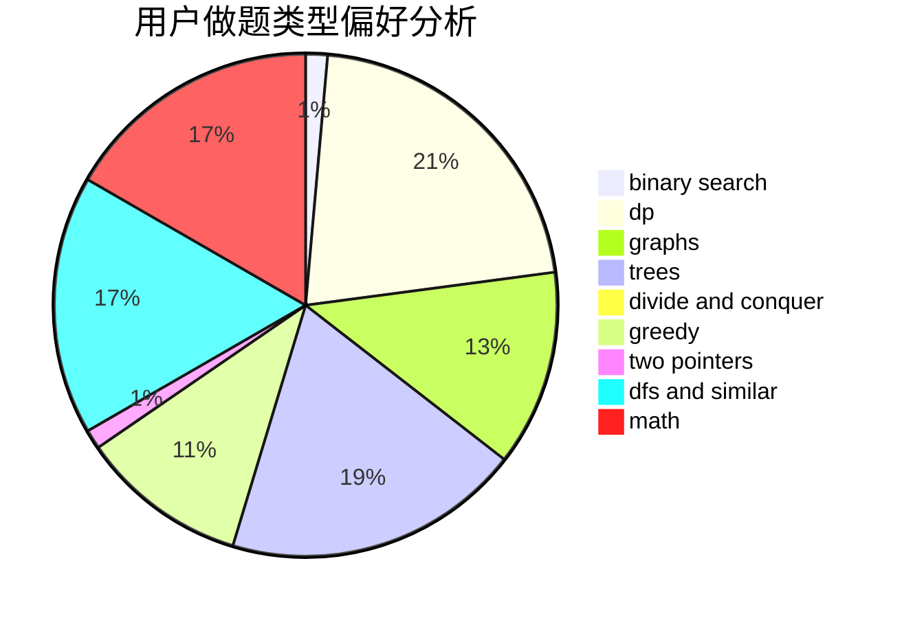

# mitsuri

<!-- tabs:start -->

#### **用户提交结果分析**

#### **用户做题类型偏好分析**

<!-- tabs:end -->
# 推荐题目
[442B](https://codeforces.com/contest/442/problem/B)
[659A](https://codeforces.com/contest/659/problem/A)
[778C](https://codeforces.com/contest/778/problem/C)
[1149C](https://codeforces.com/contest/1149/problem/C)
[557B](https://codeforces.com/contest/557/problem/B)
[180C](https://codeforces.com/contest/180/problem/C)
[218A](https://codeforces.com/contest/218/problem/A)
[260C](https://codeforces.com/contest/260/problem/C)
[1223G](https://codeforces.com/contest/1223/problem/G)
[723B](https://codeforces.com/contest/723/problem/B)
