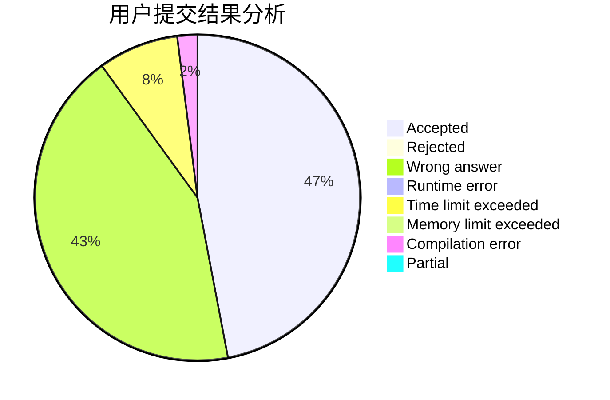
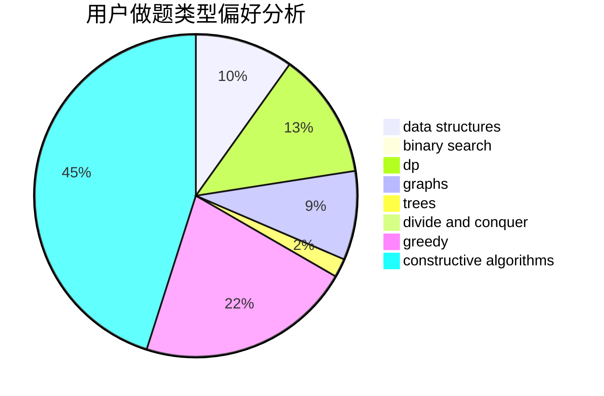
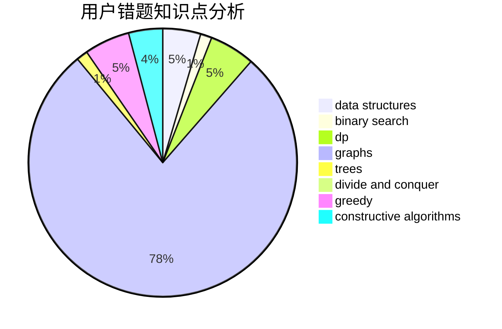

# mlby

<!-- tabs:start -->

#### **用户提交结果分析**

#### **用户做题类型偏好分析**

#### **用户错题知识点分析**

<!-- tabs:end -->
# 推荐题目
[1157E](https://codeforces.com/contest/1157/problem/E)		binary search,
                        data structures,
                        greedy		  
[566D](https://codeforces.com/contest/566/problem/D)		data structures,
                        dsu		  
[911F](https://codeforces.com/contest/911/problem/F)		constructive algorithms,
                        dfs and similar,
                        graphs,
                        greedy,
                        trees		  
[1228D](https://codeforces.com/contest/1228/problem/D)		brute force,
                        constructive algorithms,
                        graphs,
                        hashing,
                        implementation		  
[261E](https://codeforces.com/contest/261/problem/E)		brute force,
                        dp,
                        two pointers		  
[1147A](https://codeforces.com/contest/1147/problem/A)		graphs		  
[131D](https://codeforces.com/contest/131/problem/D)		dfs and similar,
                        graphs		  
[1343B](https://codeforces.com/contest/1343/problem/B)		constructive algorithms,
                        math		  
[13C](https://codeforces.com/contest/13/problem/C)		dp,
                        sortings		  
[787D](https://codeforces.com/contest/787/problem/D)		dsu,graphs,sortings,trees		  
