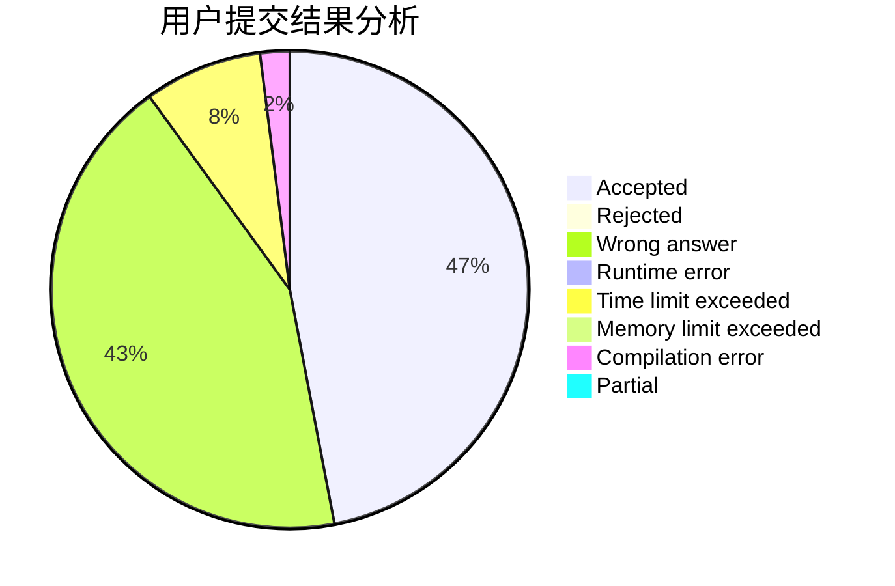
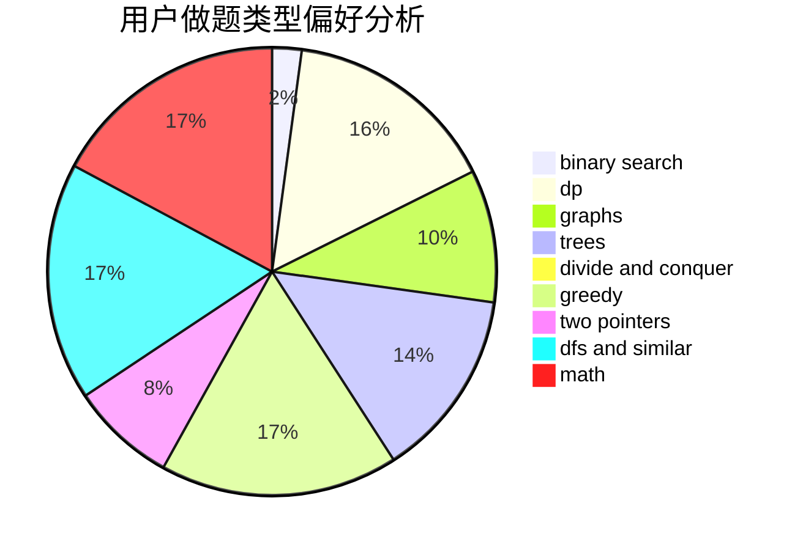

# mlby

<!-- tabs:start -->

#### **用户提交结果分析**

#### **用户做题类型偏好分析**

<!-- tabs:end -->
# 推荐题目
[1157E](https://codeforces.com/contest/1157/problem/E)
[566D](https://codeforces.com/contest/566/problem/D)
[911F](https://codeforces.com/contest/911/problem/F)
[1228D](https://codeforces.com/contest/1228/problem/D)
[261E](https://codeforces.com/contest/261/problem/E)
[1147A](https://codeforces.com/contest/1147/problem/A)
[131D](https://codeforces.com/contest/131/problem/D)
[1343B](https://codeforces.com/contest/1343/problem/B)
[13C](https://codeforces.com/contest/13/problem/C)
[787D](https://codeforces.com/contest/787/problem/D)
