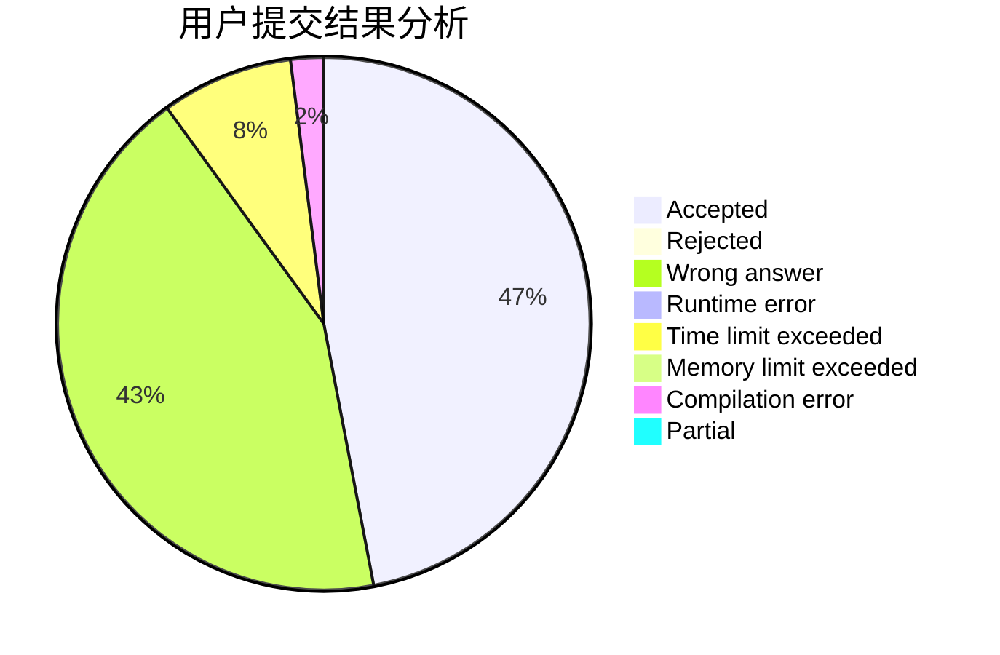
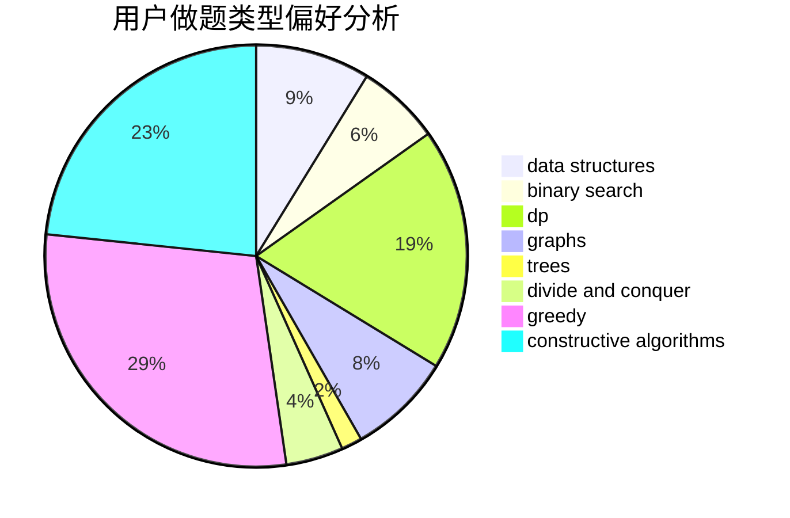
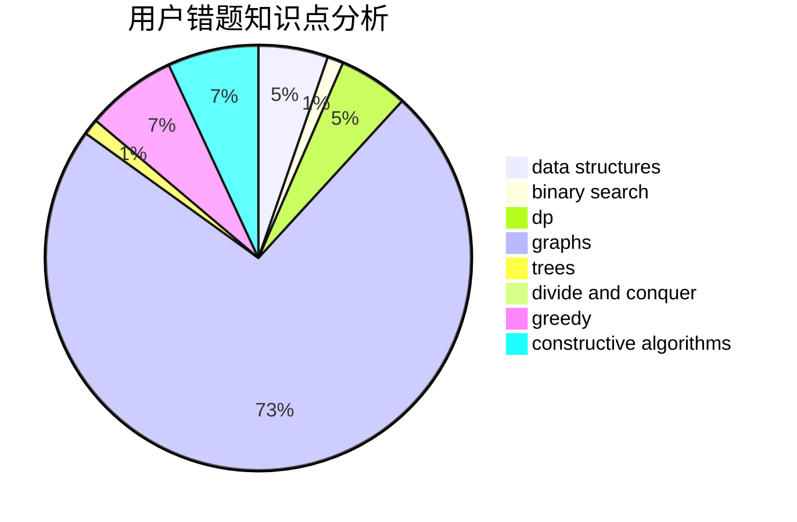

# mlby

<!-- tabs:start -->

#### **用户提交结果分析**

#### **用户做题类型偏好分析**

#### **用户错题知识点分析**

<!-- tabs:end -->
# 推荐题目
[1155F](https://codeforces.com/contest/1155/problem/F)		brute force,
                        dp,
                        graphs		  
[540C](https://codeforces.com/contest/540/problem/C)		dfs and similar		  
[893F](https://codeforces.com/contest/893/problem/F)		data structures,
                        trees		  
[1220D](https://codeforces.com/contest/1220/problem/D)		bitmasks,
                        math,
                        number theory		  
[241B](https://codeforces.com/contest/241/problem/B)		binary search,
                        bitmasks,
                        data structures,
                        math		  
[1144G](https://codeforces.com/contest/1144/problem/G)		dp,
                        greedy		  
[1310E](https://codeforces.com/contest/1310/problem/E)		dp		  
[1336A](https://codeforces.com/contest/1336/problem/A)		dfs and similar,
                        dp,
                        greedy,
                        sortings,
                        trees		  
[1392A](https://codeforces.com/contest/1392/problem/A)		greedy,
                        math		  
[768A](https://codeforces.com/contest/768/problem/A)		constructive algorithms,
                        sortings		  
