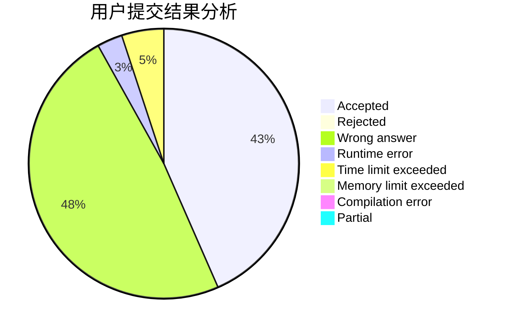
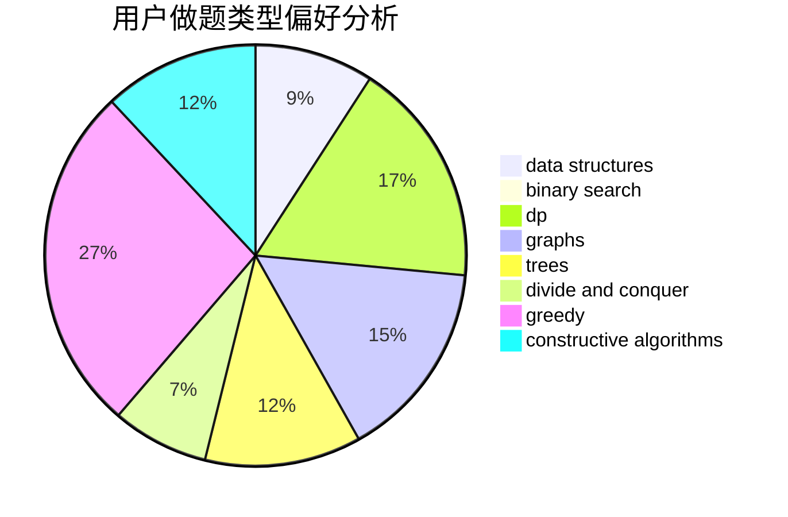

# Boboge

<!-- tabs:start -->

#### **用户提交结果分析**

#### **用户做题类型偏好分析**

#### **用户错题知识点分析**

<!-- tabs:end -->
# 推荐题目
[1510I](https://codeforces.com/contest/1510/problem/I)		greedy,
                        interactive,
                        math,
                        probabilities		  
[576D](https://codeforces.com/contest/576/problem/D)		dp,
                        matrices		  
[370A](https://codeforces.com/contest/370/problem/A)		graphs,
                        math,
                        shortest paths		  
[1064C](https://codeforces.com/contest/1064/problem/C)		dsu,graphs,sortings,trees		  
[489F](https://codeforces.com/contest/489/problem/F)		combinatorics,
                        dp		  
[576C](https://codeforces.com/contest/576/problem/C)		constructive algorithms,
                        divide and conquer,
                        geometry,
                        greedy,
                        sortings		  
[1265A](https://codeforces.com/contest/1265/problem/A)		constructive algorithms,
                        greedy		  
[1060F](https://codeforces.com/contest/1060/problem/F)		combinatorics,
                        dp		  
[459B](https://codeforces.com/contest/459/problem/B)		combinatorics,
                        implementation,
                        sortings		  
[1023F](https://codeforces.com/contest/1023/problem/F)		dfs and similar,
                        dsu,
                        graphs,
                        trees		  
