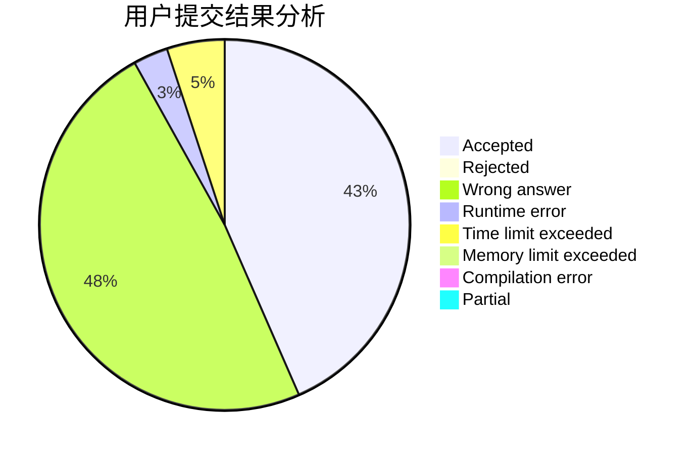
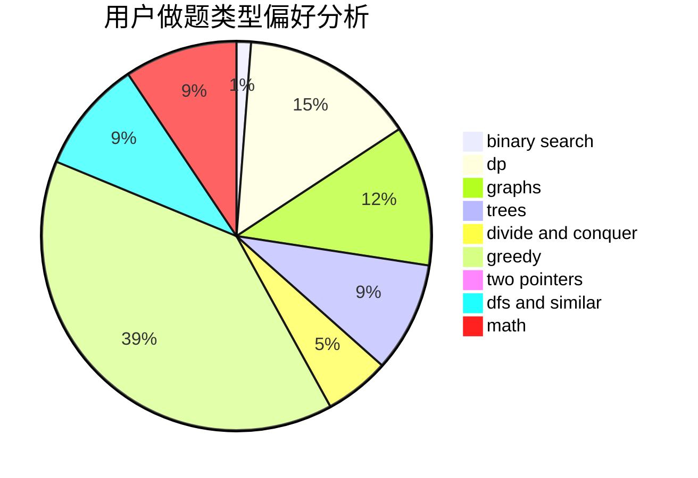

# Boboge

<!-- tabs:start -->

#### **用户提交结果分析**

#### **用户做题类型偏好分析**

<!-- tabs:end -->
# 推荐题目
[1510I](https://codeforces.com/contest/1510/problem/I)
[576D](https://codeforces.com/contest/576/problem/D)
[370A](https://codeforces.com/contest/370/problem/A)
[1064C](https://codeforces.com/contest/1064/problem/C)
[489F](https://codeforces.com/contest/489/problem/F)
[576C](https://codeforces.com/contest/576/problem/C)
[1265A](https://codeforces.com/contest/1265/problem/A)
[1060F](https://codeforces.com/contest/1060/problem/F)
[459B](https://codeforces.com/contest/459/problem/B)
[1023F](https://codeforces.com/contest/1023/problem/F)
