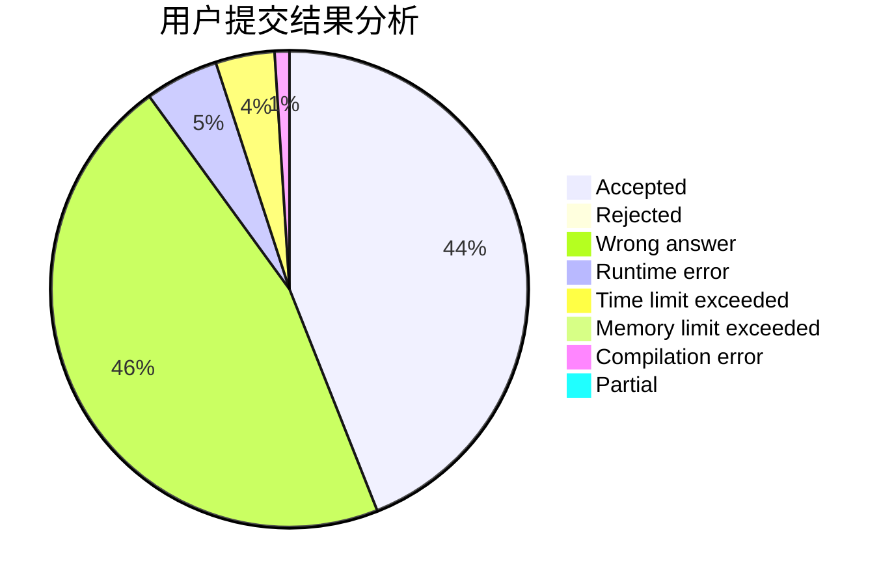
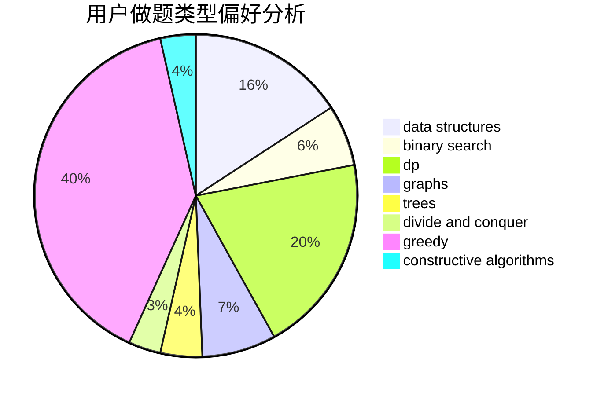
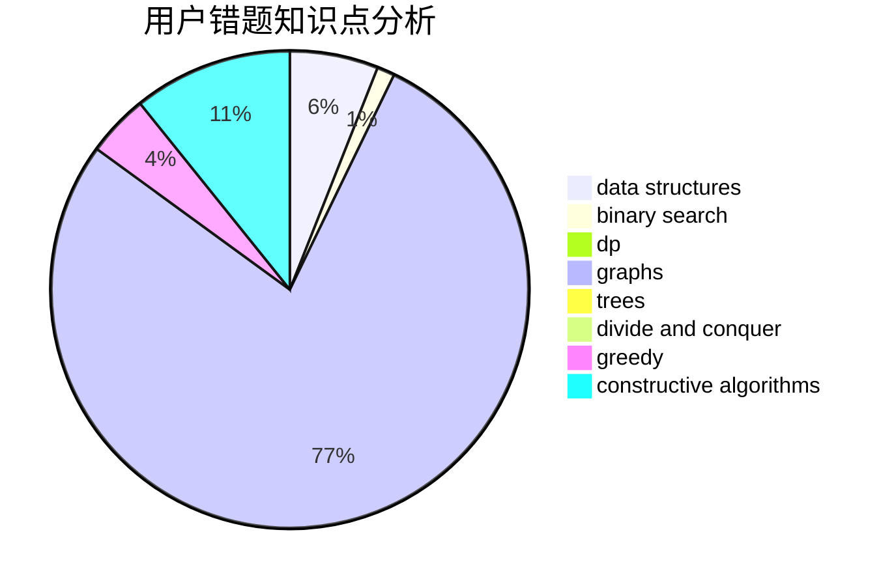

# mlcd

<!-- tabs:start -->

#### **用户提交结果分析**

#### **用户做题类型偏好分析**

#### **用户错题知识点分析**

<!-- tabs:end -->
# 推荐题目
[553E](https://codeforces.com/contest/553/problem/E)		dp,
                        fft,
                        graphs,
                        math,
                        probabilities		  
[936A](https://codeforces.com/contest/936/problem/A)		binary search,
                        implementation,
                        math		  
[1191C](https://codeforces.com/contest/1191/problem/C)		dsu,graphs,sortings,trees		  
[736E](https://codeforces.com/contest/736/problem/E)		constructive algorithms,
                        flows,
                        greedy,
                        math		  
[512C](https://codeforces.com/contest/512/problem/C)		dsu,graphs,sortings,trees		  
[1092B](https://codeforces.com/contest/1092/problem/B)		sortings		  
[858A](https://codeforces.com/contest/858/problem/A)		brute force,
                        math,
                        number theory		  
[890C](https://codeforces.com/contest/890/problem/C)		dsu,graphs,sortings,trees		  
[765A](https://codeforces.com/contest/765/problem/A)		implementation,
                        math		  
[828D](https://codeforces.com/contest/828/problem/D)		dsu,graphs,sortings,trees		  
