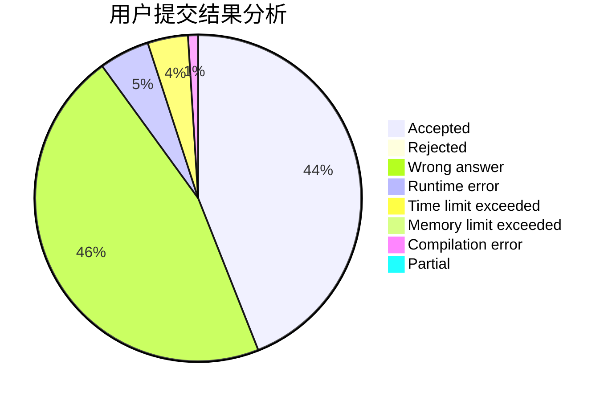
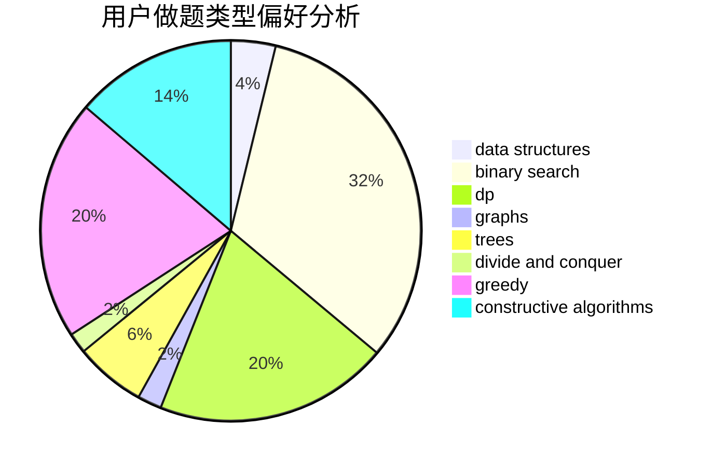

# mlcd

<!-- tabs:start -->

#### **用户提交结果分析**

#### **用户做题类型偏好分析**

#### **用户错题知识点分析**

<!-- tabs:end -->
# 推荐题目
[579A](https://codeforces.com/contest/579/problem/A)		bitmasks		  
[9581](https://codeforces.com/contest/958/problem/1)		dsu,graphs,sortings,trees		  
[1197B](https://codeforces.com/contest/1197/problem/B)		greedy,
                        implementation		  
[758D](https://codeforces.com/contest/758/problem/D)		constructive algorithms,
                        dp,
                        greedy,
                        math,
                        strings		  
[535C](https://codeforces.com/contest/535/problem/C)		binary search,
                        greedy,
                        math		  
[1092E](https://codeforces.com/contest/1092/problem/E)		constructive algorithms,
                        dfs and similar,
                        greedy,
                        trees		  
[876A](https://codeforces.com/contest/876/problem/A)		math		  
[909D](https://codeforces.com/contest/909/problem/D)		data structures,
                        greedy,
                        implementation		  
[784D](https://codeforces.com/contest/784/problem/D)		*special problem,
                        implementation		  
[847B](https://codeforces.com/contest/847/problem/B)		binary search,
                        data structures		  
