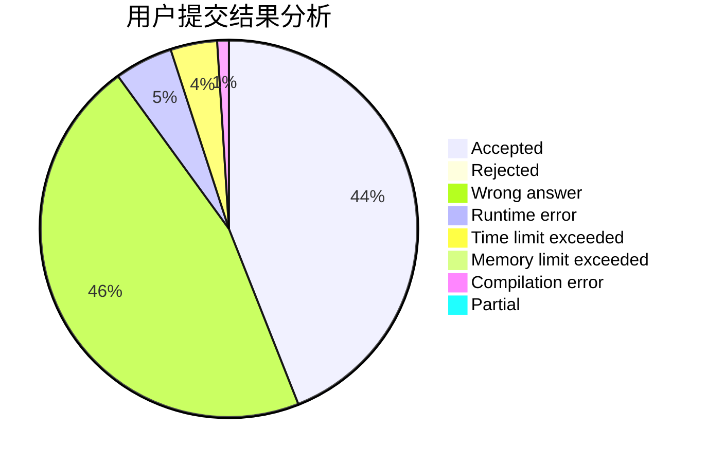
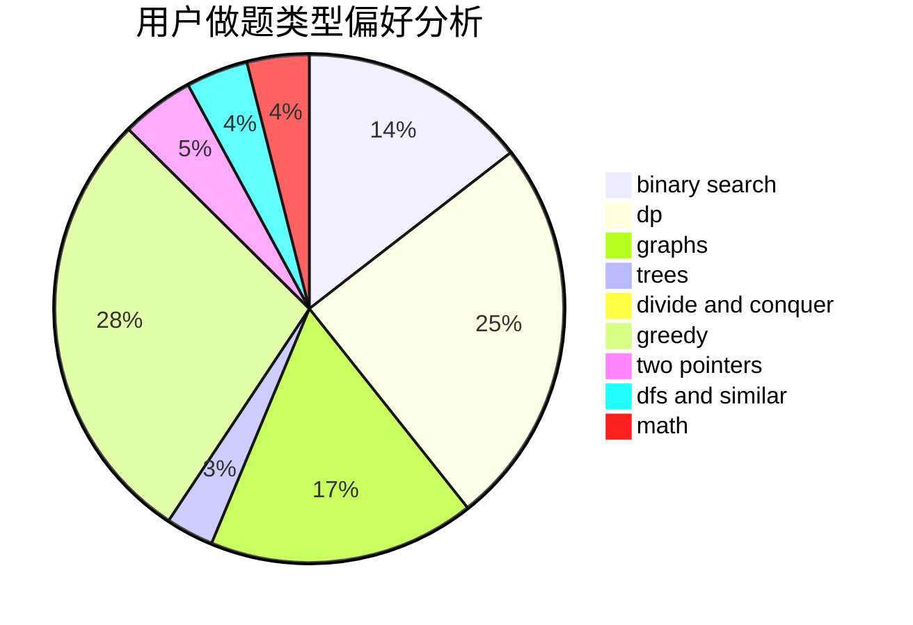

# mlcd

<!-- tabs:start -->

#### **用户提交结果分析**

#### **用户做题类型偏好分析**

<!-- tabs:end -->
# 推荐题目
[579A](https://codeforces.com/contest/579/problem/A)
[9581](https://codeforces.com/contest/958/problem/1)
[1197B](https://codeforces.com/contest/1197/problem/B)
[758D](https://codeforces.com/contest/758/problem/D)
[535C](https://codeforces.com/contest/535/problem/C)
[1092E](https://codeforces.com/contest/1092/problem/E)
[876A](https://codeforces.com/contest/876/problem/A)
[909D](https://codeforces.com/contest/909/problem/D)
[784D](https://codeforces.com/contest/784/problem/D)
[847B](https://codeforces.com/contest/847/problem/B)
