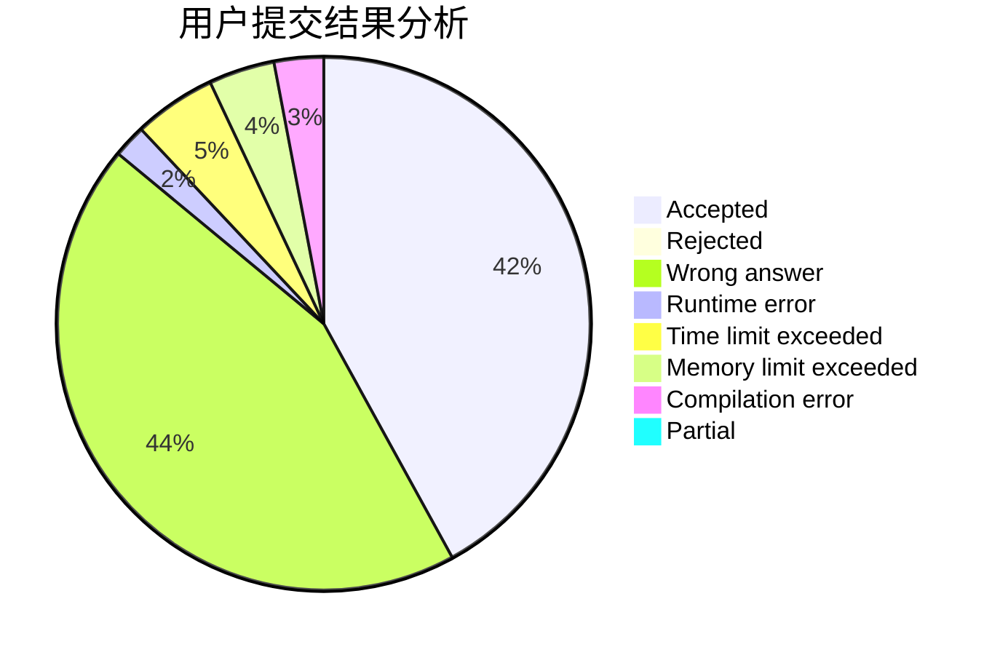
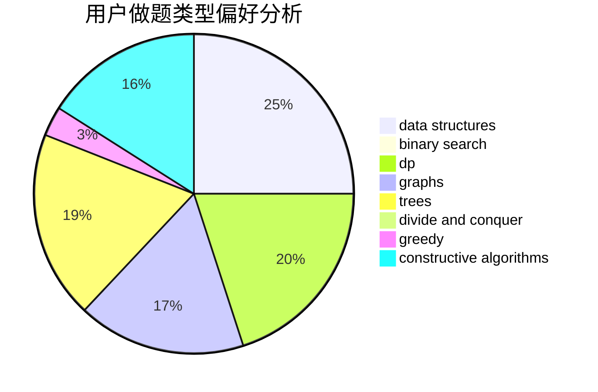
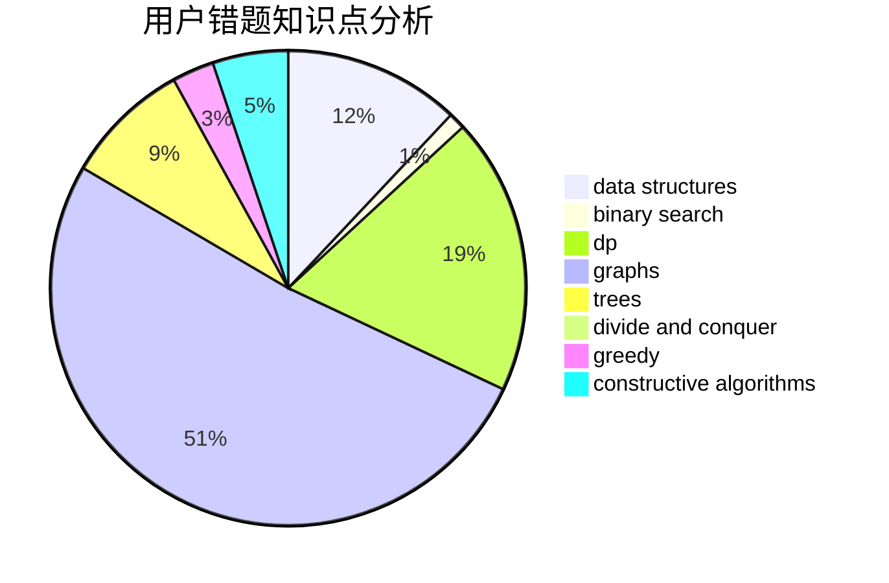

# mmh

<!-- tabs:start -->

#### **用户提交结果分析**

#### **用户做题类型偏好分析**

#### **用户错题知识点分析**

<!-- tabs:end -->
# 推荐题目
[1228D](https://codeforces.com/contest/1228/problem/D)		brute force,
                        constructive algorithms,
                        graphs,
                        hashing,
                        implementation		  
[947D](https://codeforces.com/contest/947/problem/D)		dsu,graphs,sortings,trees		  
[3D](https://codeforces.com/contest/3/problem/D)		greedy		  
[474B](https://codeforces.com/contest/474/problem/B)		binary search,
                        implementation		  
[486B](https://codeforces.com/contest/486/problem/B)		greedy,
                        hashing,
                        implementation		  
[767A](https://codeforces.com/contest/767/problem/A)		data structures,
                        implementation		  
[1388E](https://codeforces.com/contest/1388/problem/E)		data structures,
                        geometry,
                        sortings		  
[1465B](https://codeforces.com/contest/1465/problem/B)		dsu,graphs,sortings,trees		  
[1505D](https://codeforces.com/contest/1505/problem/D)		number theory		  
[319B](https://codeforces.com/contest/319/problem/B)		data structures,
                        implementation		  
