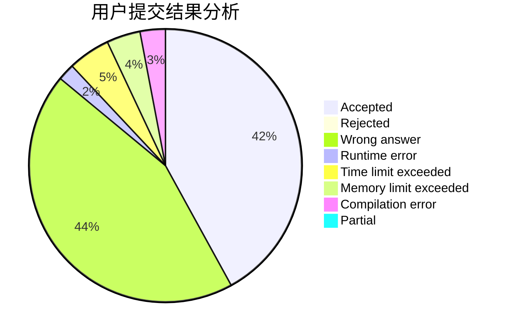
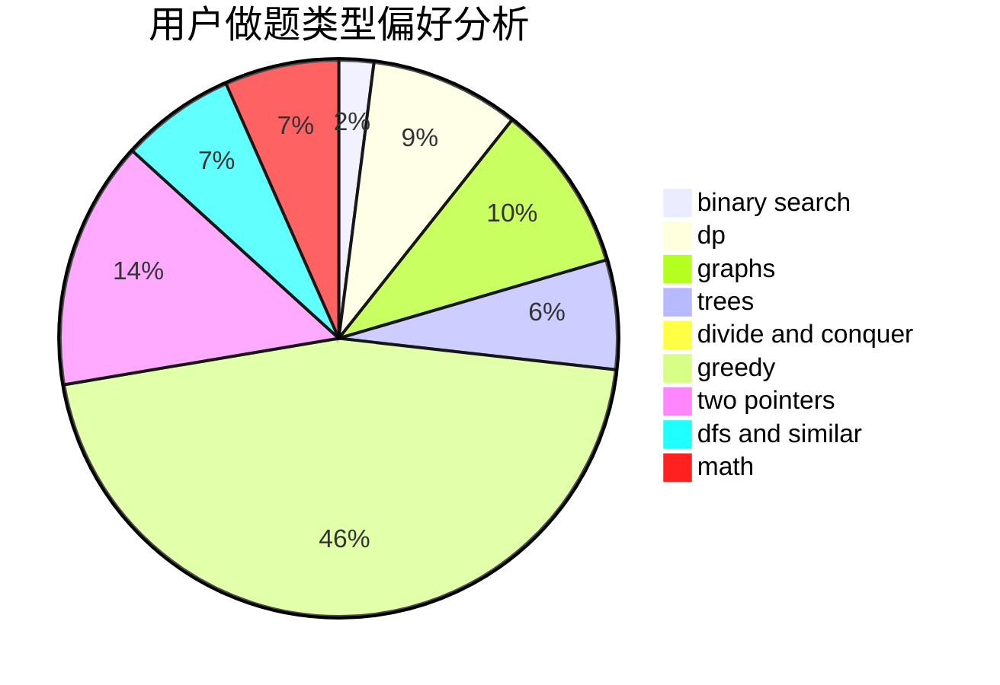

# mmh

<!-- tabs:start -->

#### **用户提交结果分析**

#### **用户做题类型偏好分析**

<!-- tabs:end -->
# 推荐题目
[1228D](https://codeforces.com/contest/1228/problem/D)
[947D](https://codeforces.com/contest/947/problem/D)
[3D](https://codeforces.com/contest/3/problem/D)
[474B](https://codeforces.com/contest/474/problem/B)
[486B](https://codeforces.com/contest/486/problem/B)
[767A](https://codeforces.com/contest/767/problem/A)
[1388E](https://codeforces.com/contest/1388/problem/E)
[1465B](https://codeforces.com/contest/1465/problem/B)
[1505D](https://codeforces.com/contest/1505/problem/D)
[319B](https://codeforces.com/contest/319/problem/B)
