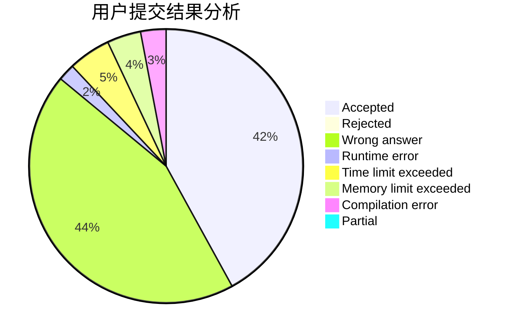
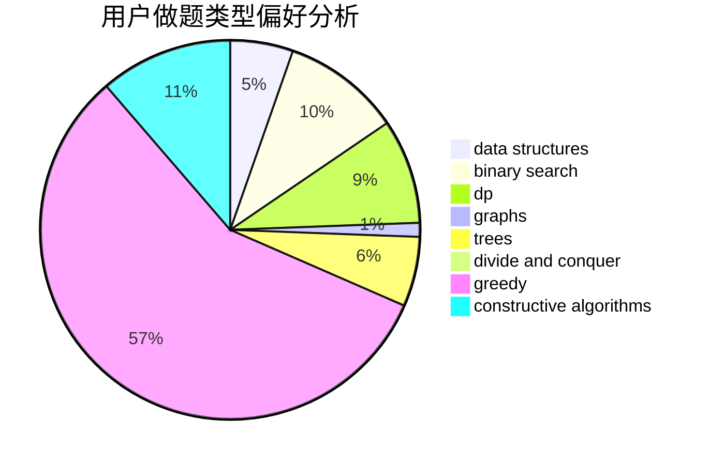
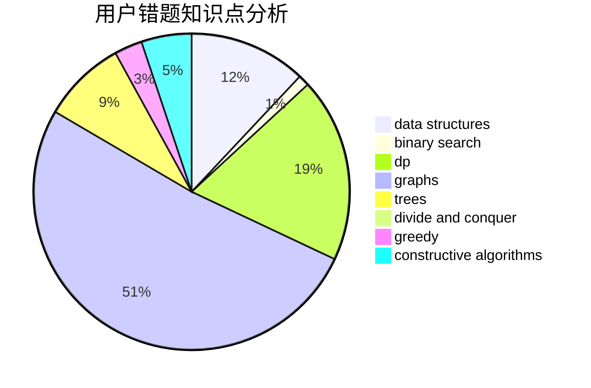

# mmh

<!-- tabs:start -->

#### **用户提交结果分析**

#### **用户做题类型偏好分析**

#### **用户错题知识点分析**

<!-- tabs:end -->
# 推荐题目
[1220D](https://codeforces.com/contest/1220/problem/D)		bitmasks,
                        math,
                        number theory		  
[924A](https://codeforces.com/contest/924/problem/A)		greedy,
                        implementation		  
[370B](https://codeforces.com/contest/370/problem/B)		implementation		  
[452B](https://codeforces.com/contest/452/problem/B)		brute force,
                        constructive algorithms,
                        geometry,
                        trees		  
[466D](https://codeforces.com/contest/466/problem/D)		combinatorics,
                        dp		  
[747D](https://codeforces.com/contest/747/problem/D)		dp,
                        greedy,
                        sortings		  
[1379E](https://codeforces.com/contest/1379/problem/E)		constructive algorithms,
                        divide and conquer,
                        dp,
                        math,
                        trees		  
[1455E](https://codeforces.com/contest/1455/problem/E)		brute force,
                        constructive algorithms,
                        flows,
                        geometry,
                        greedy,
                        implementation,
                        math,
                        ternary search		  
[1496D](https://codeforces.com/contest/1496/problem/D)		dsu,graphs,sortings,trees		  
[300D](https://codeforces.com/contest/300/problem/D)		dp,
                        fft		  
