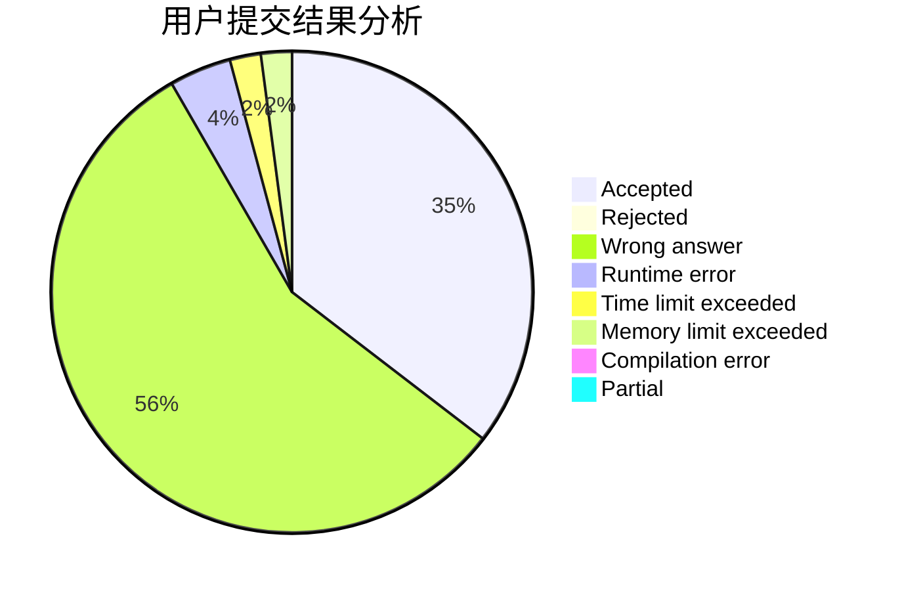
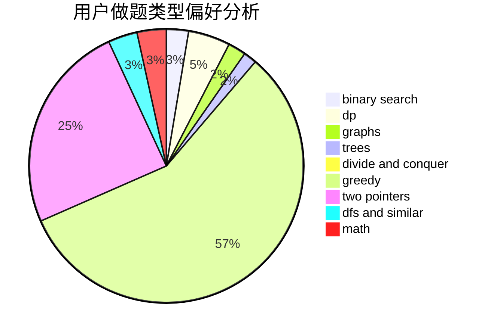

# mofianger

<!-- tabs:start -->

#### **用户提交结果分析**

#### **用户做题类型偏好分析**

<!-- tabs:end -->
# 推荐题目
[603B](https://codeforces.com/contest/603/problem/B)
[3161](https://codeforces.com/contest/316/problem/1)
[701A](https://codeforces.com/contest/701/problem/A)
[281A](https://codeforces.com/contest/281/problem/A)
[1344A](https://codeforces.com/contest/1344/problem/A)
[628C](https://codeforces.com/contest/628/problem/C)
[1297A](https://codeforces.com/contest/1297/problem/A)
[766E](https://codeforces.com/contest/766/problem/E)
[119A](https://codeforces.com/contest/119/problem/A)
[994C](https://codeforces.com/contest/994/problem/C)
