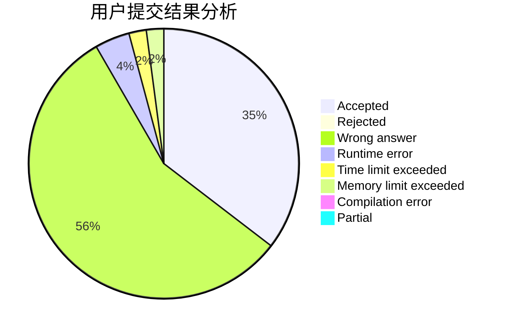
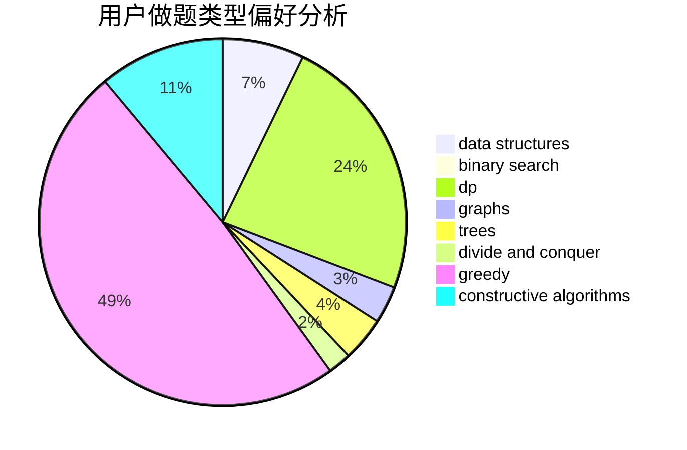
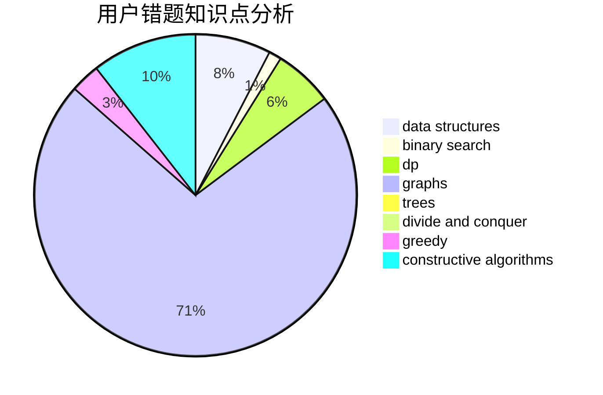

# mofianger

<!-- tabs:start -->

#### **用户提交结果分析**

#### **用户做题类型偏好分析**

#### **用户错题知识点分析**

<!-- tabs:end -->
# 推荐题目
[582B](https://codeforces.com/contest/582/problem/B)		constructive algorithms,
                        dp,
                        matrices		  
[299B](https://codeforces.com/contest/299/problem/B)		brute force,
                        implementation		  
[677A](https://codeforces.com/contest/677/problem/A)		implementation		  
[265D](https://codeforces.com/contest/265/problem/D)		dsu,graphs,sortings,trees		  
[1336E2](https://codeforces.com/contest/1336E/problem/2)		bitmasks,
                        brute force,
                        combinatorics,
                        math		  
[609C](https://codeforces.com/contest/609/problem/C)		implementation,
                        math		  
[1290D](https://codeforces.com/contest/1290/problem/D)		constructive algorithms,
                        graphs,
                        interactive		  
[747B](https://codeforces.com/contest/747/problem/B)		implementation,
                        strings		  
[1195D2](https://codeforces.com/contest/1195D/problem/2)		combinatorics,
                        math,
                        number theory		  
[97C](https://codeforces.com/contest/97/problem/C)		binary search,
                        graphs,
                        math,
                        shortest paths		  
