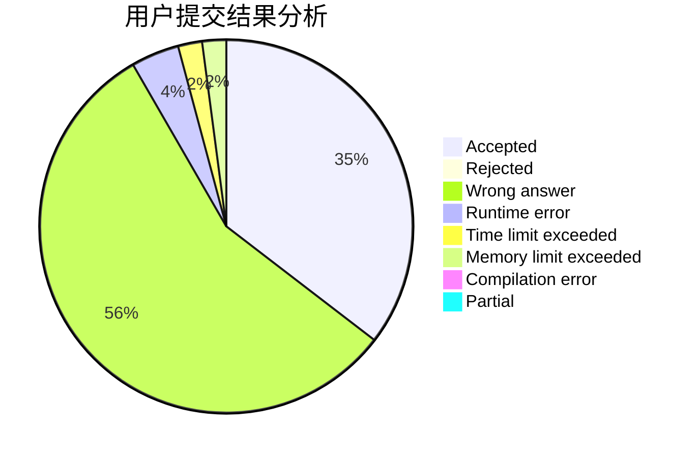
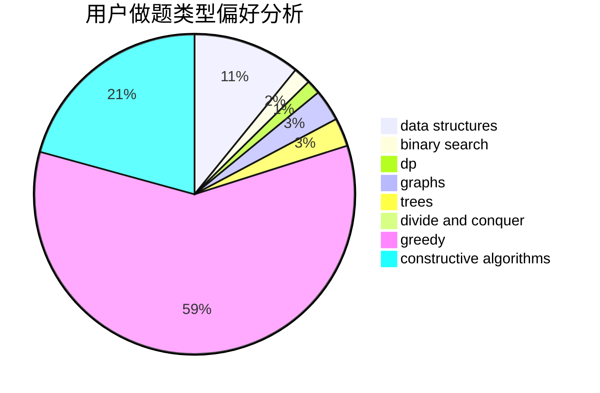

# mofianger

<!-- tabs:start -->

#### **用户提交结果分析**

#### **用户做题类型偏好分析**

#### **用户错题知识点分析**

<!-- tabs:end -->
# 推荐题目
[603B](https://codeforces.com/contest/603/problem/B)		combinatorics,
                        dfs and similar,
                        dsu,
                        math,
                        number theory		  
[3161](https://codeforces.com/contest/316/problem/1)		dsu,graphs,sortings,trees		  
[701A](https://codeforces.com/contest/701/problem/A)		greedy,
                        implementation		  
[281A](https://codeforces.com/contest/281/problem/A)		implementation,
                        strings		  
[1344A](https://codeforces.com/contest/1344/problem/A)		math,
                        number theory,
                        sortings		  
[628C](https://codeforces.com/contest/628/problem/C)		greedy,
                        strings		  
[1297A](https://codeforces.com/contest/1297/problem/A)		*special problem,
                        implementation		  
[766E](https://codeforces.com/contest/766/problem/E)		bitmasks,
                        constructive algorithms,
                        data structures,
                        dfs and similar,
                        dp,
                        math,
                        trees		  
[119A](https://codeforces.com/contest/119/problem/A)		implementation		  
[994C](https://codeforces.com/contest/994/problem/C)		dsu,graphs,sortings,trees		  
