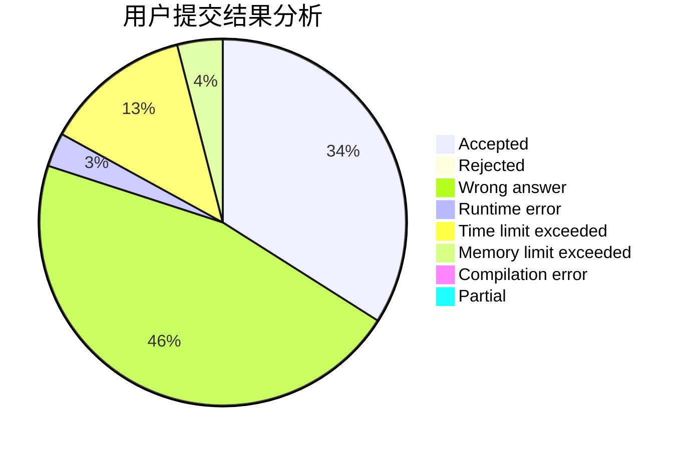
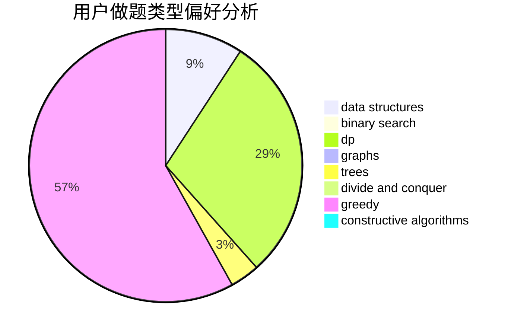
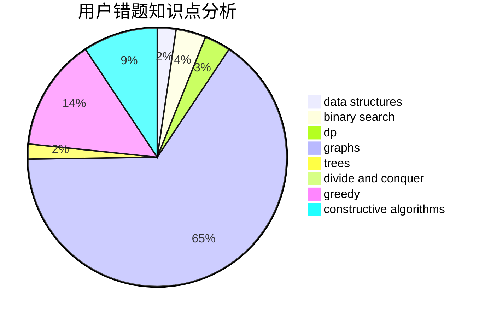

# mohei0

<!-- tabs:start -->

#### **用户提交结果分析**

#### **用户做题类型偏好分析**

#### **用户错题知识点分析**

<!-- tabs:end -->
# 推荐题目
[717E](https://codeforces.com/contest/717/problem/E)		dfs and similar		  
[643D](https://codeforces.com/contest/643/problem/D)		nan		  
[933B](https://codeforces.com/contest/933/problem/B)		math		  
[1268C](https://codeforces.com/contest/1268/problem/C)		binary search,
                        data structures		  
[315C](https://codeforces.com/contest/315/problem/C)		dsu,graphs,sortings,trees		  
[1063E](https://codeforces.com/contest/1063/problem/E)		constructive algorithms,
                        math		  
[686B](https://codeforces.com/contest/686/problem/B)		constructive algorithms,
                        implementation,
                        sortings		  
[875E](https://codeforces.com/contest/875/problem/E)		binary search,
                        data structures,
                        dp		  
[888B](https://codeforces.com/contest/888/problem/B)		greedy		  
[1002D3](https://codeforces.com/contest/1002D/problem/3)		nan		  
