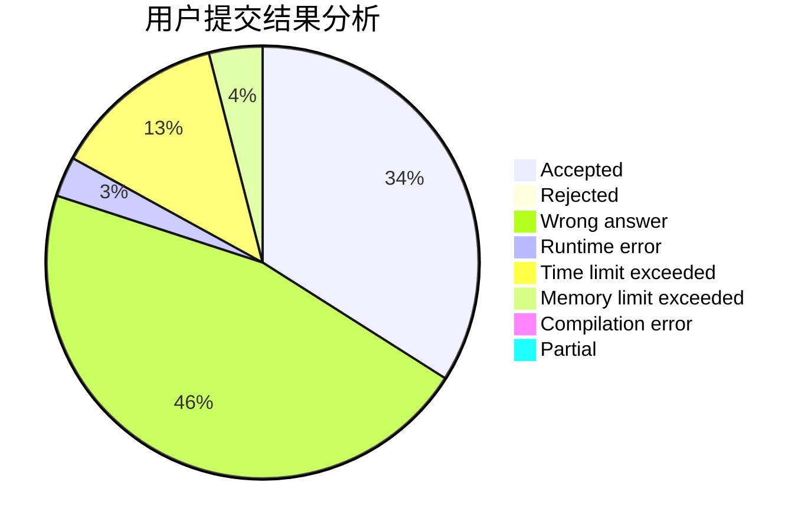
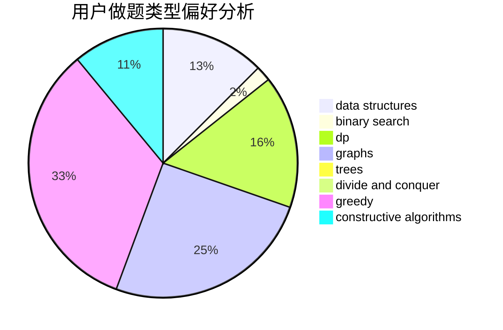
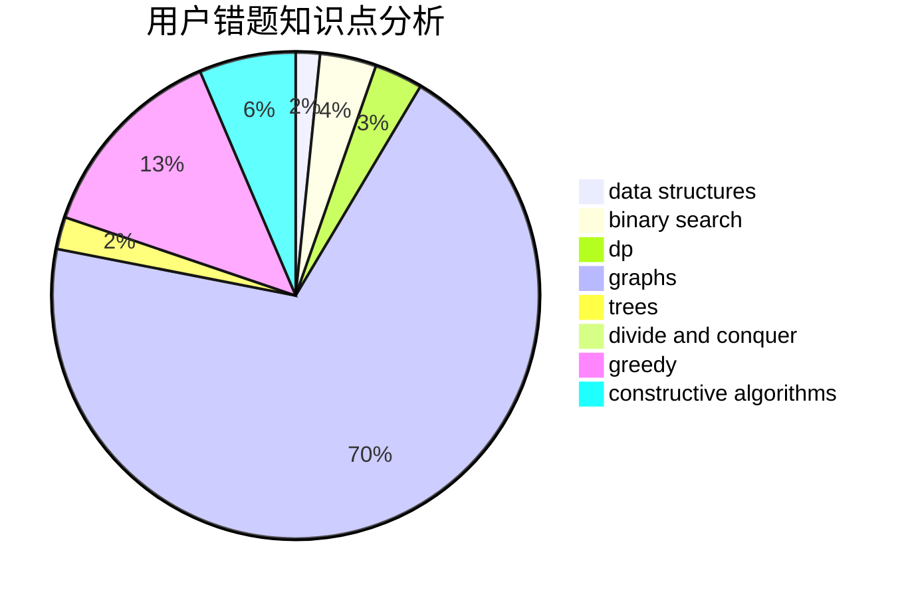

# mohei0

<!-- tabs:start -->

#### **用户提交结果分析**

#### **用户做题类型偏好分析**

#### **用户错题知识点分析**

<!-- tabs:end -->
# 推荐题目
[735A](https://codeforces.com/contest/735/problem/A)		implementation,
                        strings		  
[670B](https://codeforces.com/contest/670/problem/B)		implementation		  
[955B](https://codeforces.com/contest/955/problem/B)		implementation		  
[1277D](https://codeforces.com/contest/1277/problem/D)		data structures,
                        hashing,
                        implementation,
                        math		  
[339D](https://codeforces.com/contest/339/problem/D)		data structures,
                        trees		  
[1064B](https://codeforces.com/contest/1064/problem/B)		math		  
[708B](https://codeforces.com/contest/708/problem/B)		constructive algorithms,
                        greedy,
                        implementation,
                        math		  
[895E](https://codeforces.com/contest/895/problem/E)		data structures,
                        probabilities		  
[907D](https://codeforces.com/contest/907/problem/D)		dsu,graphs,sortings,trees		  
[1003A](https://codeforces.com/contest/1003/problem/A)		implementation		  
