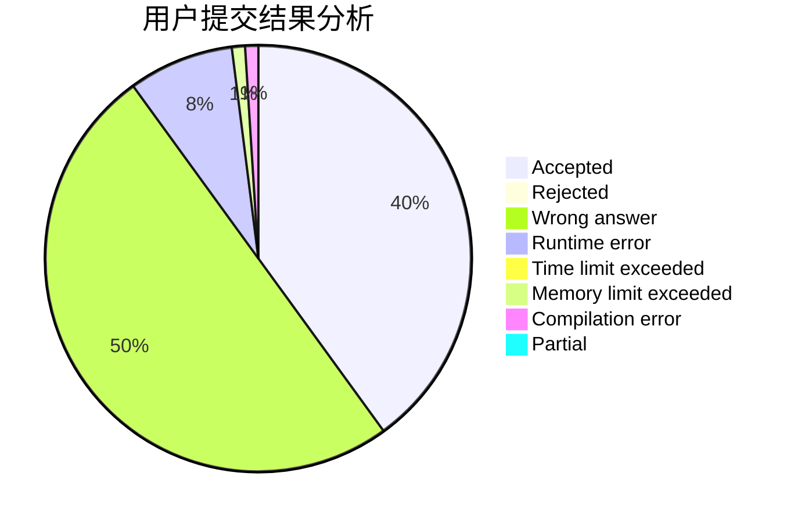
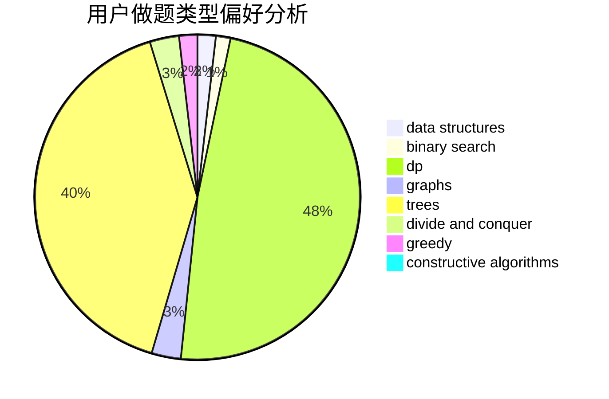

# mollnn

<!-- tabs:start -->

#### **用户提交结果分析**

#### **用户做题类型偏好分析**

#### **用户错题知识点分析**

<!-- tabs:end -->
# 推荐题目
[494B](https://codeforces.com/contest/494/problem/B)		dp,
                        strings		  
[1380G](https://codeforces.com/contest/1380/problem/G)		greedy,
                        math,
                        probabilities		  
[1102E](https://codeforces.com/contest/1102/problem/E)		combinatorics,
                        sortings		  
[1062A](https://codeforces.com/contest/1062/problem/A)		greedy,
                        implementation		  
[678B](https://codeforces.com/contest/678/problem/B)		implementation		  
[1136D](https://codeforces.com/contest/1136/problem/D)		greedy		  
[1147C](https://codeforces.com/contest/1147/problem/C)		games		  
[1170E](https://codeforces.com/contest/1170/problem/E)		*special problem,
                        binary search		  
[1076F](https://codeforces.com/contest/1076/problem/F)		dp,
                        greedy		  
[789A](https://codeforces.com/contest/789/problem/A)		implementation,
                        math		  
