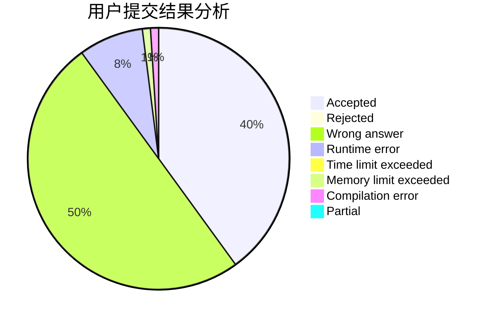
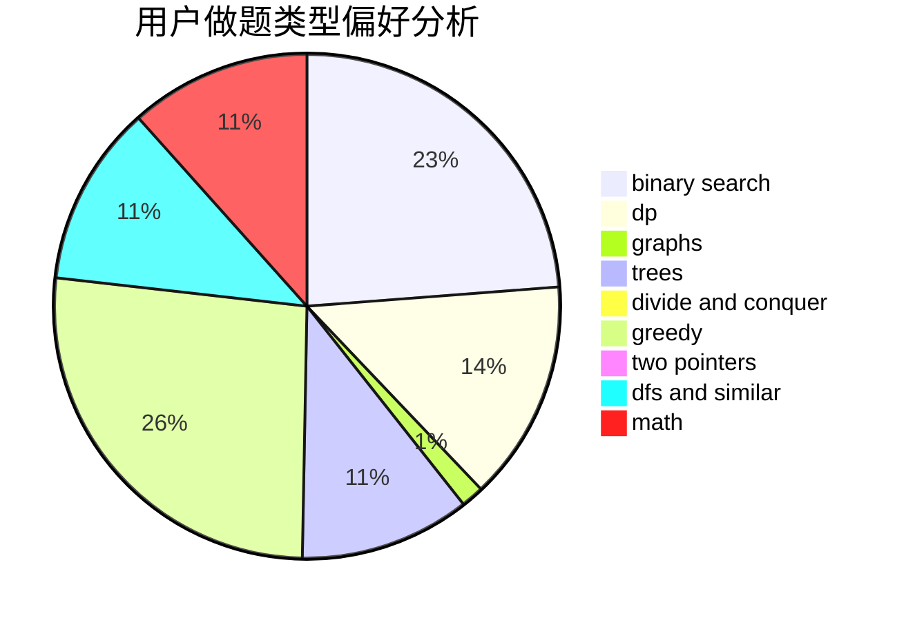

# mollnn

<!-- tabs:start -->

#### **用户提交结果分析**

#### **用户做题类型偏好分析**

<!-- tabs:end -->
# 推荐题目
[494B](https://codeforces.com/contest/494/problem/B)
[1380G](https://codeforces.com/contest/1380/problem/G)
[1102E](https://codeforces.com/contest/1102/problem/E)
[1062A](https://codeforces.com/contest/1062/problem/A)
[678B](https://codeforces.com/contest/678/problem/B)
[1136D](https://codeforces.com/contest/1136/problem/D)
[1147C](https://codeforces.com/contest/1147/problem/C)
[1170E](https://codeforces.com/contest/1170/problem/E)
[1076F](https://codeforces.com/contest/1076/problem/F)
[789A](https://codeforces.com/contest/789/problem/A)
