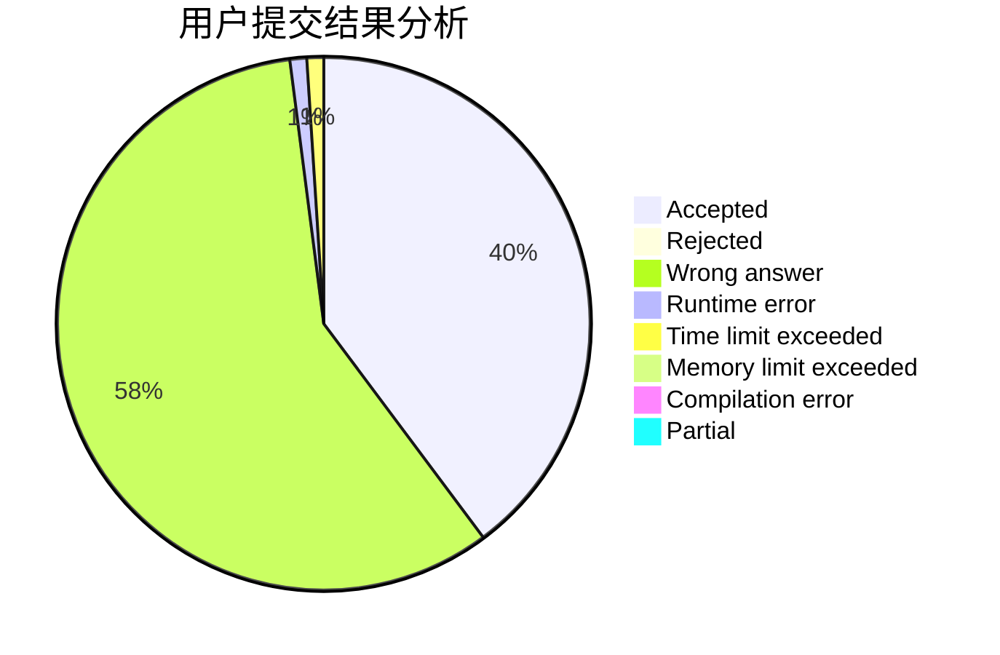
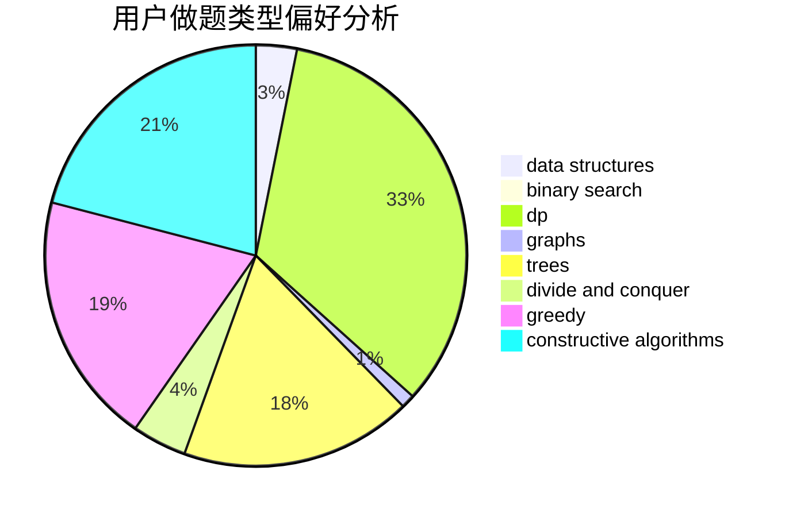
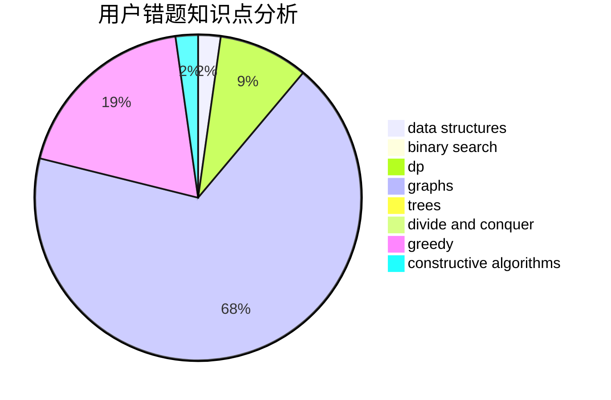

# momo2007

<!-- tabs:start -->

#### **用户提交结果分析**

#### **用户做题类型偏好分析**

#### **用户错题知识点分析**

<!-- tabs:end -->
# 推荐题目
[25A](https://codeforces.com/contest/25/problem/A)		brute force		  
[44E](https://codeforces.com/contest/44/problem/E)		dp		  
[1118B](https://codeforces.com/contest/1118/problem/B)		implementation		  
[718D](https://codeforces.com/contest/718/problem/D)		dp,
                        hashing,
                        trees		  
[343B](https://codeforces.com/contest/343/problem/B)		data structures,
                        greedy,
                        implementation		  
[439D](https://codeforces.com/contest/439/problem/D)		binary search,
                        sortings,
                        ternary search,
                        two pointers		  
[78C](https://codeforces.com/contest/78/problem/C)		dp,
                        games,
                        number theory		  
[932A](https://codeforces.com/contest/932/problem/A)		constructive algorithms		  
[906B](https://codeforces.com/contest/906/problem/B)		brute force,
                        constructive algorithms,
                        math		  
[856D](https://codeforces.com/contest/856/problem/D)		dp,
                        trees		  
