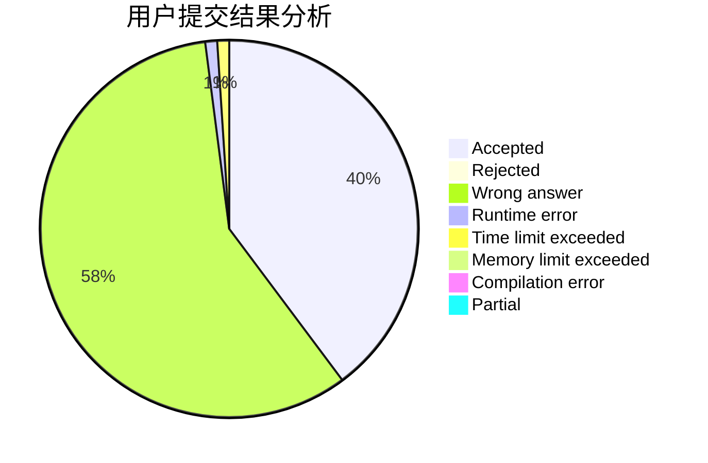
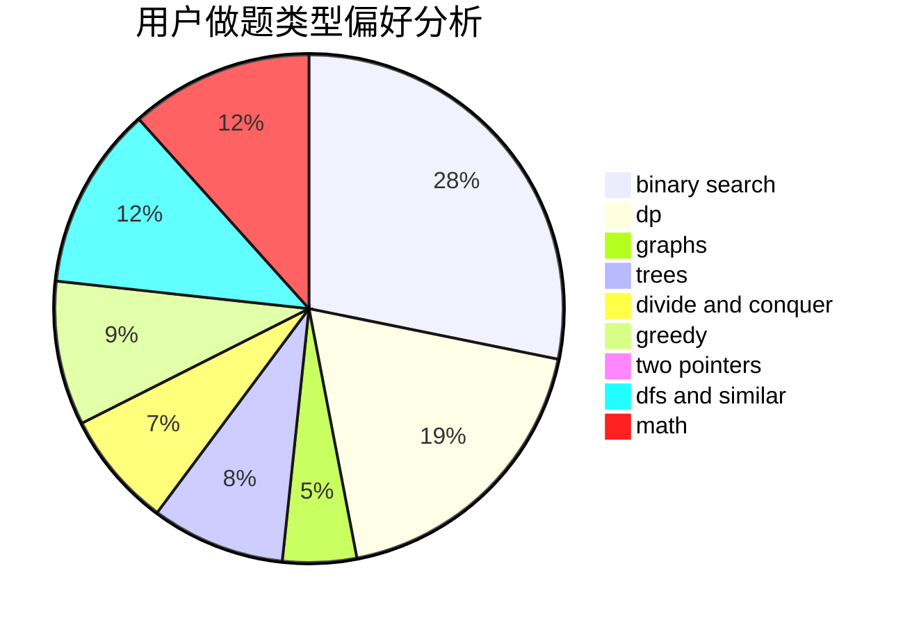

# momo2007

<!-- tabs:start -->

#### **用户提交结果分析**

#### **用户做题类型偏好分析**

<!-- tabs:end -->
# 推荐题目
[25A](https://codeforces.com/contest/25/problem/A)
[44E](https://codeforces.com/contest/44/problem/E)
[1118B](https://codeforces.com/contest/1118/problem/B)
[718D](https://codeforces.com/contest/718/problem/D)
[343B](https://codeforces.com/contest/343/problem/B)
[439D](https://codeforces.com/contest/439/problem/D)
[78C](https://codeforces.com/contest/78/problem/C)
[932A](https://codeforces.com/contest/932/problem/A)
[906B](https://codeforces.com/contest/906/problem/B)
[856D](https://codeforces.com/contest/856/problem/D)
