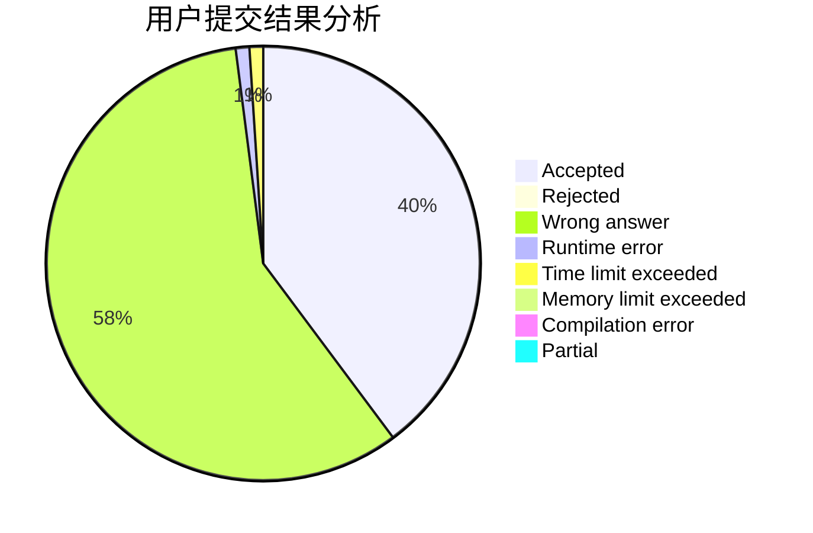
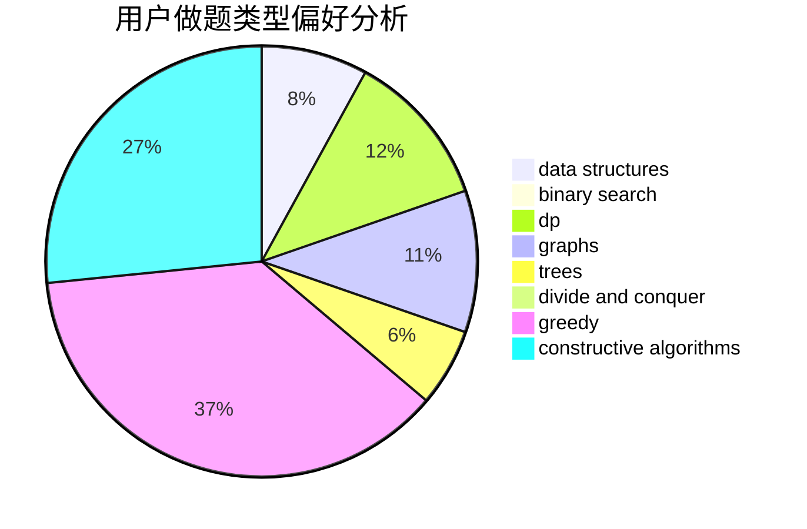
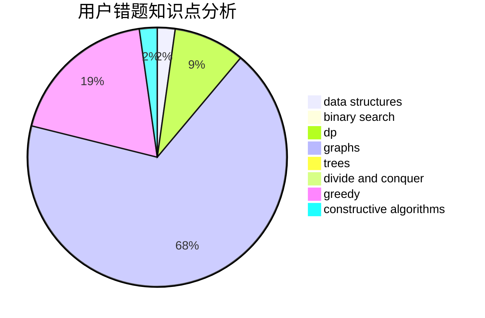

# momo2007

<!-- tabs:start -->

#### **用户提交结果分析**

#### **用户做题类型偏好分析**

#### **用户错题知识点分析**

<!-- tabs:end -->
# 推荐题目
[236D](https://codeforces.com/contest/236/problem/D)		dsu,graphs,sortings,trees		  
[429A](https://codeforces.com/contest/429/problem/A)		dfs and similar,
                        trees		  
[1116D2](https://codeforces.com/contest/1116D/problem/2)		nan		  
[700C](https://codeforces.com/contest/700/problem/C)		dfs and similar,
                        graphs		  
[316E3](https://codeforces.com/contest/316E/problem/3)		data structures,
                        math		  
[414B](https://codeforces.com/contest/414/problem/B)		combinatorics,
                        dp,
                        number theory		  
[76D](https://codeforces.com/contest/76/problem/D)		dp,
                        greedy,
                        math		  
[913C](https://codeforces.com/contest/913/problem/C)		bitmasks,
                        dp,
                        greedy		  
[887A](https://codeforces.com/contest/887/problem/A)		implementation		  
[838D](https://codeforces.com/contest/838/problem/D)		math,
                        number theory		  
