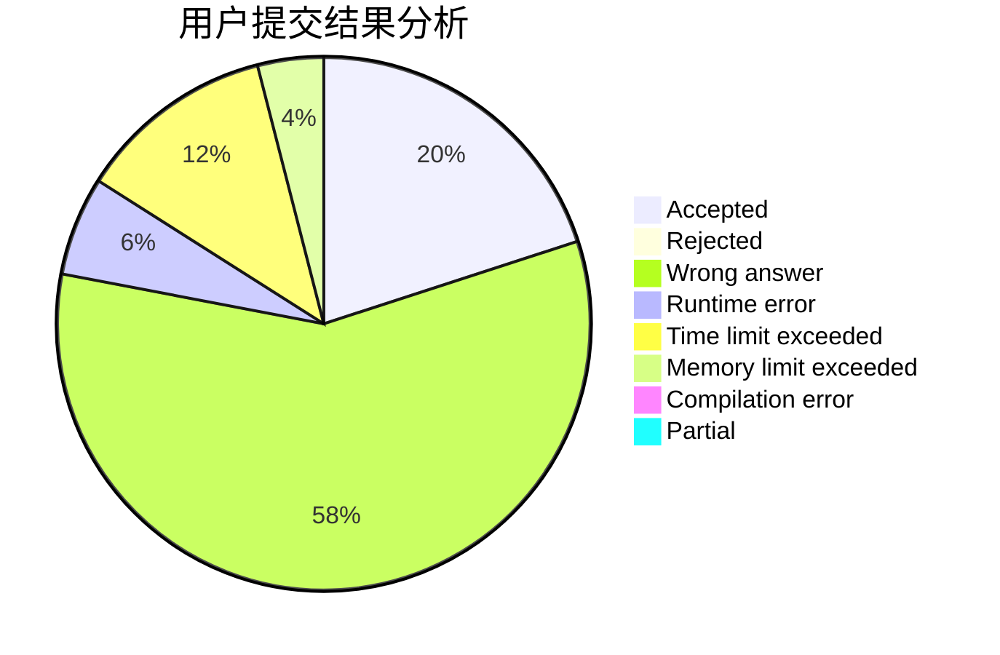
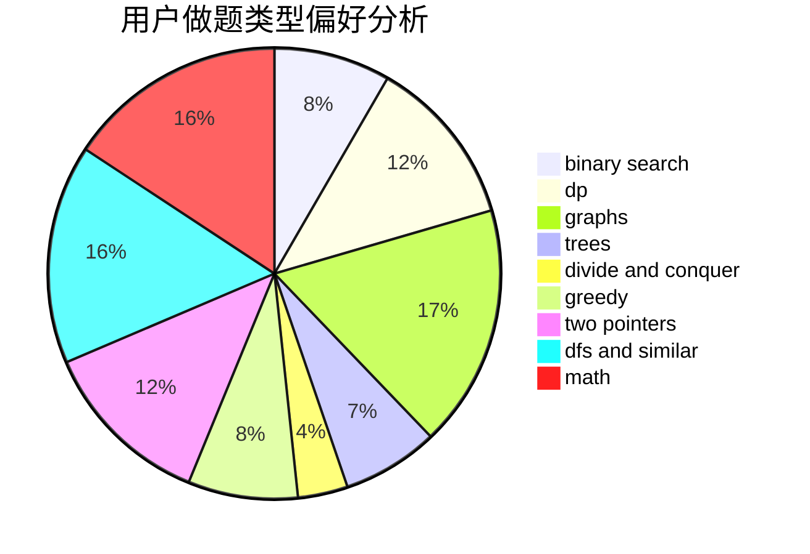

# moyujiang

<!-- tabs:start -->

#### **用户提交结果分析**

#### **用户做题类型偏好分析**

<!-- tabs:end -->
# 推荐题目
[725G](https://codeforces.com/contest/725/problem/G)
[1102D](https://codeforces.com/contest/1102/problem/D)
[922A](https://codeforces.com/contest/922/problem/A)
[306B](https://codeforces.com/contest/306/problem/B)
[858C](https://codeforces.com/contest/858/problem/C)
[913D](https://codeforces.com/contest/913/problem/D)
[1073C](https://codeforces.com/contest/1073/problem/C)
[808B](https://codeforces.com/contest/808/problem/B)
[698C](https://codeforces.com/contest/698/problem/C)
[965A](https://codeforces.com/contest/965/problem/A)
