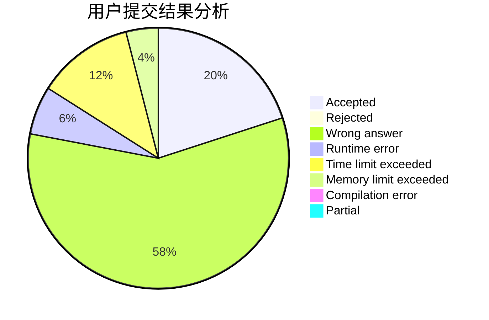
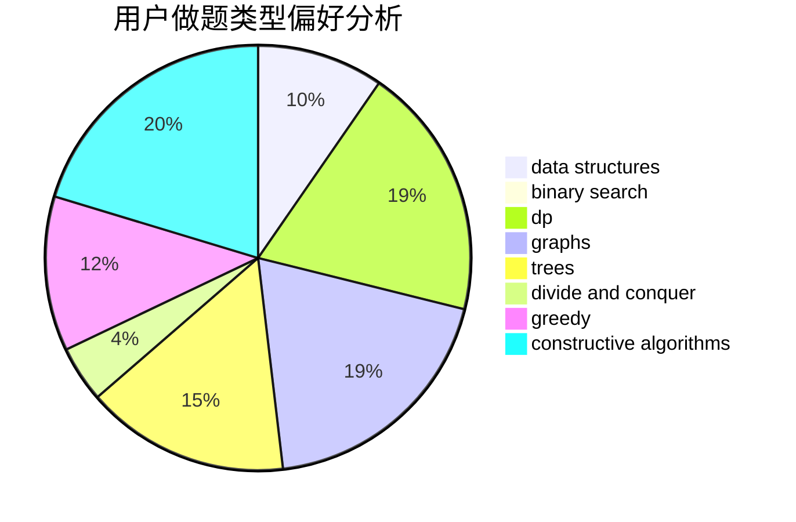
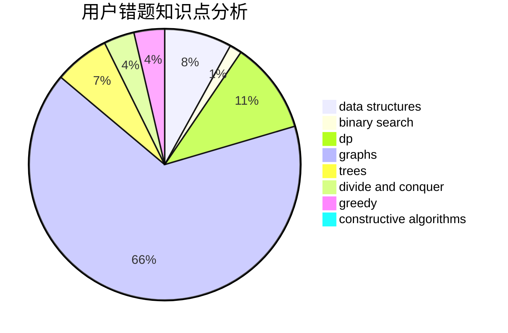

# moyujiang

<!-- tabs:start -->

#### **用户提交结果分析**

#### **用户做题类型偏好分析**

#### **用户错题知识点分析**

<!-- tabs:end -->
# 推荐题目
[725G](https://codeforces.com/contest/725/problem/G)		nan		  
[1102D](https://codeforces.com/contest/1102/problem/D)		greedy,
                        strings		  
[922A](https://codeforces.com/contest/922/problem/A)		implementation		  
[306B](https://codeforces.com/contest/306/problem/B)		data structures,
                        greedy,
                        sortings		  
[858C](https://codeforces.com/contest/858/problem/C)		dp,
                        greedy,
                        implementation		  
[913D](https://codeforces.com/contest/913/problem/D)		binary search,
                        brute force,
                        data structures,
                        greedy,
                        sortings		  
[1073C](https://codeforces.com/contest/1073/problem/C)		binary search,
                        two pointers		  
[808B](https://codeforces.com/contest/808/problem/B)		data structures,
                        implementation,
                        math		  
[698C](https://codeforces.com/contest/698/problem/C)		bitmasks,
                        dp,
                        math,
                        probabilities		  
[965A](https://codeforces.com/contest/965/problem/A)		math		  
