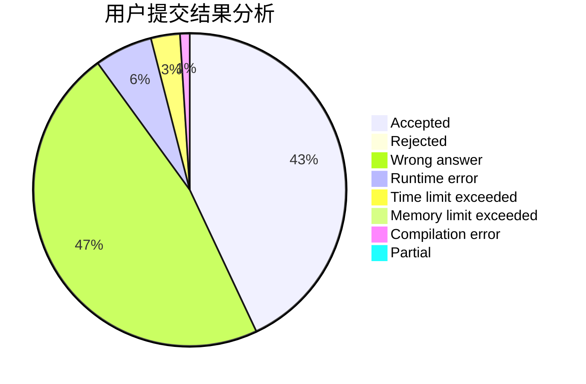
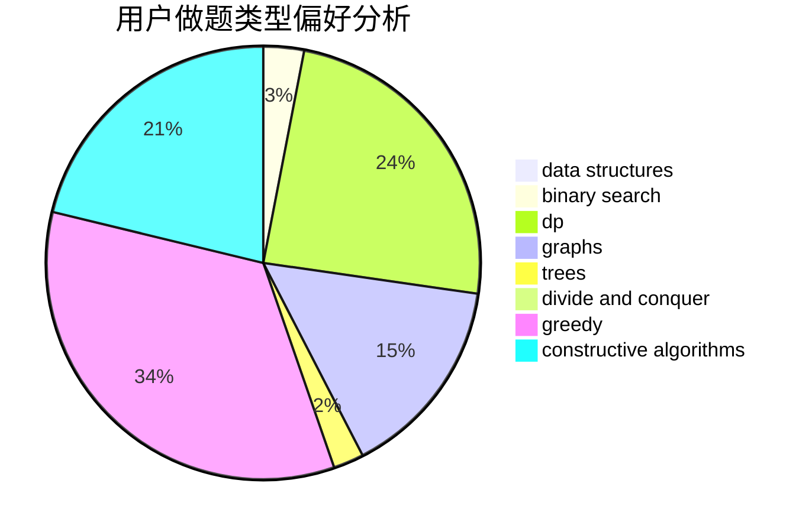
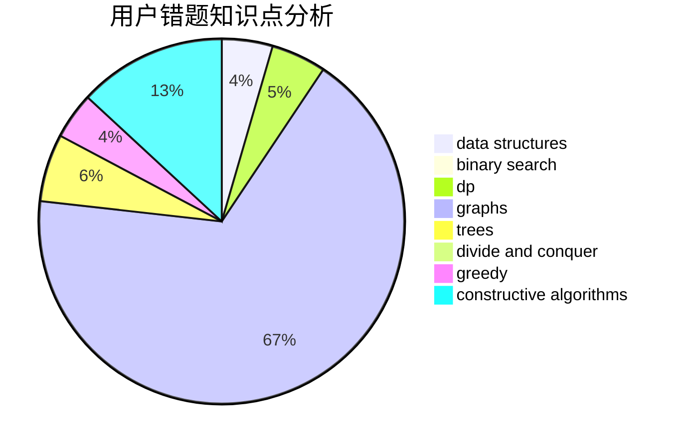

# mr_chen116

<!-- tabs:start -->

#### **用户提交结果分析**

#### **用户做题类型偏好分析**

#### **用户错题知识点分析**

<!-- tabs:end -->
# 推荐题目
[923B](https://codeforces.com/contest/923/problem/B)		binary search,
                        data structures		  
[1002B4](https://codeforces.com/contest/1002B/problem/4)		nan		  
[22C](https://codeforces.com/contest/22/problem/C)		graphs		  
[1070I](https://codeforces.com/contest/1070/problem/I)		flows,
                        graph matchings,
                        graphs		  
[803D](https://codeforces.com/contest/803/problem/D)		binary search,
                        greedy		  
[44E](https://codeforces.com/contest/44/problem/E)		dp		  
[512A](https://codeforces.com/contest/512/problem/A)		dsu,graphs,sortings,trees		  
[1355A](https://codeforces.com/contest/1355/problem/A)		brute force,
                        implementation,
                        math		  
[319B](https://codeforces.com/contest/319/problem/B)		data structures,
                        implementation		  
[489C](https://codeforces.com/contest/489/problem/C)		dp,
                        greedy,
                        implementation		  
