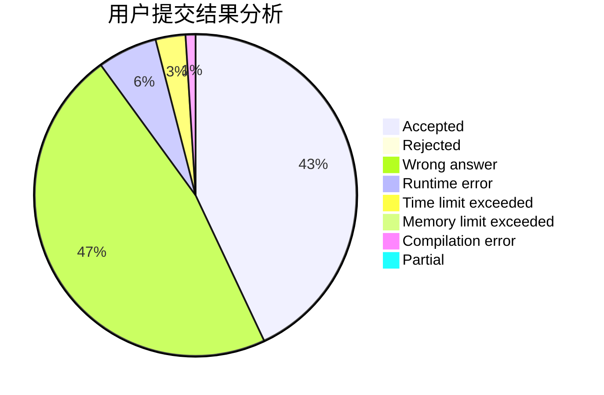
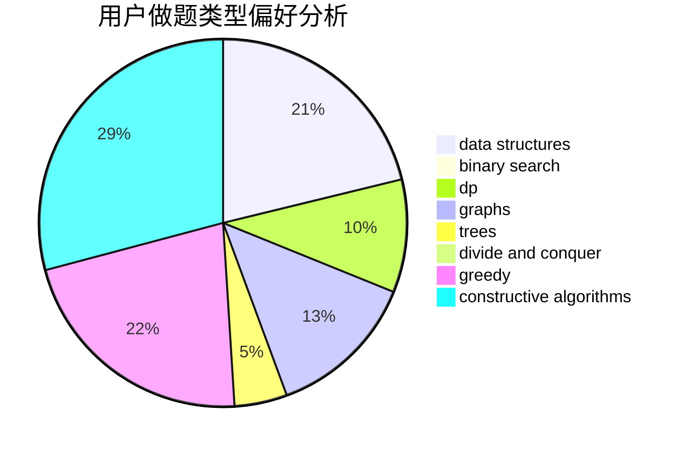
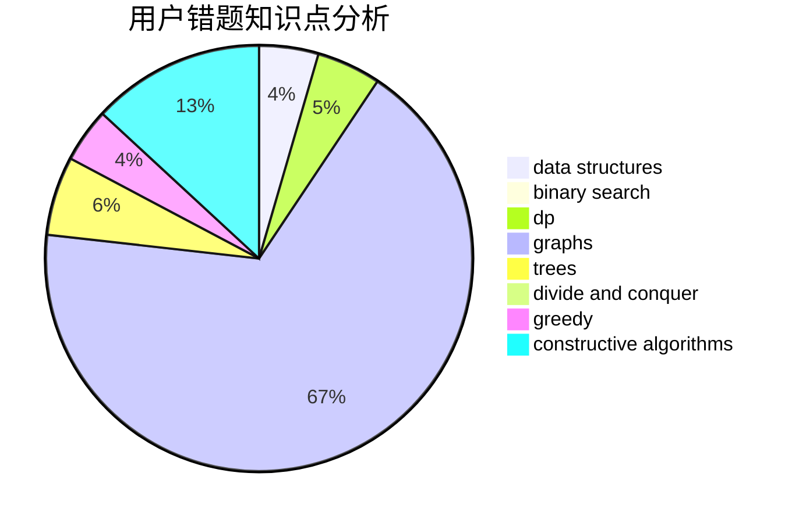

# mr_chen116

<!-- tabs:start -->

#### **用户提交结果分析**

#### **用户做题类型偏好分析**

#### **用户错题知识点分析**

<!-- tabs:end -->
# 推荐题目
[946G](https://codeforces.com/contest/946/problem/G)		data structures,
                        dp		  
[10023](https://codeforces.com/contest/1002/problem/3)		dsu,graphs,sortings,trees		  
[251A](https://codeforces.com/contest/251/problem/A)		binary search,
                        combinatorics,
                        two pointers		  
[1070L](https://codeforces.com/contest/1070/problem/L)		constructive algorithms		  
[819B](https://codeforces.com/contest/819/problem/B)		data structures,
                        implementation,
                        math		  
[471D](https://codeforces.com/contest/471/problem/D)		string suffix structures,
                        strings		  
[535A](https://codeforces.com/contest/535/problem/A)		brute force,
                        implementation		  
[1361E](https://codeforces.com/contest/1361/problem/E)		dfs and similar,
                        graphs,
                        probabilities,
                        trees		  
[34A](https://codeforces.com/contest/34/problem/A)		implementation		  
[509D](https://codeforces.com/contest/509/problem/D)		constructive algorithms,
                        math		  
