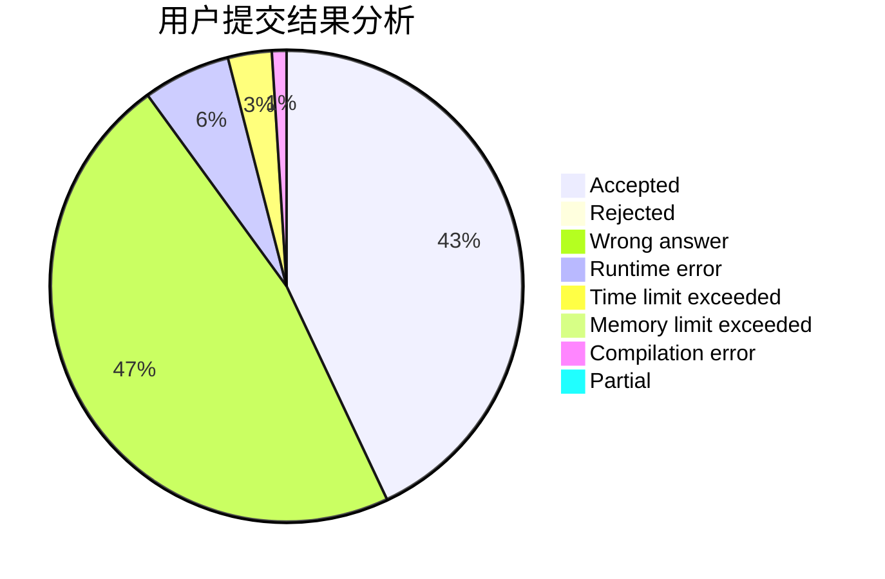
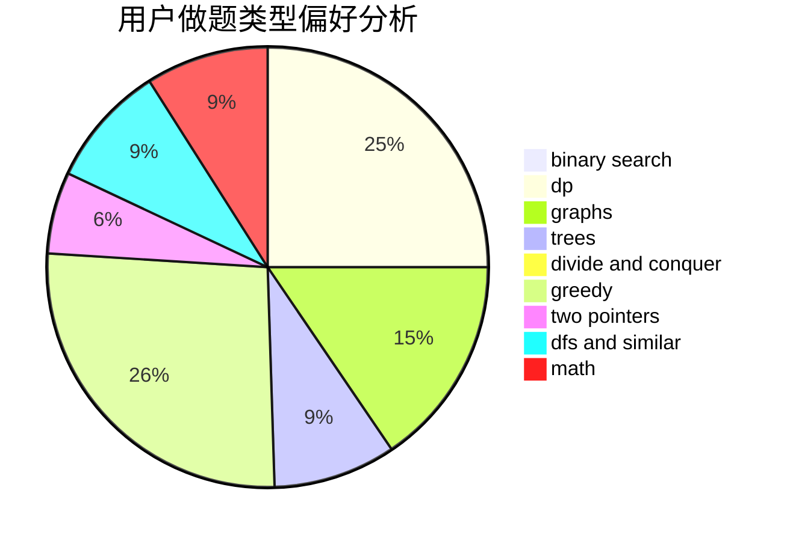

# mr_chen116

<!-- tabs:start -->

#### **用户提交结果分析**

#### **用户做题类型偏好分析**

<!-- tabs:end -->
# 推荐题目
[946G](https://codeforces.com/contest/946/problem/G)
[10023](https://codeforces.com/contest/1002/problem/3)
[251A](https://codeforces.com/contest/251/problem/A)
[1070L](https://codeforces.com/contest/1070/problem/L)
[819B](https://codeforces.com/contest/819/problem/B)
[471D](https://codeforces.com/contest/471/problem/D)
[535A](https://codeforces.com/contest/535/problem/A)
[1361E](https://codeforces.com/contest/1361/problem/E)
[34A](https://codeforces.com/contest/34/problem/A)
[509D](https://codeforces.com/contest/509/problem/D)
