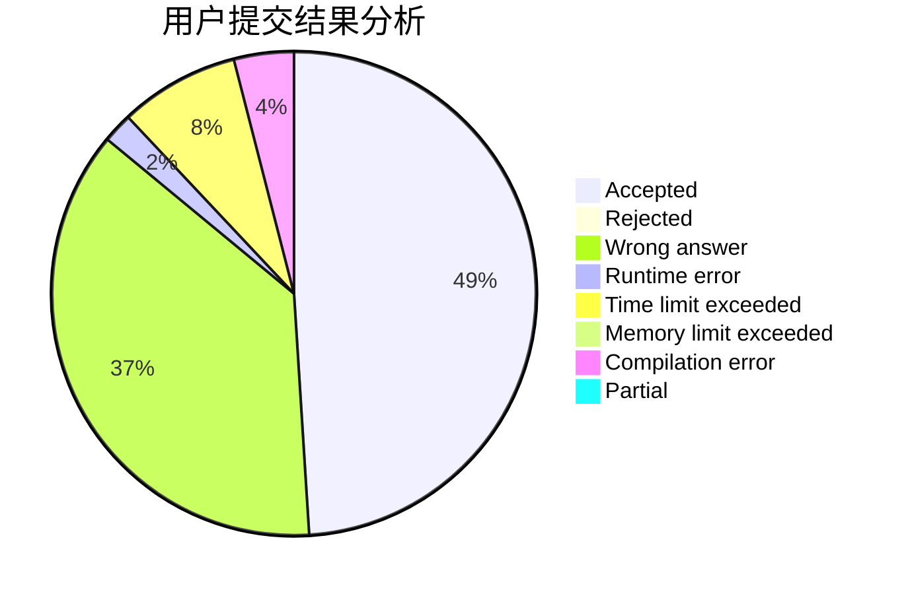
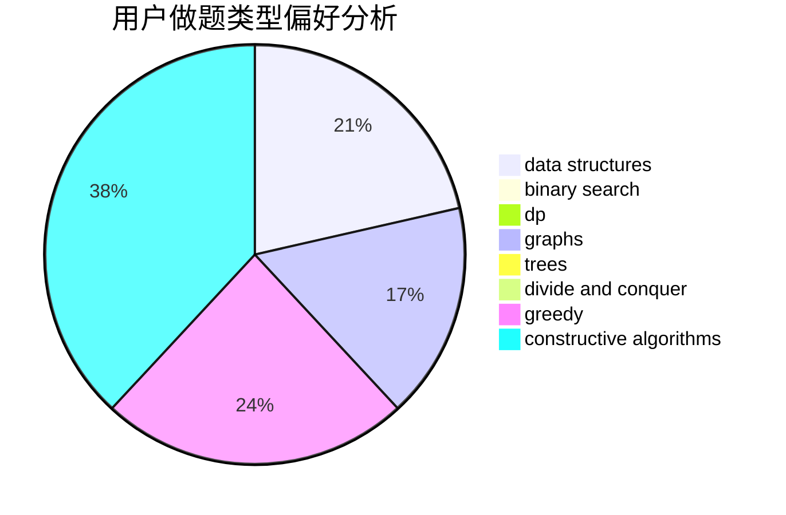
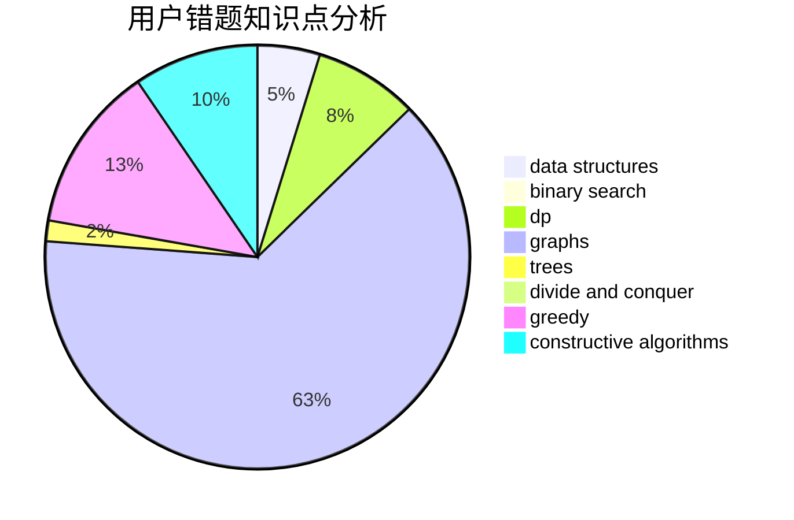

# mr_lolololol

<!-- tabs:start -->

#### **用户提交结果分析**

#### **用户做题类型偏好分析**

#### **用户错题知识点分析**

<!-- tabs:end -->
# 推荐题目
[166A](https://codeforces.com/contest/166/problem/A)		binary search,
                        implementation,
                        sortings		  
[145A](https://codeforces.com/contest/145/problem/A)		greedy,
                        implementation		  
[1270I](https://codeforces.com/contest/1270/problem/I)		constructive algorithms,
                        fft,
                        math		  
[525B](https://codeforces.com/contest/525/problem/B)		constructive algorithms,
                        greedy,
                        math,
                        strings		  
[817E](https://codeforces.com/contest/817/problem/E)		bitmasks,
                        data structures,
                        trees		  
[1482E](https://codeforces.com/contest/1482/problem/E)		data structures,
                        divide and conquer,
                        dp		  
[14462](https://codeforces.com/contest/1446/problem/2)		dsu,graphs,sortings,trees		  
[1098A](https://codeforces.com/contest/1098/problem/A)		constructive algorithms,
                        dfs and similar,
                        greedy,
                        trees		  
[1398A](https://codeforces.com/contest/1398/problem/A)		geometry,
                        math		  
[1490C](https://codeforces.com/contest/1490/problem/C)		binary search,
                        brute force,
                        brute force,
                        math		  
